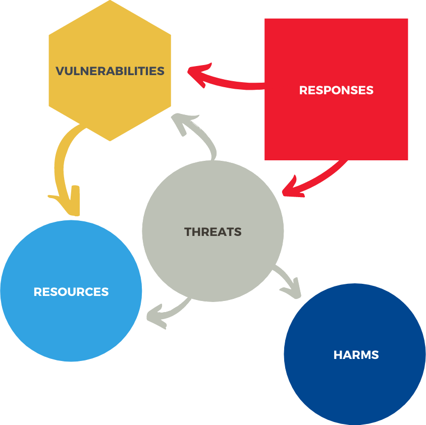

<html lang="en">
<head>
    <title>Smart Citizen Cyber Resilience Ontology</title>
    <meta http-equiv="Content-Type" content="text/html; charset=utf-8"/>
    
    
    
    
</head>
<body>
  
made by <a href="http://github.com/rdflib/pyLODE">
    pyLODE</a>
    2.8.3
  

  <h1>Smart Citizen Cyber Resilience Ontology</h1>
<section id="metadata">
    <h2 style="display:none;">Metadata</h2>
    <dl>
        <dt>URI</dt>
        <dd><code>http://cs.unu.edu/sc2r</code></dd>
        <dt>Ontology RDF</dt>
        <dd><a href="https://github.com/UNU-Macau/sc2ro">RDF (xml)</a></dd>
    </dl>
    <h2>Description</h2>
    

        
The Smart Citizen Cyber Resilience Ontology (SC2RO) maps the cyber resilience landscape for individuals. It identifies cyber resources, vulnerabilities, threats, responses and harms associated with and specific to individual citizen's cyber functionings.

    

</section>
<section id="toc">
    <h2>Table of Contents</h2>
    <ol>
        <li><a href="#classes">Classes</a></li>
        <li><a href="#objectproperties">Object Properties</a></li>
        <li><a href="#datatypeproperties">Datatype Properties</a></li>
        <li><a href="#namespaces">Namespaces</a></li>
        <li><a href="#legend">Legend</a></li>
    </ol>
</section>
<section id="overview">
    <h2>Overview</h2>
        

</section>
  <section id="classes">
    <h2>Classes <a href="">&uparrow;</a></h2>
    <ul class="hlist">
        <li><a href="#AbsorbMeasure">Absorb Measure</a></li>
        <li><a href="#AbuseThreat">Abuse Threat</a></li>
        <li><a href="#AbusedHarm">Abused Harm</a></li>
        <li><a href="#AccessControl">Access Control</a></li>
        <li><a href="#AccountHijacking">Account Hijacking</a></li>
        <li><a href="#AccountRecovery">Account Recovery</a></li>
        <li><a href="#ActiveMediation">Active Mediation</a></li>
        <li><a href="#ActivityData">Activity Data</a></li>
        <li><a href="#AdaptMeasure">Adapt Measure</a></li>
        <li><a href="#Addiction">Addiction</a></li>
        <li><a href="#Agency">Agency</a></li>
        <li><a href="#AlternativeResourceMeasure">Alternative Resource Measure</a></li>
        <li><a href="#AnglerPhishing">Angler Phishing</a></li>
        <li><a href="#AnonymityThreat">Anonymity Threat</a></li>
        <li><a href="#AnonymousRouting">Anonymous Routing</a></li>
        <li><a href="#AnticipateMeasure">Anticipate Measure</a></li>
        <li><a href="#AssetInventoryManagement">Asset Inventory Management</a></li>
        <li><a href="#AttitudinalMeasure">Attitudinal Measure</a></li>
        <li><a href="#AuthenticationThreat">Authentication Threat</a></li>
        <li><a href="#AvailabilityThreat">Availability Threat</a></li>
        <li><a href="#Awareness">Awareness</a></li>
        <li><a href="#Baiting">Baiting</a></li>
        <li><a href="#BandwagonEffect">Bandwagon Effect</a></li>
        <li><a href="#BeCritical">Be Critical</a></li>
        <li><a href="#BeSuspicious">Be Suspicious</a></li>
        <li><a href="#BeVigilant">Be Vigilant</a></li>
        <li><a href="#BehavioralData">Behavioral Data</a></li>
        <li><a href="#BiometricToken">BiometricToken</a></li>
        <li><a href="#BlackPropaganda">Black Propaganda</a></li>
        <li><a href="#Blacklisted">Blacklisted</a></li>
        <li><a href="#BodilyInjury">Bodily Injury</a></li>
        <li><a href="#BodilyPain">Bodily Pain</a></li>
        <li><a href="#BoyfriendingandGirlfriending">Boyfriending and Girlfriending</a></li>
        <li><a href="#BreachofContract">Breach of Contract</a></li>
        <li><a href="#CapacityBuilding">Capacity Building</a></li>
        <li><a href="#Catphishing">Catphishing</a></li>
        <li><a href="#Censorship">Censorship</a></li>
        <li><a href="#Cheerleading">Cheerleading</a></li>
        <li><a href="#Coercion">Coercion</a></li>
        <li><a href="#CognitiveImpairement">Cognitive Impairement</a></li>
        <li><a href="#CognitiveThreat">Cognitive Threat</a></li>
        <li><a href="#CompensationPayment">Compensation Payment</a></li>
        <li><a href="#Compromised">Compromised</a></li>
        <li><a href="#Computer">Computer</a></li>
        <li><a href="#ComputingAsset">Computing Asset</a></li>
        <li><a href="#ConfidentialityThreat">Confidentiality Threat</a></li>
        <li><a href="#Conflict">Conflict</a></li>
        <li><a href="#ConfronttheThreat">Confront the Threat</a></li>
        <li><a href="#Confusion">Confusion</a></li>
        <li><a href="#Conscientiousness">Conscientiousness</a></li>
        <li><a href="#Corrupted">Corrupted</a></li>
        <li><a href="#Couriosity">Couriosity</a></li>
        <li><a href="#Credential">Credential</a></li>
        <li><a href="#CryptoCurrency">Crypto Currency</a></li>
        <li><a href="#CyberPredator">Cyber Predator</a></li>
        <li><a href="#CyberStalking">Cyber Stalking</a></li>
        <li><a href="#Cyberbullying">Cyberbullying</a></li>
        <li><a href="#Damage">Damage</a></li>
        <li><a href="#DamagedRelationship">Damaged Relationship</a></li>
        <li><a href="#DamagedSocialPerception">Damaged Social Perception</a></li>
        <li><a href="#DarkAdvertising">Dark Advertising</a></li>
        <li><a href="#Data">Data</a></li>
        <li><a href="#DataBreach">Data Breach</a></li>
        <li><a href="#DataCorruption">Data Corruption</a></li>
        <li><a href="#DataError">Data Error</a></li>
        <li><a href="#DataLeak">Data Leak</a></li>
        <li><a href="#DataRecovery">Data Recovery</a></li>
        <li><a href="#DataRedundancy">Data Redundancy</a></li>
        <li><a href="#DataVulnerability">Data Vulnerability</a></li>
        <li><a href="#DataToken">DataToken</a></li>
        <li><a href="#Deceit">Deceit</a></li>
        <li><a href="#DemocraphicInformation">Democraphic Information</a></li>
        <li><a href="#DenialofService">Denial of Service</a></li>
        <li><a href="#Depressed">Depressed</a></li>
        <li><a href="#Destroyed">Destroyed</a></li>
        <li><a href="#DeviceIdentification">Device Identification</a></li>
        <li><a href="#DiffusionofResponsibility">Diffusion of Responsibility</a></li>
        <li><a href="#DigitalFootprintManagement">Digital Footprint Management</a></li>
        <li><a href="#DigitalHoarding">Digital Hoarding</a></li>
        <li><a href="#DigitalResource">Digital Resource</a></li>
        <li><a href="#DigitalVulnerability">Digital Vulnerability</a></li>
        <li><a href="#Discomfort">Discomfort</a></li>
        <li><a href="#DisconnectMeasure">Disconnect Measure</a></li>
        <li><a href="#Disempowerment">Disempowerment</a></li>
        <li><a href="#Disinformation">Disinformation</a></li>
        <li><a href="#DisruptedIncome">Disrupted Income</a></li>
        <li><a href="#DisruptedWork">Disrupted Work</a></li>
        <li><a href="#Disruption">Disruption</a></li>
        <li><a href="#Distraction">Distraction</a></li>
        <li><a href="#Doxing">Doxing</a></li>
        <li><a href="#Eavesdropping">Eavesdropping</a></li>
        <li><a href="#EconomicHarm">Economic Harm</a></li>
        <li><a href="#Electricity">Electricity</a></li>
        <li><a href="#EmailHygiene">Email Hygiene</a></li>
        <li><a href="#Embarrassed">Embarrassed</a></li>
        <li><a href="#EngageMeasure">Engage Measure</a></li>
        <li><a href="#EngineeredContent">Engineered Content</a></li>
        <li><a href="#EnvironmentalThreat">Environmental Threat</a></li>
        <li><a href="#EvolveMeasure">Evolve Measure</a></li>
        <li><a href="#Exposed">Exposed</a></li>
        <li><a href="#ExternalHardDrive">External Hard Drive</a></li>
        <li><a href="#ExternalSupport">External Support</a></li>
        <li><a href="#ExtorsionPayment">Extorsion Payment</a></li>
        <li><a href="#Extortion">Extortion</a></li>
        <li><a href="#Fabrication">Fabrication</a></li>
        <li><a href="#FactChecking">Fact Checking</a></li>
        <li><a href="#FailureDetection">Failure Detection</a></li>
        <li><a href="#FakeGiveaways">Fake Giveaways</a></li>
        <li><a href="#FakeNews">Fake News</a></li>
        <li><a href="#Fear">Fear</a></li>
        <li><a href="#FeelingUpset">Feeling Upset</a></li>
        <li><a href="#FileResource">File Resource</a></li>
        <li><a href="#FinancialData">FinancialData</a></li>
        <li><a href="#FinePayment">Fine Payment</a></li>
        <li><a href="#Firehosing">Firehosing</a></li>
        <li><a href="#Firewall">Firewall</a></li>
        <li><a href="#Flaming">Flaming</a></li>
        <li><a href="#Flooding">Flooding</a></li>
        <li><a href="#Forging">Forging</a></li>
        <li><a href="#Fraud">Fraud</a></li>
        <li><a href="#Frustration">Frustration</a></li>
        <li><a href="#GishGalloping">Gish Galloping</a></li>
        <li><a href="#Gluttony">Gluttony</a></li>
        <li><a href="#Greed">Greed</a></li>
        <li><a href="#Grooming">Grooming</a></li>
        <li><a href="#Guilt">Guilt</a></li>
        <li><a href="#Guilty">Guilty</a></li>
        <li><a href="#HardwareVulnerability">Hardware Vulnerability</a></li>
        <li><a href="#Harm">Harm</a></li>
        <li><a href="#Helpfulness">Helpfulness</a></li>
        <li><a href="#HumorandMeme">Humor and Meme</a></li>
        <li><a href="#Identification">Identification</a></li>
        <li><a href="#IdentifyingData">Identifying Data</a></li>
        <li><a href="#Identity">Identity</a></li>
        <li><a href="#IdentityTheft">Identity Theft</a></li>
        <li><a href="#IdentityTheftHarm">Identity Theft Harm</a></li>
        <li><a href="#ImpairedPrivateSocialBoundary">Impaired Private Social Boundary</a></li>
        <li><a href="#Impulsiveness">Impulsiveness</a></li>
        <li><a href="#InadvertentInformationDisclosure">Inadvertent Information Disclosure</a></li>
        <li><a href="#InappropriateContent">Inappropriate Content</a></li>
        <li><a href="#IncidentReporting">Incident Reporting</a></li>
        <li><a href="#IncreaseResourceMeasure">Increase Resource Measure</a></li>
        <li><a href="#IndividualPersonalResource">Individual Personal Resource</a></li>
        <li><a href="#IndividualandPersonalThreat">Individual and Personal Threat</a></li>
        <li><a href="#IndividualandPersonalVulnerability">Individual and Personal Vulnerability</a></li>
        <li><a href="#Infected">Infected</a></li>
        <li><a href="#InfluenceOperation">Influence Operation</a></li>
        <li><a href="#InfluenceThreat">Influence Threat</a></li>
        <li><a href="#InformationFlooding">Information Flooding</a></li>
        <li><a href="#InformationOverload">Information Overload</a></li>
        <li><a href="#InfrastructureResource">Infrastructure Resource</a></li>
        <li><a href="#InstitutionalThreat">Institutional Threat</a></li>
        <li><a href="#IntegrityThreat">Integrity Threat</a></li>
        <li><a href="#Interception">Interception</a></li>
        <li><a href="#InternetConnectivity">Internet Connectivity</a></li>
        <li><a href="#IntimacyThreat">Intimacy Threat</a></li>
        <li><a href="#IntrusionDetection">Intrusion Detection</a></li>
        <li><a href="#IsolateMeasure">Isolate Measure</a></li>
        <li><a href="#Isolation">Isolation</a></li>
        <li><a href="#KnowledgeResource">Knowledge Resource</a></li>
        <li><a href="#Laptop">Laptop</a></li>
        <li><a href="#Laundering">Laundering</a></li>
        <li><a href="#LeastPrivilege">Least Privilege</a></li>
        <li><a href="#LocationData">Location Data</a></li>
        <li><a href="#LoggingandAudit">Logging and Audit</a></li>
        <li><a href="#LossofConfidence">Loss of Confidence</a></li>
        <li><a href="#LossofLife">Loss of Life</a></li>
        <li><a href="#LossofWork">Loss of Work</a></li>
        <li><a href="#LostCredentials">Lost Credentials</a></li>
        <li><a href="#LostDevices">Lost Devices</a></li>
        <li><a href="#LoveBombing">Love Bombing</a></li>
        <li><a href="#LowMorale">Low Morale</a></li>
        <li><a href="#LowSatisfaction">Low Satisfaction</a></li>
        <li><a href="#LuringSexualThreat">Luring Sexual Threat</a></li>
        <li><a href="#Malfunction">Malfunction</a></li>
        <li><a href="#MaliciousContactRemoval">Malicious Contact Removal</a></li>
        <li><a href="#MaliciousContentRemoval">Malicious Content Removal</a></li>
        <li><a href="#MaliciousSoftwareDetection">Malicious Software Detection</a></li>
        <li><a href="#MaliciousSoftwareRemoval">Malicious Software Removal</a></li>
        <li><a href="#MalignRhetoric">Malign Rhetoric</a></li>
        <li><a href="#Malinformation">Malinformation</a></li>
        <li><a href="#Malware">Malware</a></li>
        <li><a href="#Masquerading">Masquerading</a></li>
        <li><a href="#MediationMeasures">Mediation Measures</a></li>
        <li><a href="#MentalFaculties">Mental Faculties</a></li>
        <li><a href="#Microtargeting">Microtargeting</a></li>
        <li><a href="#Misconfiguration">Misconfiguration</a></li>
        <li><a href="#Misinformation">Misinformation</a></li>
        <li><a href="#MisleadingAdvertising">Misleading Advertising</a></li>
        <li><a href="#MisleadingInformation">Misleading Information</a></li>
        <li><a href="#Misled">Misled</a></li>
        <li><a href="#Mistreatment">Mistreatment</a></li>
        <li><a href="#MitigationCost">Mitigation Cost</a></li>
        <li><a href="#MobileDevice">Mobile Device</a></li>
        <li><a href="#MonitoringMeasure">Monitoring Measure</a></li>
        <li><a href="#Motivation">Motivation</a></li>
        <li><a href="#MultifactorAuthentication">Multifactor Authentication</a></li>
        <li><a href="#MutualAuthentication">Mutual Authentication</a></li>
        <li><a href="#NaturalDisasterThreat">Natural Disaster Threat</a></li>
        <li><a href="#NegativePerception">Negative Perception</a></li>
        <li><a href="#NetworkEquipment">Network Equipment</a></li>
        <li><a href="#NetworkIntrusion">Network Intrusion</a></li>
        <li><a href="#NetworkRedundancy">Network Redundancy</a></li>
        <li><a href="#NetworkVulnerability">Network Vulnerability</a></li>
        <li><a href="#Non-repudiationThreat">Non-repudiation Threat</a></li>
        <li><a href="#OffensiveLanguage">Offensive Language</a></li>
        <li><a href="#OnlineService">Online Service</a></li>
        <li><a href="#OpposingInformation">Opposing Information</a></li>
        <li><a href="#Overwhelmed">Overwhelmed</a></li>
        <li><a href="#ParasocialHacking">Parasocial Hacking</a></li>
        <li><a href="#Parody">Parody</a></li>
        <li><a href="#PasswordManagement">Password Management</a></li>
        <li><a href="#PersistenceSexualThreat">Persistence Sexual Threat</a></li>
        <li><a href="#PersonalData">Personal Data</a></li>
        <li><a href="#Phishing">Phishing</a></li>
        <li><a href="#PhysicalHarm">Physical Harm</a></li>
        <li><a href="#PhysicalResource">Physical Resource</a></li>
        <li><a href="#PhysicalRestriction">Physical Restriction</a></li>
        <li><a href="#PhysicalVulnerability">Physical Vulnerability</a></li>
        <li><a href="#PhysicalToken">PhysicalToken</a></li>
        <li><a href="#Piggybacking">Piggybacking</a></li>
        <li><a href="#PointandShriek">Point and Shriek</a></li>
        <li><a href="#Polarization">Polarization</a></li>
        <li><a href="#Pornography">Pornography</a></li>
        <li><a href="#PotemkinVillageEvidence">Potemkin Village Evidence</a></li>
        <li><a href="#PrepareMeasure">Prepare Measure</a></li>
        <li><a href="#Pretexting">Pretexting</a></li>
        <li><a href="#PreventionMeasure">Prevention Measure</a></li>
        <li><a href="#PrivacyThreat">Privacy Threat</a></li>
        <li><a href="#Profanity">Profanity</a></li>
        <li><a href="#ProfessionalSupport">Professional Support</a></li>
        <li><a href="#Propaganda">Propaganda</a></li>
        <li><a href="#Prosecution">Prosecution</a></li>
        <li><a href="#PsychographicHacking">Psychographic Hacking</a></li>
        <li><a href="#PsychologicalHarm">Psychological Harm</a></li>
        <li><a href="#QuidProQuo">Quid Pro Quo</a></li>
        <li><a href="#Radicalization">Radicalization</a></li>
        <li><a href="#Raiding">Raiding</a></li>
        <li><a href="#Ransomware">Ransomware</a></li>
        <li><a href="#Reconnaissance">Reconnaissance</a></li>
        <li><a href="#RecoverMeasure">Recover Measure</a></li>
        <li><a href="#RecoveryPlan">Recovery Plan</a></li>
        <li><a href="#ReducedOpportunities">Reduced Opportunities</a></li>
        <li><a href="#ReducedPerformance">Reduced Performance</a></li>
        <li><a href="#RedundancyMeasure">Redundancy Measure</a></li>
        <li><a href="#RemoteCodeExecution">Remote Code Execution</a></li>
        <li><a href="#RemovalMeasure">Removal Measure</a></li>
        <li><a href="#Replay">Replay</a></li>
        <li><a href="#ReportingMeasure">Reporting Measure</a></li>
        <li><a href="#ReputationResource">Reputation Resource</a></li>
        <li><a href="#ReputationalHarm">Reputational Harm</a></li>
        <li><a href="#ReserveThreat">Reserve Threat</a></li>
        <li><a href="#Resource">Resource</a></li>
        <li><a href="#Response">Response</a></li>
        <li><a href="#RestrictiveMediation">Restrictive Mediation</a></li>
        <li><a href="#RighttoAssembly">Right to Assembly</a></li>
        <li><a href="#RighttoExpression">Right to Expression</a></li>
        <li><a href="#RighttoInformation">Right to Information</a></li>
        <li><a href="#RighttoInformationPrivacy">Right to Information Privacy</a></li>
        <li><a href="#RighttoOpinion">Right to Opinion</a></li>
        <li><a href="#RighttoPhysicalPrivacy">Right to Physical Privacy</a></li>
        <li><a href="#RighttoPrivacy">Right to Privacy</a></li>
        <li><a href="#RighttoPsychologicalPrivacy">Right to Psychological Privacy</a></li>
        <li><a href="#RighttoSocialPrivacy">Right to Social Privacy</a></li>
        <li><a href="#RighttoTerritorialPrivacy">Right to Territorial Privacy</a></li>
        <li><a href="#Rights">Rights</a></li>
        <li><a href="#SDCard">SD Card</a></li>
        <li><a href="#Sandboxing">Sandboxing</a></li>
        <li><a href="#Satire">Satire</a></li>
        <li><a href="#Scam">Scam</a></li>
        <li><a href="#ScamCost">Scam Cost</a></li>
        <li><a href="#Scareware">Scareware</a></li>
        <li><a href="#Sealioning">Sealioning</a></li>
        <li><a href="#SelfHarm">Self Harm</a></li>
        <li><a href="#Self-Censorship">Self-Censorship</a></li>
        <li><a href="#Server">Server</a></li>
        <li><a href="#Sextortion">Sextortion</a></li>
        <li><a href="#SexualAbuseThreat">Sexual Abuse Threat</a></li>
        <li><a href="#SexualAssault">Sexual Assault</a></li>
        <li><a href="#Shameful">Shameful</a></li>
        <li><a href="#Shilling">Shilling</a></li>
        <li><a href="#Skills">Skills</a></li>
        <li><a href="#Skimming">Skimming</a></li>
        <li><a href="#Smishing">Smishing</a></li>
        <li><a href="#SocialCapitalResource">Social Capital Resource</a></li>
        <li><a href="#SocialContact">Social Contact</a></li>
        <li><a href="#SocialEngineering">Social Engineering</a></li>
        <li><a href="#SocialHacking">Social Hacking</a></li>
        <li><a href="#SocialHarm">Social Harm</a></li>
        <li><a href="#SocialMediaHygiene">Social Media Hygiene</a></li>
        <li><a href="#SocialMediaMonitoring">Social Media Monitoring</a></li>
        <li><a href="#SocialNetworkResource">Social Network Resource</a></li>
        <li><a href="#SocialSupport">Social Support</a></li>
        <li><a href="#SocialWithdrawal">Social Withdrawal</a></li>
        <li><a href="#SocietalandSocialThreat">Societal and Social Threat</a></li>
        <li><a href="#Socio-cognitiveHacking">Socio-cognitive Hacking</a></li>
        <li><a href="#SockPuppetry">Sock Puppetry</a></li>
        <li><a href="#Software">Software</a></li>
        <li><a href="#SoftwareRedundancy">Software Redundancy</a></li>
        <li><a href="#SoftwareVulnerability">Software Vulnerability</a></li>
        <li><a href="#SolitudeThreat">Solitude Threat</a></li>
        <li><a href="#SourceRedundancy">Source Redundancy</a></li>
        <li><a href="#SpamEmail">Spam Email</a></li>
        <li><a href="#SpearPhishing">Spear Phishing</a></li>
        <li><a href="#Spoofing">Spoofing</a></li>
        <li><a href="#StorageAsset">Storage Asset</a></li>
        <li><a href="#StrawmanAttack">Strawman Attack</a></li>
        <li><a href="#Surveillance">Surveillance</a></li>
        <li><a href="#SweepstakesScam">Sweepstakes Scam</a></li>
        <li><a href="#Sympathy">Sympathy</a></li>
        <li><a href="#SystemRecovery">System Recovery</a></li>
        <li><a href="#Tailgating">Tailgating</a></li>
        <li><a href="#TechnicalMediation">Technical Mediation</a></li>
        <li><a href="#TechnologicalThreat">Technological Threat</a></li>
        <li><a href="#TheftHarm">Theft Harm</a></li>
        <li><a href="#TheftThreat">Theft Threat</a></li>
        <li><a href="#TheftofFinances">Theft of Finances</a></li>
        <li><a href="#Threat">Threat</a></li>
        <li><a href="#ThreatMonitoringMeasure">Threat Monitoring Measure</a></li>
        <li><a href="#TimeWasted">Time Wasted</a></li>
        <li><a href="#Training">Training</a></li>
        <li><a href="#TransferInformationAttack">Transfer Information Attack</a></li>
        <li><a href="#Trolling">Trolling</a></li>
        <li><a href="#TrustedData">Trusted Data</a></li>
        <li><a href="#TrustedInformation">Trusted Information</a></li>
        <li><a href="#TrustedInfrastructure">Trusted Infrastructure</a></li>
        <li><a href="#TrustedNetworking">Trusted Networking</a></li>
        <li><a href="#TrustedSoftware">Trusted Software</a></li>
        <li><a href="#USBDrive">USB Drive</a></li>
        <li><a href="#UnauthorizedAccess">Unauthorized Access</a></li>
        <li><a href="#Unavailable">Unavailable</a></li>
        <li><a href="#UnderScrutiny">Under Scrutiny</a></li>
        <li><a href="#UnsolicitedCommunication">Unsolicited Communication</a></li>
        <li><a href="#UnsolicitedSocialRequest">Unsolicited Social Request</a></li>
        <li><a href="#Urgency">Urgency</a></li>
        <li><a href="#UserIdentification">User Identification</a></li>
        <li><a href="#User-GeneratedContent">User-Generated Content</a></li>
        <li><a href="#Vandalism">Vandalism</a></li>
        <li><a href="#Violation">Violation</a></li>
        <li><a href="#VirtualPrivateNetwork">Virtual Private Network</a></li>
        <li><a href="#Vishing">Vishing</a></li>
        <li><a href="#VoilentContent">Voilent Content</a></li>
        <li><a href="#Vulnerability">Vulnerability</a></li>
        <li><a href="#WebHygiene">Web Hygiene</a></li>
        <li><a href="#WhalingPhishing">Whaling Phishing</a></li>
        <li><a href="#WhatAboutism">WhatAboutism</a></li>
        <li><a href="#WithstandMeasure">Withstand Measure</a></li>
        <li><a href="#Worry">Worry</a></li>
        <li><a href="#YouAreNotImmune">You Are Not Immune</a></li>
    </ul>
    

        <h3>Absorb Measurec</h3>
        <table>
            <tr>
                <th>URI</th>
                <td><code>http://cs.unu.edu/sc2r#AbsorbMeasure</code></td>
            </tr>
            <tr>
                <th>Description</th>
                <td>
                    
Responses are framed around four resilience phases of Prepare, Absorb, Recover, and Adapt.

The Absorb phase is triggered by the occurrence of an adverse cyber event, which diminishes and degrades individuals’ overall core cyber functioning (i.e., harmful impact). The effectiveness of the Absorb measures adopted in this phase determines the extent of the impact of the adverse incident.

                </td>
            </tr>
            <tr>
                <th>Super-classes</th>
                <td>
                    <a href="#Response">sc2r:Response</a>c 
                </td>
            </tr>
            <tr>
                <th>Sub-classes</th>
                <td>
                    <a href="#WithstandMeasure">sc2r:WithstandMeasure</a>c 
                    <a href="#EngageMeasure">sc2r:EngageMeasure</a>c 
                    <a href="#ReportingMeasure">sc2r:Reporting</a>c 
                </td>
            </tr>
        </table>
    

    

        <h3>Abuse Threatc</h3>
        <table>
            <tr>
                <th>URI</th>
                <td><code>http://cs.unu.edu/sc2r#Abuse</code></td>
            </tr>
            <tr>
                <th>Description</th>
                <td>
                    
Abuse threats emanate from the harmful treatment of individuals online.

                </td>
            </tr>
            <tr>
                <th>Super-classes</th>
                <td>
                    <a href="#IndividualandPersonalThreat">sc2r:PersonalThreat</a>c 
                </td>
            </tr>
            <tr>
                <th>Sub-classes</th>
                <td>
                    <a href="#SexualAbuseThreat">sc2r:SexualAbuse</a>c 
                    <a href="#Cyberbullying">sc2r:Cyberbullying</a>c 
                    <a href="#UnsolicitedCommunication">sc2r:UnsolicitedCommunication</a>c 
                    <a href="#Flaming">sc2r:Flaming</a>c 
                    <a href="#CyberPredator">sc2r:CyberPredator</a>c 
                    <a href="#CyberStalking">sc2r:CyberStalking</a>c 
                    <a href="#Trolling">sc2r:Trolling</a>c 
                </td>
            </tr>
        </table>
    

    

        <h3>Abused Harmc</h3>
        <table>
            <tr>
                <th>URI</th>
                <td><code>http://cs.unu.edu/sc2r#Abused</code></td>
            </tr>
            <tr>
                <th>Super-classes</th>
                <td>
                    <a href="#PhysicalHarm">sc2r:PhysicalHarm</a>c 
                </td>
            </tr>
        </table>
    

    

        <h3>Access Controlc</h3>
        <table>
            <tr>
                <th>URI</th>
                <td><code>http://cs.unu.edu/sc2r#AccessControl</code></td>
            </tr>
            <tr>
                <th>Description</th>
                <td>
                    
Access control is the prevention measure that involves controlling and authorizing access to cyber resources

                </td>
            </tr>
            <tr>
                <th>Super-classes</th>
                <td>
                    <a href="#PreventionMeasure">sc2r:PreventionMeasure</a>c 
                </td>
            </tr>
            <tr>
                <th>Sub-classes</th>
                <td>
                    <a href="#Sandboxing">sc2r:Sandboxing</a>c 
                    <a href="#LeastPrivilege">sc2r:LeastPrivilege</a>c 
                    <a href="#Firewall">sc2r:Firewall</a>c 
                    <a href="#PhysicalRestriction">sc2r:PhysicalRestriction</a>c 
                </td>
            </tr>
        </table>
    

    

        <h3>Account Hijackingc</h3>
        <table>
            <tr>
                <th>URI</th>
                <td><code>http://cs.unu.edu/sc2r#AccountHijacking</code></td>
            </tr>
            <tr>
                <th>Description</th>
                <td>
                    
This is the process where an individuals account is hijacked or stolen by someone else.

                </td>
            </tr>
            <tr>
                <th>Super-classes</th>
                <td>
                    <a href="#AuthenticationThreat">sc2r:AuthenticationThreat</a>c 
                </td>
            </tr>
        </table>
    

    

        <h3>Account Recoveryc</h3>
        <table>
            <tr>
                <th>URI</th>
                <td><code>http://cs.unu.edu/sc2r#AccountRecovery</code></td>
            </tr>
            <tr>
                <th>Description</th>
                <td>
                    
Account recovery measures involve restoring access and control of an account after an adverse cyber incident.

                </td>
            </tr>
            <tr>
                <th>Super-classes</th>
                <td>
                    <a href="#RecoverMeasure">sc2r:RecoverMeasure</a>c 
                </td>
            </tr>
        </table>
    

    

        <h3>Active Mediationc</h3>
        <table>
            <tr>
                <th>URI</th>
                <td><code>http://cs.unu.edu/sc2r#ActiveMediation</code></td>
            </tr>
            <tr>
                <th>Description</th>
                <td>
                    
Active Mediation involves awareness-raising and discussion with potential victims of adverse cyber incidents.

                </td>
            </tr>
            <tr>
                <th>Super-classes</th>
                <td>
                    <a href="#MediationMeasures">sc2r:MediationMeasures</a>c 
                </td>
            </tr>
        </table>
    

    

        <h3>Activity Datac</h3>
        <table>
            <tr>
                <th>URI</th>
                <td><code>http://cs.unu.edu/sc2r#ActivityData</code></td>
            </tr>
            <tr>
                <th>Description</th>
                <td>
                    
Activity Data is the record of any user action (online or in the physical world) that can be logged on a computer.

                </td>
            </tr>
            <tr>
                <th>Super-classes</th>
                <td>
                    <a href="#PersonalData">sc2r:PersonalData</a>c 
                </td>
            </tr>
        </table>
    

    

        <h3>Adapt Measurec</h3>
        <table>
            <tr>
                <th>URI</th>
                <td><code>http://cs.unu.edu/sc2r#AdaptMeasure</code></td>
            </tr>
            <tr>
                <th>Description</th>
                <td>
                    
Responses are framed around four resilience phases of Prepare, Absorb, Recover, and Adapt.

Once baseline cyber functioning has been restored, the Adapt phase can commence and Adapt measures can be put in the place, using the learnings and experience from the adverse event to inform the evolution and increase in cyber functioning and to “bounce forward better”

                </td>
            </tr>
            <tr>
                <th>Super-classes</th>
                <td>
                    <a href="#Response">sc2r:Response</a>c 
                </td>
            </tr>
            <tr>
                <th>Sub-classes</th>
                <td>
                    <a href="#CapacityBuilding">sc2r:CapacityBuilding</a>c 
                    <a href="#EvolveMeasure">sc2r:Evolve</a>c 
                </td>
            </tr>
        </table>
    

    

        <h3>Addictionc</h3>
        <table>
            <tr>
                <th>URI</th>
                <td><code>http://cs.unu.edu/sc2r#Addiction</code></td>
            </tr>
            <tr>
                <th>Super-classes</th>
                <td>
                    <a href="#PsychologicalHarm">sc2r:PsychologicalHarm</a>c 
                </td>
            </tr>
        </table>
    

    

        <h3>Agencyc</h3>
        <table>
            <tr>
                <th>URI</th>
                <td><code>http://cs.unu.edu/sc2r#Agency</code></td>
            </tr>
            <tr>
                <th>Description</th>
                <td>
                    
Agency is the ability to define one’s goals and act upon them.

                </td>
            </tr>
            <tr>
                <th>Super-classes</th>
                <td>
                    <a href="#IndividualPersonalResource">sc2r:IndividualResource</a>c 
                </td>
            </tr>
            <tr>
                <th>Sub-classes</th>
                <td>
                    <a href="#MentalFaculties">sc2r:MentalFaculties</a>c 
                </td>
            </tr>
        </table>
    

    

        <h3>Alternative Resource Measurec</h3>
        <table>
            <tr>
                <th>URI</th>
                <td><code>http://cs.unu.edu/sc2r#AlternativeResource</code></td>
            </tr>
            <tr>
                <th>Description</th>
                <td>
                    
This measure involves engaging alternative complementary cyber resources to deal with incidents that have deminished cyber functioning of primary resources.

For example, in cases of data corruption, the redundant backups of the data would be utilized. In cases where a computing device is damaged, an alternative device would be utilized.

                </td>
            </tr>
            <tr>
                <th>Super-classes</th>
                <td>
                    <a href="#WithstandMeasure">sc2r:WithstandMeasure</a>c 
                </td>
            </tr>
        </table>
    

    

        <h3>Angler Phishingc</h3>
        <table>
            <tr>
                <th>URI</th>
                <td><code>http://cs.unu.edu/sc2r#AnglerPhishing</code></td>
            </tr>
            <tr>
                <th>Description</th>
                <td>
                    
Angler Phishing occurs when individuals receive a message from a social media account masquerading as a corporate's customer support account that tricks them into handing over their sensitive information.

                </td>
            </tr>
            <tr>
                <th>Super-classes</th>
                <td>
                    <a href="#Phishing">sc2r:Phishing</a>c 
                </td>
            </tr>
        </table>
    

    

        <h3>Anonymity Threatc</h3>
        <table>
            <tr>
                <th>URI</th>
                <td><code>http://cs.unu.edu/sc2r#AnonymityThreat</code></td>
            </tr>
            <tr>
                <th>Description</th>
                <td>
                    
Anonimity Threat occurs when individuals' preference to remain anonymous or unnoticed online is threatened.

                </td>
            </tr>
            <tr>
                <th>Super-classes</th>
                <td>
                    <a href="#PrivacyThreat">sc2r:PrivacyThreat</a>c 
                </td>
            </tr>
        </table>
    

    

        <h3>Anonymous Routingc</h3>
        <table>
            <tr>
                <th>URI</th>
                <td><code>http://cs.unu.edu/sc2r#AnonymousRouting</code></td>
            </tr>
            <tr>
                <th>Description</th>
                <td>
                    
Anonymous routing is the use of computing networks in a way that protects communication from identification by third-party observers.

                </td>
            </tr>
            <tr>
                <th>Super-classes</th>
                <td>
                    <a href="#TrustedNetworking">sc2r:TrustedNetworking</a>c 
                </td>
            </tr>
        </table>
    

    

        <h3>Anticipate Measurec</h3>
        <table>
            <tr>
                <th>URI</th>
                <td><code>http://cs.unu.edu/sc2r#AnticipateMeasure</code></td>
            </tr>
            <tr>
                <th>Description</th>
                <td>
                    
Anticipate Measure are put in place by individual to prepare for and anticipate the inevitability of adverse cyber incidents.

                </td>
            </tr>
            <tr>
                <th>Super-classes</th>
                <td>
                    <a href="#PrepareMeasure">sc2r:PrepareMeasure</a>c 
                </td>
            </tr>
            <tr>
                <th>Sub-classes</th>
                <td>
                    <a href="#Training">sc2r:Training</a>c 
                    <a href="#RedundancyMeasure">sc2r:RedundancyMeasure</a>c 
                    <a href="#RecoveryPlan">sc2r:RecoveryPlan</a>c 
                    <a href="#AttitudinalMeasure">sc2r:AttitudinalMeasure</a>c 
                    <a href="#Awareness">sc2r:Awareness</a>c 
                </td>
            </tr>
        </table>
    

    

        <h3>Right to Assemblyc</h3>
        <table>
            <tr>
                <th>URI</th>
                <td><code>http://cs.unu.edu/sc2r#Assembly</code></td>
            </tr>
            <tr>
                <th>Description</th>
                <td>
                    
The Rght to Assemble (freedom of association) is individual's right to gather and meet, both publicly and privately.

                </td>
            </tr>
            <tr>
                <th>Super-classes</th>
                <td>
                    <a href="#Rights">sc2r:Right</a>c 
                </td>
            </tr>
        </table>
    

    

        <h3>Asset Inventory Managementc</h3>
        <table>
            <tr>
                <th>URI</th>
                <td><code>http://cs.unu.edu/sc2r#AssetInventory</code></td>
            </tr>
            <tr>
                <th>Description</th>
                <td>
                    
Asset inventory Management involves maintaining a list of cyber resources and assets that individuals have access to.

                </td>
            </tr>
            <tr>
                <th>Super-classes</th>
                <td>
                    <a href="#Awareness">sc2r:Awareness</a>c 
                </td>
            </tr>
        </table>
    

    

        <h3>Attitudinal Measurec</h3>
        <table>
            <tr>
                <th>URI</th>
                <td><code>http://cs.unu.edu/sc2r#AttitudinalMeasure</code></td>
            </tr>
            <tr>
                <th>Description</th>
                <td>
                    
Attitudinal Measures are attitudes that individuals can adopt in the context of preparing and planning for adverse cyber incidents.

                </td>
            </tr>
            <tr>
                <th>Super-classes</th>
                <td>
                    <a href="#AnticipateMeasure">sc2r:AnticipateMeasure</a>c 
                </td>
            </tr>
            <tr>
                <th>Sub-classes</th>
                <td>
                    <a href="#BeVigilant">sc2r:BeVigilant</a>c 
                    <a href="#YouAreNotImmune">sc2r:YouAreNotImmune</a>c 
                    <a href="#BeSuspicious">sc2r:BeSuspicious</a>c 
                    <a href="#BeCritical">sc2r:BeCritical</a>c 
                </td>
            </tr>
        </table>
    

    

        <h3>Authentication Threatc</h3>
        <table>
            <tr>
                <th>URI</th>
                <td><code>http://cs.unu.edu/sc2r#AuthenticationThreat</code></td>
            </tr>
            <tr>
                <th>Description</th>
                <td>
                    
Authentication threats compromise the Authentication cyber security goal.

                </td>
            </tr>
            <tr>
                <th>Super-classes</th>
                <td>
                    <a href="#TechnologicalThreat">sc2r:TechnologicalThreat</a>c 
                </td>
            </tr>
            <tr>
                <th>Sub-classes</th>
                <td>
                    <a href="#UnauthorizedAccess">sc2r:UnauthorizedAccess</a>c 
                    <a href="#Masquerading">sc2r:Masquerading</a>c 
                    <a href="#Fabrication">sc2r:Fabrication</a>c 
                    <a href="#Spoofing">sc2r:Spoofing</a>c 
                    <a href="#AccountHijacking">sc2r:AccountHijacking</a>c 
                </td>
            </tr>
        </table>
    

    

        <h3>Availability Threatc</h3>
        <table>
            <tr>
                <th>URI</th>
                <td><code>http://cs.unu.edu/sc2r#AvailabilityThreat</code></td>
            </tr>
            <tr>
                <th>Description</th>
                <td>
                    
Availability Threats compromise the Availability cyber security goal.

                </td>
            </tr>
            <tr>
                <th>Super-classes</th>
                <td>
                    <a href="#TechnologicalThreat">sc2r:TechnologicalThreat</a>c 
                </td>
            </tr>
            <tr>
                <th>Sub-classes</th>
                <td>
                    <a href="#LostCredentials">sc2r:LostCredentials</a>c 
                    <a href="#Disruption">sc2r:Disruption</a>c 
                    <a href="#DenialofService">sc2r:DenialOfService</a>c 
                    <a href="#Ransomware">sc2r:Ransomware</a>c 
                    <a href="#LostDevices">sc2r:LostDevices</a>c 
                </td>
            </tr>
        </table>
    

    

        <h3>Awarenessc</h3>
        <table>
            <tr>
                <th>URI</th>
                <td><code>http://cs.unu.edu/sc2r#Awareness</code></td>
            </tr>
            <tr>
                <th>Description</th>
                <td>
                    
Awareness measures enhance the ability of individuals to comprehend their cybersecurity landscape.

                </td>
            </tr>
            <tr>
                <th>Super-classes</th>
                <td>
                    <a href="#AnticipateMeasure">sc2r:AnticipateMeasure</a>c 
                </td>
            </tr>
            <tr>
                <th>Sub-classes</th>
                <td>
                    <a href="#DigitalFootprintManagement">sc2r:DigitalFootprint</a>c 
                    <a href="#AssetInventoryManagement">sc2r:AssetInventory</a>c 
                </td>
            </tr>
        </table>
    

    

        <h3>Baitingc</h3>
        <table>
            <tr>
                <th>URI</th>
                <td><code>http://cs.unu.edu/sc2r#Baiting</code></td>
            </tr>
            <tr>
                <th>Description</th>
                <td>
                    
Baiting occurs when individuals are tricked into handing their login credentials to the perpetrator who leverages the offer of free items or goods.

                </td>
            </tr>
            <tr>
                <th>Super-classes</th>
                <td>
                    <a href="#SocialEngineering">sc2r:SocialEngineering</a>c 
                </td>
            </tr>
        </table>
    

    

        <h3>Bandwagon Effectc</h3>
        <table>
            <tr>
                <th>URI</th>
                <td><code>http://cs.unu.edu/sc2r#BandwagonEffect</code></td>
            </tr>
            <tr>
                <th>Description</th>
                <td>
                    
Bandwagon Effect (contagion effect) refers to the creation of the illusion of group consensus to cause people to think or act in the same way as the group does.

                </td>
            </tr>
            <tr>
                <th>Super-classes</th>
                <td>
                    <a href="#PsychographicHacking">sc2r:PsychographicHacking</a>c 
                </td>
            </tr>
        </table>
    

    

        <h3>Be Criticalc</h3>
        <table>
            <tr>
                <th>URI</th>
                <td><code>http://cs.unu.edu/sc2r#BeCritical</code></td>
            </tr>
            <tr>
                <th>Description</th>
                <td>
                    
This attitute emphasizes the need to be critical in online engagements. 

For example being critical with regards to news and content consumed online.

                </td>
            </tr>
            <tr>
                <th>Super-classes</th>
                <td>
                    <a href="#AttitudinalMeasure">sc2r:AttitudinalMeasure</a>c 
                </td>
            </tr>
        </table>
    

    

        <h3>Be Suspiciousc</h3>
        <table>
            <tr>
                <th>URI</th>
                <td><code>http://cs.unu.edu/sc2r#BeSuspicious</code></td>
            </tr>
            <tr>
                <th>Description</th>
                <td>
                    
This attitute emphasizes the importance of being suspicious online.

For example, being suspicious of unsolicited communication.

                </td>
            </tr>
            <tr>
                <th>Super-classes</th>
                <td>
                    <a href="#AttitudinalMeasure">sc2r:AttitudinalMeasure</a>c 
                </td>
            </tr>
        </table>
    

    

        <h3>Be Vigilantc</h3>
        <table>
            <tr>
                <th>URI</th>
                <td><code>http://cs.unu.edu/sc2r#BeVigilant</code></td>
            </tr>
            <tr>
                <th>Description</th>
                <td>
                    
This attitute emphasizes the need to be vigilant online.

                </td>
            </tr>
            <tr>
                <th>Super-classes</th>
                <td>
                    <a href="#AttitudinalMeasure">sc2r:AttitudinalMeasure</a>c 
                </td>
            </tr>
        </table>
    

    

        <h3>Behavioral Datac</h3>
        <table>
            <tr>
                <th>URI</th>
                <td><code>http://cs.unu.edu/sc2r#BehaviouralData</code></td>
            </tr>
            <tr>
                <th>Description</th>
                <td>
                    
Behavioural Data refers to data collected from individual's online activities, typically commercial behaviour using a range of devices connected to the Internet. Behavioural data tracks the sites visited, the apps downloaded, or the games played.

                </td>
            </tr>
            <tr>
                <th>Super-classes</th>
                <td>
                    <a href="#PersonalData">sc2r:PersonalData</a>c 
                </td>
            </tr>
        </table>
    

    

        <h3>BiometricTokenc</h3>
        <table>
            <tr>
                <th>URI</th>
                <td><code>http://cs.unu.edu/sc2r#BiometricToken</code></td>
            </tr>
            <tr>
                <th>Description</th>
                <td>
                    
Biometric Token is a biometric-based security token that is used for authentication or verification purpose.

                </td>
            </tr>
            <tr>
                <th>Super-classes</th>
                <td>
                    <a href="#Credential">sc2r:Credential</a>c 
                </td>
            </tr>
        </table>
    

    

        <h3>Black Propagandac</h3>
        <table>
            <tr>
                <th>URI</th>
                <td><code>http://cs.unu.edu/sc2r#BlackPropaganda</code></td>
            </tr>
            <tr>
                <th>Description</th>
                <td>
                    
Where white propaganda clearly states its source and grey propaganda obscures its origins, black propaganda actively deceives about its origins

                </td>
            </tr>
            <tr>
                <th>Super-classes</th>
                <td>
                    <a href="#SocialHacking">sc2r:SocialHacking</a>c 
                </td>
            </tr>
        </table>
    

    

        <h3>Blacklistedc</h3>
        <table>
            <tr>
                <th>URI</th>
                <td><code>http://cs.unu.edu/sc2r#Blacklisted</code></td>
            </tr>
            <tr>
                <th>Super-classes</th>
                <td>
                    <a href="#ReputationalHarm">sc2r:ReputationalHarm</a>c 
                </td>
            </tr>
        </table>
    

    

        <h3>Bodily Injuryc</h3>
        <table>
            <tr>
                <th>URI</th>
                <td><code>http://cs.unu.edu/sc2r#BodilyInjury</code></td>
            </tr>
            <tr>
                <th>Super-classes</th>
                <td>
                    <a href="#PhysicalHarm">sc2r:PhysicalHarm</a>c 
                </td>
            </tr>
            <tr>
                <th>Sub-classes</th>
                <td>
                    <a href="#SelfHarm">sc2r:SelfHarm</a>c 
                    <a href="#BodilyPain">sc2r:Pain</a>c 
                </td>
            </tr>
        </table>
    

    

        <h3>Boyfriending and Girlfriendingc</h3>
        <table>
            <tr>
                <th>URI</th>
                <td><code>http://cs.unu.edu/sc2r#BoyfriendingGirlfriending</code></td>
            </tr>
            <tr>
                <th>Description</th>
                <td>
                    
Boyfriending/girlfriending occurs when individuals are manipulated into thinking that they are in a relationship with the perpetrator.

                </td>
            </tr>
            <tr>
                <th>Super-classes</th>
                <td>
                    <a href="#SexualAbuseThreat">sc2r:SexualAbuse</a>c 
                </td>
            </tr>
        </table>
    

    

        <h3>Capacity Buildingc</h3>
        <table>
            <tr>
                <th>URI</th>
                <td><code>http://cs.unu.edu/sc2r#CapacityBuilding</code></td>
            </tr>
            <tr>
                <th>Description</th>
                <td>
                    
The capacity-building measures involve increasing the level of nominal cyber functioning of individuals.

                </td>
            </tr>
            <tr>
                <th>Super-classes</th>
                <td>
                    <a href="#AdaptMeasure">sc2r:AdaptMeasure</a>c 
                </td>
            </tr>
        </table>
    

    

        <h3>Catphishingc</h3>
        <table>
            <tr>
                <th>URI</th>
                <td><code>http://cs.unu.edu/sc2r#Catphishing</code></td>
            </tr>
            <tr>
                <th>Description</th>
                <td>
                    
Catphishing occurs when individuals are targeted by the perpetrator who creates a fictitious online profile to seduce them into a fictitious online relationship in order to benefit from them. The perpetrator often uses social media or dating sites to get to their target.

                </td>
            </tr>
            <tr>
                <th>Super-classes</th>
                <td>
                    <a href="#Phishing">sc2r:Phishing</a>c 
                </td>
            </tr>
        </table>
    

    

        <h3>Censorshipc</h3>
        <table>
            <tr>
                <th>URI</th>
                <td><code>http://cs.unu.edu/sc2r#Censorship</code></td>
            </tr>
            <tr>
                <th>Description</th>
                <td>
                    
Censorship occurs when individuals are suppressed or constrained by institutions from achieving specific cyber functionings - including consuming and producing information, accessing content, software, or media.

                </td>
            </tr>
            <tr>
                <th>Super-classes</th>
                <td>
                    <a href="#InstitutionalThreat">sc2r:InstitutionalThreat</a>c 
                </td>
            </tr>
        </table>
    

    

        <h3>Cheerleadingc</h3>
        <table>
            <tr>
                <th>URI</th>
                <td><code>http://cs.unu.edu/sc2r#Cheerleading</code></td>
            </tr>
            <tr>
                <th>Description</th>
                <td>
                    
Using information influence techniques to crowd out dissent

                </td>
            </tr>
            <tr>
                <th>Super-classes</th>
                <td>
                    <a href="#SocialHacking">sc2r:SocialHacking</a>c 
                </td>
            </tr>
        </table>
    

    

        <h3>Coercionc</h3>
        <table>
            <tr>
                <th>URI</th>
                <td><code>http://cs.unu.edu/sc2r#Coercion</code></td>
            </tr>
            <tr>
                <th>Description</th>
                <td>
                    
Coercion occurs when individuals are persuaded by threats or force to do something.

                </td>
            </tr>
            <tr>
                <th>Super-classes</th>
                <td>
                    <a href="#InfluenceThreat">sc2r:InfluenceThreat</a>c 
                </td>
            </tr>
        </table>
    

    

        <h3>Cognitive Impairementc</h3>
        <table>
            <tr>
                <th>URI</th>
                <td><code>http://cs.unu.edu/sc2r#CognitiveImpairement</code></td>
            </tr>
            <tr>
                <th>Super-classes</th>
                <td>
                    <a href="#PsychologicalHarm">sc2r:PsychologicalHarm</a>c 
                </td>
            </tr>
        </table>
    

    

        <h3>Cognitive Threatc</h3>
        <table>
            <tr>
                <th>URI</th>
                <td><code>http://cs.unu.edu/sc2r#CognitiveThreat</code></td>
            </tr>
            <tr>
                <th>Description</th>
                <td>
                    
Cognitive and Influece Threats are adverse incidents that compromise or affect individuals cognitive functioning. They include efforts to influence the perceptions, behaviour, and decisions of individuals for the benefit of others.

                </td>
            </tr>
            <tr>
                <th>Super-classes</th>
                <td>
                    <a href="#IndividualandPersonalThreat">sc2r:PersonalThreat</a>c 
                </td>
            </tr>
            <tr>
                <th>Sub-classes</th>
                <td>
                    <a href="#Disinformation">sc2r:Disinformation</a>c 
                    <a href="#DigitalHoarding">sc2r:DigitalHoarding</a>c 
                    <a href="#InformationFlooding">sc2r:InformationFlooding</a>c 
                    <a href="#InformationOverload">sc2r:InformationOverload</a>c 
                    <a href="#Misinformation">sc2r:Misinformation</a>c 
                    <a href="#Malinformation">sc2r:Malinformation</a>c 
                </td>
            </tr>
        </table>
    

    

        <h3>Compensation Paymentc</h3>
        <table>
            <tr>
                <th>URI</th>
                <td><code>http://cs.unu.edu/sc2r#CompensationPayment</code></td>
            </tr>
            <tr>
                <th>Super-classes</th>
                <td>
                    <a href="#EconomicHarm">sc2r:EconomicHarm</a>c 
                </td>
            </tr>
        </table>
    

    

        <h3>Compromisedc</h3>
        <table>
            <tr>
                <th>URI</th>
                <td><code>http://cs.unu.edu/sc2r#Compromised</code></td>
            </tr>
            <tr>
                <th>Super-classes</th>
                <td>
                    <a href="#PhysicalHarm">sc2r:PhysicalHarm</a>c 
                </td>
            </tr>
        </table>
    

    

        <h3>Computerc</h3>
        <table>
            <tr>
                <th>URI</th>
                <td><code>http://cs.unu.edu/sc2r#Computer</code></td>
            </tr>
            <tr>
                <th>Description</th>
                <td>
                    
Computer is an electronic device that can store, retrieve, and process data.

                </td>
            </tr>
            <tr>
                <th>Super-classes</th>
                <td>
                    <a href="#ComputingAsset">sc2r:ComputingAsset</a>c 
                </td>
            </tr>
        </table>
    

    

        <h3>Computing Assetc</h3>
        <table>
            <tr>
                <th>URI</th>
                <td><code>http://cs.unu.edu/sc2r#ComputingAsset</code></td>
            </tr>
            <tr>
                <th>Super-classes</th>
                <td>
                    <a href="#PhysicalResource">sc2r:PhysicalResource</a>c 
                </td>
            </tr>
            <tr>
                <th>Sub-classes</th>
                <td>
                    <a href="#Laptop">sc2r:Laptop</a>c 
                    <a href="#Computer">sc2r:Computer</a>c 
                    <a href="#MobileDevice">sc2r:MobileDevice</a>c 
                    <a href="#Server">sc2r:Server</a>c 
                </td>
            </tr>
        </table>
    

    

        <h3>Confidentiality Threatc</h3>
        <table>
            <tr>
                <th>URI</th>
                <td><code>http://cs.unu.edu/sc2r#ConfidentialityThreat</code></td>
            </tr>
            <tr>
                <th>Description</th>
                <td>
                    
Confidentiality Threats compromise the Confidentiality cybersecurity goal.

                </td>
            </tr>
            <tr>
                <th>Super-classes</th>
                <td>
                    <a href="#TechnologicalThreat">sc2r:TechnologicalThreat</a>c 
                </td>
            </tr>
            <tr>
                <th>Sub-classes</th>
                <td>
                    <a href="#DataBreach">sc2r:DataBreach</a>c 
                    <a href="#Doxing">sc2r:Doxing</a>c 
                    <a href="#InadvertentInformationDisclosure">sc2r:InadvertentDisclosure</a>c 
                    <a href="#DataLeak">sc2r:DataLeak</a>c 
                    <a href="#Skimming">sc2r:Skimming</a>c 
                    <a href="#Interception">sc2r:Interception</a>c 
                    <a href="#Reconnaissance">sc2r:Reconnaissance</a>c 
                </td>
            </tr>
        </table>
    

    

        <h3>Conflictc</h3>
        <table>
            <tr>
                <th>URI</th>
                <td><code>http://cs.unu.edu/sc2r#Conflict</code></td>
            </tr>
            <tr>
                <th>Super-classes</th>
                <td>
                    <a href="#SocialHarm">sc2r:SocialHarm</a>c 
                </td>
            </tr>
        </table>
    

    

        <h3>Confront the Threatc</h3>
        <table>
            <tr>
                <th>URI</th>
                <td><code>http://cs.unu.edu/sc2r#ConfrontThreat</code></td>
            </tr>
            <tr>
                <th>Description</th>
                <td>
                    
Confronting the threat is an engage response that involves directly confronting the cyber threat. For examples, in the case of socio-technical threats, this involves direct engagement with the threat actors.

                </td>
            </tr>
            <tr>
                <th>Super-classes</th>
                <td>
                    <a href="#EngageMeasure">sc2r:EngageMeasure</a>c 
                </td>
            </tr>
        </table>
    

    

        <h3>Confusionc</h3>
        <table>
            <tr>
                <th>URI</th>
                <td><code>http://cs.unu.edu/sc2r#Confusion</code></td>
            </tr>
            <tr>
                <th>Super-classes</th>
                <td>
                    <a href="#PsychologicalHarm">sc2r:PsychologicalHarm</a>c 
                </td>
            </tr>
            <tr>
                <th>Sub-classes</th>
                <td>
                    <a href="#Misled">sc2r:Misled</a>c 
                </td>
            </tr>
        </table>
    

    

        <h3>Conscientiousnessc</h3>
        <table>
            <tr>
                <th>URI</th>
                <td><code>http://cs.unu.edu/sc2r#Conscientiousness</code></td>
            </tr>
            <tr>
                <th>Super-classes</th>
                <td>
                    <a href="#IndividualandPersonalVulnerability">sc2r:Individual</a>c 
                </td>
            </tr>
        </table>
    

    

        <h3>Breach of Contractc</h3>
        <table>
            <tr>
                <th>URI</th>
                <td><code>http://cs.unu.edu/sc2r#ContractBreach</code></td>
            </tr>
            <tr>
                <th>Description</th>
                <td>
                    
A contract breach occurs when individuals break conditions of a contract in the course of utilizing cyber resources.

                </td>
            </tr>
            <tr>
                <th>Super-classes</th>
                <td>
                    <a href="#Violation">sc2r:Violation</a>c 
                </td>
            </tr>
        </table>
    

    

        <h3>Corruptedc</h3>
        <table>
            <tr>
                <th>URI</th>
                <td><code>http://cs.unu.edu/sc2r#Corrupted</code></td>
            </tr>
            <tr>
                <th>Super-classes</th>
                <td>
                    <a href="#PhysicalHarm">sc2r:PhysicalHarm</a>c 
                </td>
            </tr>
        </table>
    

    

        <h3>Credentialc</h3>
        <table>
            <tr>
                <th>URI</th>
                <td><code>http://cs.unu.edu/sc2r#Credential</code></td>
            </tr>
            <tr>
                <th>Description</th>
                <td>
                    
A Credential is the tool for authentication or verification. A credential may be part of a certificate or other authentication process that helps confirm a user’s identity in relation to a network address or other system ID.

                </td>
            </tr>
            <tr>
                <th>Super-classes</th>
                <td>
                    <a href="#IdentifyingData">sc2r:IdentifyingData</a>c 
                </td>
            </tr>
            <tr>
                <th>Sub-classes</th>
                <td>
                    <a href="#PhysicalToken">sc2r:PhysicalToken</a>c 
                    <a href="#DataToken">sc2r:DataToken</a>c 
                    <a href="#BiometricToken">sc2r:BiometricToken</a>c 
                </td>
            </tr>
        </table>
    

    

        <h3>Couriosityc</h3>
        <table>
            <tr>
                <th>URI</th>
                <td><code>http://cs.unu.edu/sc2r#Curiosity</code></td>
            </tr>
            <tr>
                <th>Super-classes</th>
                <td>
                    <a href="#IndividualandPersonalVulnerability">sc2r:Individual</a>c 
                </td>
            </tr>
        </table>
    

    

        <h3>Cyber Predatorc</h3>
        <table>
            <tr>
                <th>URI</th>
                <td><code>http://cs.unu.edu/sc2r#CyberPredator</code></td>
            </tr>
            <tr>
                <th>Description</th>
                <td>
                    
Cyber Predator refers to those who use the Internet to exploit others, usually young people, for emotional, sexual, and other purposes.

                </td>
            </tr>
            <tr>
                <th>Super-classes</th>
                <td>
                    <a href="#AbuseThreat">sc2r:Abuse</a>c 
                </td>
            </tr>
        </table>
    

    

        <h3>Cyber Stalkingc</h3>
        <table>
            <tr>
                <th>URI</th>
                <td><code>http://cs.unu.edu/sc2r#CyberStalking</code></td>
            </tr>
            <tr>
                <th>Description</th>
                <td>
                    
Cyber Stalking occurs to individuals when they are being stalked online or through the use of digital technology. Motives for cyber stalking may be to control or intimidate the victim, or to gather information for use in other crimes.

                </td>
            </tr>
            <tr>
                <th>Super-classes</th>
                <td>
                    <a href="#AbuseThreat">sc2r:Abuse</a>c 
                </td>
            </tr>
        </table>
    

    

        <h3>Cyberbullyingc</h3>
        <table>
            <tr>
                <th>URI</th>
                <td><code>http://cs.unu.edu/sc2r#Cyberbullying</code></td>
            </tr>
            <tr>
                <th>Description</th>
                <td>
                    
Cyberbullying occurs when individuals are bullied, harassed, humiliated, threatened, embarrased, or targeted through the use of online communication methods.

                </td>
            </tr>
            <tr>
                <th>Super-classes</th>
                <td>
                    <a href="#AbuseThreat">sc2r:Abuse</a>c 
                </td>
            </tr>
        </table>
    

    

        <h3>Crypto Currencyc</h3>
        <table>
            <tr>
                <th>URI</th>
                <td><code>http://cs.unu.edu/sc2r#CyptoCurrency</code></td>
            </tr>
            <tr>
                <th>Description</th>
                <td>
                    
A Cryptocurrency is a digital or virtual currency that is secured by cryptography.

                </td>
            </tr>
            <tr>
                <th>Super-classes</th>
                <td>
                    <a href="#FileResource">sc2r:File</a>c 
                </td>
            </tr>
        </table>
    

    

        <h3>Damagec</h3>
        <table>
            <tr>
                <th>URI</th>
                <td><code>http://cs.unu.edu/sc2r#Damage</code></td>
            </tr>
            <tr>
                <th>Description</th>
                <td>
                    
These are damages to cyber resources, including data, software, and hard, that compromise the integrity and proper functioning of the resources.

                </td>
            </tr>
            <tr>
                <th>Super-classes</th>
                <td>
                    <a href="#IntegrityThreat">sc2r:IntegrityThreat</a>c 
                </td>
            </tr>
        </table>
    

    

        <h3>Damaged Relationshipc</h3>
        <table>
            <tr>
                <th>URI</th>
                <td><code>http://cs.unu.edu/sc2r#DamagedRelationship</code></td>
            </tr>
            <tr>
                <th>Super-classes</th>
                <td>
                    <a href="#SocialHarm">sc2r:SocialHarm</a>c 
                </td>
            </tr>
        </table>
    

    

        <h3>Damaged Social Perceptionc</h3>
        <table>
            <tr>
                <th>URI</th>
                <td><code>http://cs.unu.edu/sc2r#DamagedSocialPerception</code></td>
            </tr>
            <tr>
                <th>Super-classes</th>
                <td>
                    <a href="#ReputationalHarm">sc2r:ReputationalHarm</a>c 
                </td>
            </tr>
        </table>
    

    

        <h3>Dark Advertisingc</h3>
        <table>
            <tr>
                <th>URI</th>
                <td><code>http://cs.unu.edu/sc2r#DarkAdvertising</code></td>
            </tr>
            <tr>
                <th>Description</th>
                <td>
                    
Dark Advertising is a type of advertising where the message can only be seen by the advertiser and the specific target group. Other people with dissimilar interests or who fall outside of the target group will usually be completely unaware of their existence.

                </td>
            </tr>
            <tr>
                <th>Super-classes</th>
                <td>
                    <a href="#PsychographicHacking">sc2r:PsychographicHacking</a>c 
                </td>
            </tr>
        </table>
    

    

        <h3>Datac</h3>
        <table>
            <tr>
                <th>URI</th>
                <td><code>http://cs.unu.edu/sc2r#Data</code></td>
            </tr>
            <tr>
                <th>Description</th>
                <td>
                    
Data is information that has been translated into a form that is efficient for movement or processing.

                </td>
            </tr>
            <tr>
                <th>Super-classes</th>
                <td>
                    <a href="#DigitalResource">sc2r:DigitalResource</a>c 
                </td>
            </tr>
            <tr>
                <th>Sub-classes</th>
                <td>
                    <a href="#PersonalData">sc2r:PersonalData</a>c 
                    <a href="#FileResource">sc2r:File</a>c 
                </td>
            </tr>
        </table>
    

    

        <h3>Data Breachc</h3>
        <table>
            <tr>
                <th>URI</th>
                <td><code>http://cs.unu.edu/sc2r#DataBreach</code></td>
            </tr>
            <tr>
                <th>Description</th>
                <td>
                    
A data breach occurs when there is unauthorized access to data as a result of an attacker exploiting data systems which host individuals' confidential data. The source of data breaches is external.

                </td>
            </tr>
            <tr>
                <th>Super-classes</th>
                <td>
                    <a href="#ConfidentialityThreat">sc2r:ConfidentialityThreat</a>c 
                </td>
            </tr>
        </table>
    

    

        <h3>Data Corruptionc</h3>
        <table>
            <tr>
                <th>URI</th>
                <td><code>http://cs.unu.edu/sc2r#DataCorruption</code></td>
            </tr>
            <tr>
                <th>Description</th>
                <td>
                    
Data Corruption occurs when there are errors to data which compromise the integrity of the data.

                </td>
            </tr>
            <tr>
                <th>Super-classes</th>
                <td>
                    <a href="#IntegrityThreat">sc2r:IntegrityThreat</a>c 
                </td>
            </tr>
        </table>
    

    

        <h3>Data Errorc</h3>
        <table>
            <tr>
                <th>URI</th>
                <td><code>http://cs.unu.edu/sc2r#DataError</code></td>
            </tr>
            <tr>
                <th>Description</th>
                <td>
                    
These are data errors that compromise the integrity of data.

                </td>
            </tr>
            <tr>
                <th>Super-classes</th>
                <td>
                    <a href="#IntegrityThreat">sc2r:IntegrityThreat</a>c 
                </td>
            </tr>
        </table>
    

    

        <h3>Data Leakc</h3>
        <table>
            <tr>
                <th>URI</th>
                <td><code>http://cs.unu.edu/sc2r#DataLeak</code></td>
            </tr>
            <tr>
                <th>Description</th>
                <td>
                    
A data leak occurs when confidential information is made accessible to unauthorized individuals a a result of an internal factor.

                </td>
            </tr>
            <tr>
                <th>Super-classes</th>
                <td>
                    <a href="#ConfidentialityThreat">sc2r:ConfidentialityThreat</a>c 
                </td>
            </tr>
        </table>
    

    

        <h3>Data Recoveryc</h3>
        <table>
            <tr>
                <th>URI</th>
                <td><code>http://cs.unu.edu/sc2r#DataRecovery</code></td>
            </tr>
            <tr>
                <th>Description</th>
                <td>
                    
Data recovery measures involve the recovery of data resources, from data backups, to enable continued use of a data after an adverse cyber incident, such as data corruption and loss.

                </td>
            </tr>
            <tr>
                <th>Super-classes</th>
                <td>
                    <a href="#RecoverMeasure">sc2r:RecoverMeasure</a>c 
                </td>
            </tr>
        </table>
    

    

        <h3>Data Redundancyc</h3>
        <table>
            <tr>
                <th>URI</th>
                <td><code>http://cs.unu.edu/sc2r#DataRedundancy</code></td>
            </tr>
            <tr>
                <th>Description</th>
                <td>
                    
Data redundancy measure involves having data backups and redundant data storage.

                </td>
            </tr>
            <tr>
                <th>Super-classes</th>
                <td>
                    <a href="#RedundancyMeasure">sc2r:RedundancyMeasure</a>c 
                </td>
            </tr>
        </table>
    

    

        <h3>DataTokenc</h3>
        <table>
            <tr>
                <th>URI</th>
                <td><code>http://cs.unu.edu/sc2r#DataToken</code></td>
            </tr>
            <tr>
                <th>Description</th>
                <td>
                    
Data Token is tokenized data access that is used to secure access to data.

                </td>
            </tr>
            <tr>
                <th>Super-classes</th>
                <td>
                    <a href="#Credential">sc2r:Credential</a>c 
                </td>
            </tr>
        </table>
    

    

        <h3>Data Vulnerabilityc</h3>
        <table>
            <tr>
                <th>URI</th>
                <td><code>http://cs.unu.edu/sc2r#DataVulnerability</code></td>
            </tr>
            <tr>
                <th>Super-classes</th>
                <td>
                    <a href="#DigitalVulnerability">sc2r:Digital</a>c 
                </td>
            </tr>
        </table>
    

    

        <h3>Deceitc</h3>
        <table>
            <tr>
                <th>URI</th>
                <td><code>http://cs.unu.edu/sc2r#Deceit</code></td>
            </tr>
            <tr>
                <th>Description</th>
                <td>
                    
Threat of deceptive content and information

                </td>
            </tr>
            <tr>
                <th>Super-classes</th>
                <td>
                    <a href="#Disinformation">sc2r:Disinformation</a>c 
                </td>
            </tr>
            <tr>
                <th>Sub-classes</th>
                <td>
                    <a href="#Forging">sc2r:Forging</a>c 
                    <a href="#PotemkinVillageEvidence">sc2r:PotemkinVillageEvidence</a>c 
                    <a href="#Shilling">sc2r:Shilling</a>c 
                </td>
            </tr>
        </table>
    

    

        <h3>Democraphic Informationc</h3>
        <table>
            <tr>
                <th>URI</th>
                <td><code>http://cs.unu.edu/sc2r#DemographicInformation</code></td>
            </tr>
            <tr>
                <th>Description</th>
                <td>
                    
Demographic Information is information about groups of people according to certain attributes, such as age, gender, place of residence, and socio-economic status.

                </td>
            </tr>
            <tr>
                <th>Super-classes</th>
                <td>
                    <a href="#PersonalData">sc2r:PersonalData</a>c 
                </td>
            </tr>
        </table>
    

    

        <h3>Denial of Servicec</h3>
        <table>
            <tr>
                <th>URI</th>
                <td><code>http://cs.unu.edu/sc2r#DenialOfService</code></td>
            </tr>
            <tr>
                <th>Description</th>
                <td>
                    
A Denial of Service occurs when attackers maliciously restrict and limit access to information and services from legitimate users.

                </td>
            </tr>
            <tr>
                <th>Super-classes</th>
                <td>
                    <a href="#AvailabilityThreat">sc2r:AvailabilityThreat</a>c 
                </td>
            </tr>
        </table>
    

    

        <h3>Depressedc</h3>
        <table>
            <tr>
                <th>URI</th>
                <td><code>http://cs.unu.edu/sc2r#Depressed</code></td>
            </tr>
            <tr>
                <th>Super-classes</th>
                <td>
                    <a href="#PsychologicalHarm">sc2r:PsychologicalHarm</a>c 
                </td>
            </tr>
        </table>
    

    

        <h3>Destroyedc</h3>
        <table>
            <tr>
                <th>URI</th>
                <td><code>http://cs.unu.edu/sc2r#Destroyed</code></td>
            </tr>
            <tr>
                <th>Super-classes</th>
                <td>
                    <a href="#PhysicalHarm">sc2r:PhysicalHarm</a>c 
                </td>
            </tr>
        </table>
    

    

        <h3>Device Identificationc</h3>
        <table>
            <tr>
                <th>URI</th>
                <td><code>http://cs.unu.edu/sc2r#DeviceIdentification</code></td>
            </tr>
            <tr>
                <th>Description</th>
                <td>
                    
Device authentication is the process is verifying the identity of the devices that are used to connect to network resources.

                </td>
            </tr>
            <tr>
                <th>Super-classes</th>
                <td>
                    <a href="#Identification">sc2r:Identification</a>c 
                </td>
            </tr>
        </table>
    

    

        <h3>Diffusion of Responsibilityc</h3>
        <table>
            <tr>
                <th>URI</th>
                <td><code>http://cs.unu.edu/sc2r#DiffusionOfResponsibility</code></td>
            </tr>
            <tr>
                <th>Super-classes</th>
                <td>
                    <a href="#IndividualandPersonalVulnerability">sc2r:Individual</a>c 
                </td>
            </tr>
        </table>
    

    

        <h3>Digital Vulnerabilityc</h3>
        <table>
            <tr>
                <th>URI</th>
                <td><code>http://cs.unu.edu/sc2r#Digital</code></td>
            </tr>
            <tr>
                <th>Super-classes</th>
                <td>
                    <a href="#Vulnerability">sc2r:Vulnerability</a>c 
                </td>
            </tr>
            <tr>
                <th>Sub-classes</th>
                <td>
                    <a href="#DataVulnerability">sc2r:DataVulnerability</a>c 
                    <a href="#SoftwareVulnerability">sc2r:SoftwareVulnerability</a>c 
                    <a href="#NetworkVulnerability">sc2r:NetworkVulnerability</a>c 
                </td>
            </tr>
        </table>
    

    

        <h3>Digital Footprint Managementc</h3>
        <table>
            <tr>
                <th>URI</th>
                <td><code>http://cs.unu.edu/sc2r#DigitalFootprint</code></td>
            </tr>
            <tr>
                <th>Description</th>
                <td>
                    
Digital Footprint management involves understanding the digital resources, including the trail of data, that is involved and used in individuals Cyber functionings.

                </td>
            </tr>
            <tr>
                <th>Super-classes</th>
                <td>
                    <a href="#Awareness">sc2r:Awareness</a>c 
                </td>
            </tr>
        </table>
    

    

        <h3>Digital Hoardingc</h3>
        <table>
            <tr>
                <th>URI</th>
                <td><code>http://cs.unu.edu/sc2r#DigitalHoarding</code></td>
            </tr>
            <tr>
                <th>Description</th>
                <td>
                    
Digital hoarding (also known as e-hoarding, datahording or cyberhoarding) is excessive acquisition and reluctance to delete electronic material no longer valuable to the user

                </td>
            </tr>
            <tr>
                <th>Super-classes</th>
                <td>
                    <a href="#CognitiveThreat">sc2r:CognitiveThreat</a>c 
                </td>
            </tr>
        </table>
    

    

        <h3>Digital Resourcec</h3>
        <table>
            <tr>
                <th>URI</th>
                <td><code>http://cs.unu.edu/sc2r#DigitalResource</code></td>
            </tr>
            <tr>
                <th>Description</th>
                <td>
                    
Digital resources are resources that have been conceived and created digitally or by converting analogue materials to a digital format (digitised).

                </td>
            </tr>
            <tr>
                <th>Super-classes</th>
                <td>
                    <a href="#Resource">sc2r:Resource</a>c 
                </td>
            </tr>
            <tr>
                <th>Sub-classes</th>
                <td>
                    <a href="#Data">sc2r:Data</a>c 
                    <a href="#Software">sc2r:Software</a>c 
                </td>
            </tr>
        </table>
    

    

        <h3>Discomfortc</h3>
        <table>
            <tr>
                <th>URI</th>
                <td><code>http://cs.unu.edu/sc2r#Discomfort</code></td>
            </tr>
            <tr>
                <th>Super-classes</th>
                <td>
                    <a href="#PsychologicalHarm">sc2r:PsychologicalHarm</a>c 
                </td>
            </tr>
        </table>
    

    

        <h3>Disconnect Measurec</h3>
        <table>
            <tr>
                <th>URI</th>
                <td><code>http://cs.unu.edu/sc2r#DisconnectMeasure</code></td>
            </tr>
            <tr>
                <th>Description</th>
                <td>
                    
The Disconnect measure involves removal of connection and interaction between the threat and the affected cyber resource. While the threat remains, the affected resource is removed from the attack situation.

For example, in the case of a Remote Execution attack or Denial of Service attack, this could include physical disconnection of affected devices from the network. In the case of socio-technical threats, such as cyberbullying, it could include disconnecting from the relevant platform.

                </td>
            </tr>
            <tr>
                <th>Super-classes</th>
                <td>
                    <a href="#EngageMeasure">sc2r:EngageMeasure</a>c 
                </td>
            </tr>
        </table>
    

    

        <h3>Disempowermentc</h3>
        <table>
            <tr>
                <th>URI</th>
                <td><code>http://cs.unu.edu/sc2r#Disempowerment</code></td>
            </tr>
            <tr>
                <th>Super-classes</th>
                <td>
                    <a href="#PsychologicalHarm">sc2r:PsychologicalHarm</a>c 
                </td>
            </tr>
        </table>
    

    

        <h3>Disinformationc</h3>
        <table>
            <tr>
                <th>URI</th>
                <td><code>http://cs.unu.edu/sc2r#Disinformation</code></td>
            </tr>
            <tr>
                <th>Description</th>
                <td>
                    
Disinformation is false or misleading information that is spread deliberately to cause harm. This is a subset of misinformation, which may also be unintentional.

                </td>
            </tr>
            <tr>
                <th>Super-classes</th>
                <td>
                    <a href="#CognitiveThreat">sc2r:CognitiveThreat</a>c 
                </td>
            </tr>
            <tr>
                <th>Sub-classes</th>
                <td>
                    <a href="#EngineeredContent">sc2r:EngineeredContent</a>c 
                    <a href="#MalignRhetoric">sc2r:MalignRhetoric</a>c 
                    <a href="#Propaganda">sc2r:Propaganda</a>c 
                    <a href="#FakeNews">sc2r:FakeNews</a>c 
                    <a href="#Deceit">sc2r:Deceit</a>c 
                    <a href="#InfluenceOperation">sc2r:InfluenceOperation</a>c 
                    <a href="#OpposingInformation">sc2r:OpposingInformation</a>c 
                </td>
            </tr>
        </table>
    

    

        <h3>Disrupted Incomec</h3>
        <table>
            <tr>
                <th>URI</th>
                <td><code>http://cs.unu.edu/sc2r#DisruptedIncome</code></td>
            </tr>
            <tr>
                <th>Super-classes</th>
                <td>
                    <a href="#EconomicHarm">sc2r:EconomicHarm</a>c 
                </td>
            </tr>
        </table>
    

    

        <h3>Disrupted Workc</h3>
        <table>
            <tr>
                <th>URI</th>
                <td><code>http://cs.unu.edu/sc2r#DisruptedWork</code></td>
            </tr>
            <tr>
                <th>Super-classes</th>
                <td>
                    <a href="#EconomicHarm">sc2r:EconomicHarm</a>c 
                </td>
            </tr>
        </table>
    

    

        <h3>Disruptionc</h3>
        <table>
            <tr>
                <th>URI</th>
                <td><code>http://cs.unu.edu/sc2r#Disruption</code></td>
            </tr>
            <tr>
                <th>Description</th>
                <td>
                    
Disruption occurs when individuals access to information and resources is disrupted.

                </td>
            </tr>
            <tr>
                <th>Super-classes</th>
                <td>
                    <a href="#AvailabilityThreat">sc2r:AvailabilityThreat</a>c 
                </td>
            </tr>
        </table>
    

    

        <h3>Distractionc</h3>
        <table>
            <tr>
                <th>URI</th>
                <td><code>http://cs.unu.edu/sc2r#Distraction</code></td>
            </tr>
            <tr>
                <th>Super-classes</th>
                <td>
                    <a href="#PsychologicalHarm">sc2r:PsychologicalHarm</a>c 
                </td>
            </tr>
        </table>
    

    

        <h3>Doxingc</h3>
        <table>
            <tr>
                <th>URI</th>
                <td><code>http://cs.unu.edu/sc2r#Doxing</code></td>
            </tr>
            <tr>
                <th>Description</th>
                <td>
                    
Doxing is when private and confidential information about individuals is researched and published online with malicious intent.

                </td>
            </tr>
            <tr>
                <th>Super-classes</th>
                <td>
                    <a href="#ConfidentialityThreat">sc2r:ConfidentialityThreat</a>c 
                </td>
            </tr>
        </table>
    

    

        <h3>Eavesdroppingc</h3>
        <table>
            <tr>
                <th>URI</th>
                <td><code>http://cs.unu.edu/sc2r#Eavesdropping</code></td>
            </tr>
            <tr>
                <th>Description</th>
                <td>
                    
Eavesdropping occurs when attackes secretly and stealthly gain access to private and confidential communication without the consent of and the authorization from the communicating parties.

                </td>
            </tr>
            <tr>
                <th>Super-classes</th>
                <td>
                    <a href="#Interception">sc2r:Interception</a>c 
                </td>
            </tr>
        </table>
    

    

        <h3>Economic Harmc</h3>
        <table>
            <tr>
                <th>URI</th>
                <td><code>http://cs.unu.edu/sc2r#EconomicHarm</code></td>
            </tr>
            <tr>
                <th>Super-classes</th>
                <td>
                    <a href="#Harm">sc2r:Harm</a>c 
                </td>
            </tr>
            <tr>
                <th>Sub-classes</th>
                <td>
                    <a href="#CompensationPayment">sc2r:CompensationPayment</a>c 
                    <a href="#FinePayment">sc2r:Fine</a>c 
                    <a href="#TheftofFinances">sc2r:TheftOfFinances</a>c 
                    <a href="#ScamCost">sc2r:ScamCost</a>c 
                    <a href="#ExtorsionPayment">sc2r:ExtorsionPayment</a>c 
                    <a href="#LossofWork">sc2r:LossOfWork</a>c 
                    <a href="#MitigationCost">sc2r:MitigationCost</a>c 
                    <a href="#DisruptedWork">sc2r:DisruptedWork</a>c 
                    <a href="#DisruptedIncome">sc2r:DisruptedIncome</a>c 
                    <a href="#TimeWasted">sc2r:TimeWasted</a>c 
                </td>
            </tr>
        </table>
    

    

        <h3>Electricityc</h3>
        <table>
            <tr>
                <th>URI</th>
                <td><code>http://cs.unu.edu/sc2r#Electricity</code></td>
            </tr>
            <tr>
                <th>Description</th>
                <td>
                    
Electricity is the flow of electrical power or charge that is used to power the infrastructures supporting our cyber functionings.

                </td>
            </tr>
            <tr>
                <th>Super-classes</th>
                <td>
                    <a href="#InfrastructureResource">sc2r:InfrastructureResource</a>c 
                </td>
            </tr>
        </table>
    

    

        <h3>Email Hygienec</h3>
        <table>
            <tr>
                <th>URI</th>
                <td><code>http://cs.unu.edu/sc2r#EmailHygiene</code></td>
            </tr>
            <tr>
                <th>Description</th>
                <td>
                    
Email hygiene are measures and practices that contribute to safe and secure use of email.

                </td>
            </tr>
            <tr>
                <th>Super-classes</th>
                <td>
                    <a href="#WebHygiene">sc2r:WebHygiene</a>c 
                </td>
            </tr>
        </table>
    

    

        <h3>Embarrassedc</h3>
        <table>
            <tr>
                <th>URI</th>
                <td><code>http://cs.unu.edu/sc2r#Embarrassed</code></td>
            </tr>
            <tr>
                <th>Super-classes</th>
                <td>
                    <a href="#PsychologicalHarm">sc2r:PsychologicalHarm</a>c 
                </td>
            </tr>
        </table>
    

    

        <h3>Engage Measurec</h3>
        <table>
            <tr>
                <th>URI</th>
                <td><code>http://cs.unu.edu/sc2r#EngageMeasure</code></td>
            </tr>
            <tr>
                <th>Description</th>
                <td>
                    
Engage measures involve direct handling of and engagement with the adverse cyber incident.

                </td>
            </tr>
            <tr>
                <th>Super-classes</th>
                <td>
                    <a href="#AbsorbMeasure">sc2r:AbsorbMeasure</a>c 
                </td>
            </tr>
            <tr>
                <th>Sub-classes</th>
                <td>
                    <a href="#DisconnectMeasure">sc2r:DisconnectMeasure</a>c 
                    <a href="#IsolateMeasure">sc2r:IsolateMeasure</a>c 
                    <a href="#RemovalMeasure">sc2r:RemovalMeasure</a>c 
                    <a href="#ConfronttheThreat">sc2r:ConfrontThreat</a>c 
                </td>
            </tr>
        </table>
    

    

        <h3>Engineered Contentc</h3>
        <table>
            <tr>
                <th>URI</th>
                <td><code>http://cs.unu.edu/sc2r#EngineeredContent</code></td>
            </tr>
            <tr>
                <th>Description</th>
                <td>
                    
Engineered content is broadly information that is produced for specific influence and cognitive disinformation objectives.

                </td>
            </tr>
            <tr>
                <th>Super-classes</th>
                <td>
                    <a href="#Disinformation">sc2r:Disinformation</a>c 
                </td>
            </tr>
        </table>
    

    

        <h3>Environmental Threatc</h3>
        <table>
            <tr>
                <th>URI</th>
                <td><code>http://cs.unu.edu/sc2r#EnvironmentalThreat</code></td>
            </tr>
            <tr>
                <th>Description</th>
                <td>
                    
Environmental Threats emanate from individuals' wider environmental and institutional context.

                </td>
            </tr>
            <tr>
                <th>Super-classes</th>
                <td>
                    <a href="#Threat">sc2r:Threat</a>c 
                </td>
            </tr>
            <tr>
                <th>Sub-classes</th>
                <td>
                    <a href="#InstitutionalThreat">sc2r:InstitutionalThreat</a>c 
                    <a href="#NaturalDisasterThreat">sc2r:NaturalDisaster</a>c 
                </td>
            </tr>
        </table>
    

    

        <h3>Evolve Measurec</h3>
        <table>
            <tr>
                <th>URI</th>
                <td><code>http://cs.unu.edu/sc2r#Evolve</code></td>
            </tr>
            <tr>
                <th>Description</th>
                <td>
                    
The evolve measure involves an adaptation in the use of cyber resource through the adoption of complementary resources that enable higher nominal cyber functioning.

                </td>
            </tr>
            <tr>
                <th>Super-classes</th>
                <td>
                    <a href="#AdaptMeasure">sc2r:AdaptMeasure</a>c 
                </td>
            </tr>
        </table>
    

    

        <h3>Exposedc</h3>
        <table>
            <tr>
                <th>URI</th>
                <td><code>http://cs.unu.edu/sc2r#Exposed</code></td>
            </tr>
            <tr>
                <th>Super-classes</th>
                <td>
                    <a href="#PhysicalHarm">sc2r:PhysicalHarm</a>c 
                </td>
            </tr>
        </table>
    

    

        <h3>Right to Expressionc</h3>
        <table>
            <tr>
                <th>URI</th>
                <td><code>http://cs.unu.edu/sc2r#Expression</code></td>
            </tr>
            <tr>
                <th>Description</th>
                <td>
                    
The Right to Expression (freedom of expression) is individual's right to express their beliefs, thoughts, ideas, and emotions about different issues.

                </td>
            </tr>
            <tr>
                <th>Super-classes</th>
                <td>
                    <a href="#Rights">sc2r:Right</a>c 
                </td>
            </tr>
        </table>
    

    

        <h3>External Hard Drivec</h3>
        <table>
            <tr>
                <th>URI</th>
                <td><code>http://cs.unu.edu/sc2r#ExternalHardDrive</code></td>
            </tr>
            <tr>
                <th>Description</th>
                <td>
                    
External Hard Drive is a portable storage device located outside of a computer that is connected through a USB cable or wireless connection.

                </td>
            </tr>
            <tr>
                <th>Super-classes</th>
                <td>
                    <a href="#StorageAsset">sc2r:StorageAsset</a>c 
                </td>
            </tr>
        </table>
    

    

        <h3>External Supportc</h3>
        <table>
            <tr>
                <th>URI</th>
                <td><code>http://cs.unu.edu/sc2r#ExternalSupport</code></td>
            </tr>
            <tr>
                <th>Description</th>
                <td>
                    
External support involves receiving external input and support towards recovering and restoring cyber functioning.

                </td>
            </tr>
            <tr>
                <th>Super-classes</th>
                <td>
                    <a href="#RecoverMeasure">sc2r:RecoverMeasure</a>c 
                </td>
            </tr>
            <tr>
                <th>Sub-classes</th>
                <td>
                    <a href="#ProfessionalSupport">sc2r:ProfessionalSupport</a>c 
                    <a href="#SocialSupport">sc2r:SocialSupport</a>c 
                </td>
            </tr>
        </table>
    

    

        <h3>Extorsion Paymentc</h3>
        <table>
            <tr>
                <th>URI</th>
                <td><code>http://cs.unu.edu/sc2r#ExtorsionPayment</code></td>
            </tr>
            <tr>
                <th>Super-classes</th>
                <td>
                    <a href="#EconomicHarm">sc2r:EconomicHarm</a>c 
                </td>
            </tr>
        </table>
    

    

        <h3>Extortionc</h3>
        <table>
            <tr>
                <th>URI</th>
                <td><code>http://cs.unu.edu/sc2r#Extortion</code></td>
            </tr>
            <tr>
                <th>Description</th>
                <td>
                    
Extortion refers to the use of threat or intimidation by a perpetrator to gain something from the target.

                </td>
            </tr>
            <tr>
                <th>Super-classes</th>
                <td>
                    <a href="#InfluenceThreat">sc2r:InfluenceThreat</a>c 
                </td>
            </tr>
        </table>
    

    

        <h3>Fabricationc</h3>
        <table>
            <tr>
                <th>URI</th>
                <td><code>http://cs.unu.edu/sc2r#Fabrication</code></td>
            </tr>
            <tr>
                <th>Description</th>
                <td>
                    
Fabrication refers to an attack where illigitimate information is generated under the pretence of a false identity.

                </td>
            </tr>
            <tr>
                <th>Super-classes</th>
                <td>
                    <a href="#AuthenticationThreat">sc2r:AuthenticationThreat</a>c 
                </td>
            </tr>
        </table>
    

    

        <h3>Fact Checkingc</h3>
        <table>
            <tr>
                <th>URI</th>
                <td><code>http://cs.unu.edu/sc2r#Fact-checking</code></td>
            </tr>
            <tr>
                <th>Description</th>
                <td>
                    
Fact-checking involves establishing the truth and validating the facts behind a specific adverse incident. 

In the case of socio-technical threats such as misinformation attacks, fact-checking involves establishing the veracity of the information consumed. In the case of technical threat, it would involve understanding the documenting the experience adverse incident.

                </td>
            </tr>
            <tr>
                <th>Super-classes</th>
                <td>
                    <a href="#RecoverMeasure">sc2r:RecoverMeasure</a>c 
                </td>
            </tr>
        </table>
    

    

        <h3>Failure Detectionc</h3>
        <table>
            <tr>
                <th>URI</th>
                <td><code>http://cs.unu.edu/sc2r#FailureDetection</code></td>
            </tr>
            <tr>
                <th>Description</th>
                <td>
                    
Failure detection is the monitoring measures that involves checking for the failure in the operation of specific cyber resources.

                </td>
            </tr>
            <tr>
                <th>Super-classes</th>
                <td>
                    <a href="#ThreatMonitoringMeasure">sc2r:ThreatMonitoringMeasure</a>c 
                </td>
            </tr>
        </table>
    

    

        <h3>Fake Giveawaysc</h3>
        <table>
            <tr>
                <th>URI</th>
                <td><code>http://cs.unu.edu/sc2r#FakeGiveways</code></td>
            </tr>
            <tr>
                <th>Description</th>
                <td>
                    
Fake Giveaway scam occurs individuals are promised a prize in exchange for doing something beforehand, such as paying a fee.

                </td>
            </tr>
            <tr>
                <th>Super-classes</th>
                <td>
                    <a href="#Scam">sc2r:Scam</a>c 
                </td>
            </tr>
        </table>
    

    

        <h3>Fake Newsc</h3>
        <table>
            <tr>
                <th>URI</th>
                <td><code>http://cs.unu.edu/sc2r#FakeNews</code></td>
            </tr>
            <tr>
                <th>Description</th>
                <td>
                    
Fake News is news that include deliberate disinformation content.

                </td>
            </tr>
            <tr>
                <th>Super-classes</th>
                <td>
                    <a href="#Disinformation">sc2r:Disinformation</a>c 
                </td>
            </tr>
        </table>
    

    

        <h3>Fearc</h3>
        <table>
            <tr>
                <th>URI</th>
                <td><code>http://cs.unu.edu/sc2r#Fear</code></td>
            </tr>
            <tr>
                <th>Super-classes</th>
                <td>
                    <a href="#IndividualandPersonalVulnerability">sc2r:Individual</a>c 
                </td>
            </tr>
        </table>
    

    

        <h3>Feeling Upsetc</h3>
        <table>
            <tr>
                <th>URI</th>
                <td><code>http://cs.unu.edu/sc2r#FeelingUpset</code></td>
            </tr>
            <tr>
                <th>Super-classes</th>
                <td>
                    <a href="#PsychologicalHarm">sc2r:PsychologicalHarm</a>c 
                </td>
            </tr>
        </table>
    

    

        <h3>File Resourcec</h3>
        <table>
            <tr>
                <th>URI</th>
                <td><code>http://cs.unu.edu/sc2r#File</code></td>
            </tr>
            <tr>
                <th>Description</th>
                <td>
                    
A File is an object on a computer that stores data, information, settings, or commands used with a computer program.

                </td>
            </tr>
            <tr>
                <th>Super-classes</th>
                <td>
                    <a href="#Data">sc2r:Data</a>c 
                </td>
            </tr>
            <tr>
                <th>Sub-classes</th>
                <td>
                    <a href="#CryptoCurrency">sc2r:CyptoCurrency</a>c 
                </td>
            </tr>
        </table>
    

    

        <h3>FinancialDatac</h3>
        <table>
            <tr>
                <th>URI</th>
                <td><code>http://cs.unu.edu/sc2r#FinancialData</code></td>
            </tr>
            <tr>
                <th>Description</th>
                <td>
                    
Financial Data is data on individual's assets, liabilities, equity, income, expenses, and cash flow.

                </td>
            </tr>
            <tr>
                <th>Super-classes</th>
                <td>
                    <a href="#IdentifyingData">sc2r:IdentifyingData</a>c 
                </td>
            </tr>
        </table>
    

    

        <h3>Fine Paymentc</h3>
        <table>
            <tr>
                <th>URI</th>
                <td><code>http://cs.unu.edu/sc2r#Fine</code></td>
            </tr>
            <tr>
                <th>Super-classes</th>
                <td>
                    <a href="#EconomicHarm">sc2r:EconomicHarm</a>c 
                </td>
            </tr>
        </table>
    

    

        <h3>Firehosingc</h3>
        <table>
            <tr>
                <th>URI</th>
                <td><code>http://cs.unu.edu/sc2r#Firehosing</code></td>
            </tr>
            <tr>
                <th>Description</th>
                <td>
                    
Firehosing (firehose of falsehood) is a technique in which a large number of messages are broadcast rapidly, repetitively, and continuously over multiple channels without regard for truth or consistency. While Gish Gallop usually refers to a single online encounter, firehosing involves a strategy of massive disinformation over time and in multiple venues.

                </td>
            </tr>
            <tr>
                <th>Super-classes</th>
                <td>
                    <a href="#MalignRhetoric">sc2r:MalignRhetoric</a>c 
                </td>
            </tr>
        </table>
    

    

        <h3>Firewallc</h3>
        <table>
            <tr>
                <th>URI</th>
                <td><code>http://cs.unu.edu/sc2r#Firewall</code></td>
            </tr>
            <tr>
                <th>Description</th>
                <td>
                    
Firewall is a mechanisms for allowing and denying access to specific network resources.

                </td>
            </tr>
            <tr>
                <th>Super-classes</th>
                <td>
                    <a href="#AccessControl">sc2r:AccessControl</a>c 
                </td>
            </tr>
        </table>
    

    

        <h3>Flamingc</h3>
        <table>
            <tr>
                <th>URI</th>
                <td><code>http://cs.unu.edu/sc2r#Flaming</code></td>
            </tr>
            <tr>
                <th>Description</th>
                <td>
                    
Flaming is the online act of posting insults, often laced with profanity or other offensive language on social networking sites

                </td>
            </tr>
            <tr>
                <th>Super-classes</th>
                <td>
                    <a href="#AbuseThreat">sc2r:Abuse</a>c 
                </td>
            </tr>
        </table>
    

    

        <h3>Floodingc</h3>
        <table>
            <tr>
                <th>URI</th>
                <td><code>http://cs.unu.edu/sc2r#Flooding</code></td>
            </tr>
            <tr>
                <th>Description</th>
                <td>
                    
Flooding involves the generation of fraudulent messages to increase traffic on the network for consuming server’s or network’s resources.

                </td>
            </tr>
            <tr>
                <th>Super-classes</th>
                <td>
                    <a href="#SocialHacking">sc2r:SocialHacking</a>c 
                </td>
            </tr>
        </table>
    

    

        <h3>Forgingc</h3>
        <table>
            <tr>
                <th>URI</th>
                <td><code>http://cs.unu.edu/sc2r#Forging</code></td>
            </tr>
            <tr>
                <th>Description</th>
                <td>
                    
Forging is the illegitimate dissemination of falsified evidence.

                </td>
            </tr>
            <tr>
                <th>Super-classes</th>
                <td>
                    <a href="#Deceit">sc2r:Deceit</a>c 
                </td>
            </tr>
        </table>
    

    

        <h3>Fraudc</h3>
        <table>
            <tr>
                <th>URI</th>
                <td><code>http://cs.unu.edu/sc2r#Fraud</code></td>
            </tr>
            <tr>
                <th>Description</th>
                <td>
                    
Online Fraud is a type of deception or fraud scheme that uses the Internet and digital communications technology to provide fraudulent solicitations to prospective targets to conduct fraudulent transactions, or to transmit the proceeds of fraud to those connected with the scheme. Online fraud may include identity theft, non-delivery payment, and online advertising fraud.

                </td>
            </tr>
            <tr>
                <th>Super-classes</th>
                <td>
                    <a href="#TheftThreat">sc2r:TheftThreat</a>c 
                </td>
            </tr>
        </table>
    

    

        <h3>Frustrationc</h3>
        <table>
            <tr>
                <th>URI</th>
                <td><code>http://cs.unu.edu/sc2r#Frustration</code></td>
            </tr>
            <tr>
                <th>Super-classes</th>
                <td>
                    <a href="#PsychologicalHarm">sc2r:PsychologicalHarm</a>c 
                </td>
            </tr>
        </table>
    

    

        <h3>Gish Gallopingc</h3>
        <table>
            <tr>
                <th>URI</th>
                <td><code>http://cs.unu.edu/sc2r#GishGalloping</code></td>
            </tr>
            <tr>
                <th>Description</th>
                <td>
                    
Gish Galloping is a rhetorical tactic used to flood individuals with as many arguments as possible (without regard for accuracy or strength of the argument) in a way that make them feel overwhelmed. Gish galloping usually refers to a single online encounter, for example in an online debate setting.

                </td>
            </tr>
            <tr>
                <th>Super-classes</th>
                <td>
                    <a href="#MalignRhetoric">sc2r:MalignRhetoric</a>c 
                </td>
            </tr>
        </table>
    

    

        <h3>Gluttonyc</h3>
        <table>
            <tr>
                <th>URI</th>
                <td><code>http://cs.unu.edu/sc2r#Gluttony</code></td>
            </tr>
            <tr>
                <th>Super-classes</th>
                <td>
                    <a href="#PsychologicalHarm">sc2r:PsychologicalHarm</a>c 
                </td>
            </tr>
        </table>
    

    

        <h3>Greedc</h3>
        <table>
            <tr>
                <th>URI</th>
                <td><code>http://cs.unu.edu/sc2r#Greed</code></td>
            </tr>
            <tr>
                <th>Super-classes</th>
                <td>
                    <a href="#IndividualandPersonalVulnerability">sc2r:Individual</a>c 
                </td>
            </tr>
        </table>
    

    

        <h3>Groomingc</h3>
        <table>
            <tr>
                <th>URI</th>
                <td><code>http://cs.unu.edu/sc2r#Grooming</code></td>
            </tr>
            <tr>
                <th>Description</th>
                <td>
                    
Grooming occurs when the pepetrator uses tactics to gain the target's trust and to develop a relationship with the target by giving complimenets, attention, affection, or gifts.

                </td>
            </tr>
            <tr>
                <th>Super-classes</th>
                <td>
                    <a href="#SexualAbuseThreat">sc2r:SexualAbuse</a>c 
                </td>
            </tr>
        </table>
    

    

        <h3>Guiltc</h3>
        <table>
            <tr>
                <th>URI</th>
                <td><code>http://cs.unu.edu/sc2r#Guilt</code></td>
            </tr>
            <tr>
                <th>Super-classes</th>
                <td>
                    <a href="#IndividualandPersonalVulnerability">sc2r:Individual</a>c 
                </td>
            </tr>
        </table>
    

    

        <h3>Guiltyc</h3>
        <table>
            <tr>
                <th>URI</th>
                <td><code>http://cs.unu.edu/sc2r#Guilty</code></td>
            </tr>
            <tr>
                <th>Super-classes</th>
                <td>
                    <a href="#PsychologicalHarm">sc2r:PsychologicalHarm</a>c 
                </td>
            </tr>
        </table>
    

    

        <h3>Hardware Vulnerabilityc</h3>
        <table>
            <tr>
                <th>URI</th>
                <td><code>http://cs.unu.edu/sc2r#HardwareVulnerability</code></td>
            </tr>
            <tr>
                <th>Super-classes</th>
                <td>
                    <a href="#PhysicalVulnerability">sc2r:Physical</a>c 
                </td>
            </tr>
        </table>
    

    

        <h3>Harmc</h3>
        <table>
            <tr>
                <th>URI</th>
                <td><code>http://cs.unu.edu/sc2r#Harm</code></td>
            </tr>
            <tr>
                <th>Description</th>
                <td>
                    
A Harm, also called Impact, is the negative consequences of unmitigated Threats

                </td>
            </tr>
            <tr>
                <th>Sub-classes</th>
                <td>
                    <a href="#EconomicHarm">sc2r:EconomicHarm</a>c 
                    <a href="#ReputationalHarm">sc2r:ReputationalHarm</a>c 
                    <a href="#PhysicalHarm">sc2r:PhysicalHarm</a>c 
                    <a href="#PsychologicalHarm">sc2r:PsychologicalHarm</a>c 
                    <a href="#SocialHarm">sc2r:SocialHarm</a>c 
                </td>
            </tr>
            <tr>
                <th>In domain of</th>
                <td>
                    <a href="#isResultOf">sc2r:isResultOf</a>op 
                    <a href="#canBeResultOf">sc2r:canBeResultOf</a>op 
                </td>
            </tr>
            <tr>
                <th>In range of</th>
                <td>
                    <a href="#canResultIn">sc2r:canResultIn</a>op 
                    <a href="#resultsIn">sc2r:resultsIn</a>op 
                </td>
            </tr>
        </table>
    

    

        <h3>Helpfulnessc</h3>
        <table>
            <tr>
                <th>URI</th>
                <td><code>http://cs.unu.edu/sc2r#Helpfulness</code></td>
            </tr>
            <tr>
                <th>Super-classes</th>
                <td>
                    <a href="#IndividualandPersonalVulnerability">sc2r:Individual</a>c 
                </td>
            </tr>
        </table>
    

    

        <h3>Humor and Memec</h3>
        <table>
            <tr>
                <th>URI</th>
                <td><code>http://cs.unu.edu/sc2r#HumorAndMeme</code></td>
            </tr>
            <tr>
                <th>Description</th>
                <td>
                    
Humor and Memes that are employed to influence individuals and shape narratives.

                </td>
            </tr>
            <tr>
                <th>Super-classes</th>
                <td>
                    <a href="#InfluenceOperation">sc2r:InfluenceOperation</a>c 
                </td>
            </tr>
        </table>
    

    

        <h3>Identificationc</h3>
        <table>
            <tr>
                <th>URI</th>
                <td><code>http://cs.unu.edu/sc2r#Identification</code></td>
            </tr>
            <tr>
                <th>Description</th>
                <td>
                    
Identification is a prevention measure that involves confirming claimed identity online.

                </td>
            </tr>
            <tr>
                <th>Super-classes</th>
                <td>
                    <a href="#PreventionMeasure">sc2r:PreventionMeasure</a>c 
                </td>
            </tr>
            <tr>
                <th>Sub-classes</th>
                <td>
                    <a href="#MutualAuthentication">sc2r:MutualAuthentication</a>c 
                    <a href="#PasswordManagement">sc2r:PasswordManagement</a>c 
                    <a href="#DeviceIdentification">sc2r:DeviceIdentification</a>c 
                    <a href="#MultifactorAuthentication">sc2r:MultiFactorAuthentication</a>c 
                    <a href="#UserIdentification">sc2r:UserIdentification</a>c 
                </td>
            </tr>
        </table>
    

    

        <h3>Identifying Datac</h3>
        <table>
            <tr>
                <th>URI</th>
                <td><code>http://cs.unu.edu/sc2r#IdentifyingData</code></td>
            </tr>
            <tr>
                <th>Description</th>
                <td>
                    
Identifying Data includes all kinds of data that can be used to identify an individual and their personal information.

                </td>
            </tr>
            <tr>
                <th>Super-classes</th>
                <td>
                    <a href="#PersonalData">sc2r:PersonalData</a>c 
                </td>
            </tr>
            <tr>
                <th>Sub-classes</th>
                <td>
                    <a href="#Credential">sc2r:Credential</a>c 
                    <a href="#FinancialData">sc2r:FinancialData</a>c 
                </td>
            </tr>
        </table>
    

    

        <h3>Identityc</h3>
        <table>
            <tr>
                <th>URI</th>
                <td><code>http://cs.unu.edu/sc2r#Identity</code></td>
            </tr>
            <tr>
                <th>Description</th>
                <td>
                    
Identity consists of individual personal attributes, such as gender, race, ethnicity, abilities, and socio-economic status.

                </td>
            </tr>
            <tr>
                <th>Super-classes</th>
                <td>
                    <a href="#IndividualPersonalResource">sc2r:IndividualResource</a>c 
                </td>
            </tr>
        </table>
    

    

        <h3>Identity Theftc</h3>
        <table>
            <tr>
                <th>URI</th>
                <td><code>http://cs.unu.edu/sc2r#IdentityTheft</code></td>
            </tr>
            <tr>
                <th>Description</th>
                <td>
                    
Identity theft is the deliberate use of someone else's identity, usually as a method to gain a financial advantage or obtain credit and other benefits in the other person's name, and perhaps to the other person's disadvantage or loss.

                </td>
            </tr>
            <tr>
                <th>Super-classes</th>
                <td>
                    <a href="#TheftThreat">sc2r:TheftThreat</a>c 
                </td>
            </tr>
        </table>
    

    

        <h3>Identity Theft Harmc</h3>
        <table>
            <tr>
                <th>URI</th>
                <td><code>http://cs.unu.edu/sc2r#IdentityTheftLoss</code></td>
            </tr>
            <tr>
                <th>Super-classes</th>
                <td>
                    <a href="#PsychologicalHarm">sc2r:PsychologicalHarm</a>c 
                </td>
            </tr>
        </table>
    

    

        <h3>Impaired Private Social Boundaryc</h3>
        <table>
            <tr>
                <th>URI</th>
                <td><code>http://cs.unu.edu/sc2r#ImpairedPrivateSocialBoundary</code></td>
            </tr>
            <tr>
                <th>Super-classes</th>
                <td>
                    <a href="#SocialHarm">sc2r:SocialHarm</a>c 
                </td>
            </tr>
        </table>
    

    

        <h3>Impulsivenessc</h3>
        <table>
            <tr>
                <th>URI</th>
                <td><code>http://cs.unu.edu/sc2r#Impulsiveness</code></td>
            </tr>
            <tr>
                <th>Super-classes</th>
                <td>
                    <a href="#IndividualandPersonalVulnerability">sc2r:Individual</a>c 
                </td>
            </tr>
        </table>
    

    

        <h3>Inadvertent Information Disclosurec</h3>
        <table>
            <tr>
                <th>URI</th>
                <td><code>http://cs.unu.edu/sc2r#InadvertentDisclosure</code></td>
            </tr>
            <tr>
                <th>Description</th>
                <td>
                    
Inadvertent information disclosure occurs when individuals disclose private and confidential information inadvertently.

                </td>
            </tr>
            <tr>
                <th>Super-classes</th>
                <td>
                    <a href="#ConfidentialityThreat">sc2r:ConfidentialityThreat</a>c 
                </td>
            </tr>
        </table>
    

    

        <h3>Inappropriate Contentc</h3>
        <table>
            <tr>
                <th>URI</th>
                <td><code>http://cs.unu.edu/sc2r#InappropriateContent</code></td>
            </tr>
            <tr>
                <th>Description</th>
                <td>
                    
Inappropriate information is content that causes harm to individuals who consume it.

                </td>
            </tr>
            <tr>
                <th>Super-classes</th>
                <td>
                    <a href="#Malinformation">sc2r:Malinformation</a>c 
                </td>
            </tr>
            <tr>
                <th>Sub-classes</th>
                <td>
                    <a href="#OffensiveLanguage">sc2r:OffensiveLanguage</a>c 
                    <a href="#VoilentContent">sc2r:Violence</a>c 
                    <a href="#Pornography">sc2r:Pornography</a>c 
                    <a href="#Profanity">sc2r:Profanity</a>c 
                </td>
            </tr>
        </table>
    

    

        <h3>Incident Reportingc</h3>
        <table>
            <tr>
                <th>URI</th>
                <td><code>http://cs.unu.edu/sc2r#IncidentReporting</code></td>
            </tr>
            <tr>
                <th>Description</th>
                <td>
                    
Incident reporting is the formal documentation and reporting of adverse cyber incidents that are experienced by individuals.

                </td>
            </tr>
            <tr>
                <th>Super-classes</th>
                <td>
                    <a href="#ReportingMeasure">sc2r:Reporting</a>c 
                </td>
            </tr>
        </table>
    

    

        <h3>Increase Resource Measurec</h3>
        <table>
            <tr>
                <th>URI</th>
                <td><code>http://cs.unu.edu/sc2r#IncreaseResources</code></td>
            </tr>
            <tr>
                <th>Description</th>
                <td>
                    
This measure involves increasing resources that are allocated towards maintaining the desired level of cyber functioning and supplementing the affected resources. 

For example, in cases where the adverse cyber incident deminished the quality of functioning of specific cyber resources, this measure would involve adding more resources (e.g., computing resources) to enable continue desired functioning.

                </td>
            </tr>
            <tr>
                <th>Super-classes</th>
                <td>
                    <a href="#WithstandMeasure">sc2r:WithstandMeasure</a>c 
                </td>
            </tr>
        </table>
    

    

        <h3>Individual and Personal Vulnerabilityc</h3>
        <table>
            <tr>
                <th>URI</th>
                <td><code>http://cs.unu.edu/sc2r#Individual</code></td>
            </tr>
            <tr>
                <th>Super-classes</th>
                <td>
                    <a href="#Vulnerability">sc2r:Vulnerability</a>c 
                </td>
            </tr>
            <tr>
                <th>Sub-classes</th>
                <td>
                    <a href="#DiffusionofResponsibility">sc2r:DiffusionOfResponsibility</a>c 
                    <a href="#Impulsiveness">sc2r:Impulsiveness</a>c 
                    <a href="#Helpfulness">sc2r:Helpfulness</a>c 
                    <a href="#Fear">sc2r:Fear</a>c 
                    <a href="#Greed">sc2r:Greed</a>c 
                    <a href="#Conscientiousness">sc2r:Conscientiousness</a>c 
                    <a href="#Couriosity">sc2r:Curiosity</a>c 
                    <a href="#Urgency">sc2r:Urgency</a>c 
                    <a href="#Guilt">sc2r:Guilt</a>c 
                    <a href="#Sympathy">sc2r:Sympathy</a>c 
                </td>
            </tr>
        </table>
    

    

        <h3>Individual Personal Resourcec</h3>
        <table>
            <tr>
                <th>URI</th>
                <td><code>http://cs.unu.edu/sc2r#IndividualResource</code></td>
            </tr>
            <tr>
                <th>Description</th>
                <td>
                    
Individual resources are a combination of natural endowments and what is acquired through social relationships.

                </td>
            </tr>
            <tr>
                <th>Super-classes</th>
                <td>
                    <a href="#Resource">sc2r:Resource</a>c 
                </td>
            </tr>
            <tr>
                <th>Sub-classes</th>
                <td>
                    <a href="#SocialCapitalResource">sc2r:SocialCapital</a>c 
                    <a href="#Rights">sc2r:Right</a>c 
                    <a href="#Identity">sc2r:Identity</a>c 
                    <a href="#Agency">sc2r:Agency</a>c 
                </td>
            </tr>
        </table>
    

    

        <h3>Infectedc</h3>
        <table>
            <tr>
                <th>URI</th>
                <td><code>http://cs.unu.edu/sc2r#Infected</code></td>
            </tr>
            <tr>
                <th>Super-classes</th>
                <td>
                    <a href="#PhysicalHarm">sc2r:PhysicalHarm</a>c 
                </td>
            </tr>
        </table>
    

    

        <h3>Influence Operationc</h3>
        <table>
            <tr>
                <th>URI</th>
                <td><code>http://cs.unu.edu/sc2r#InfluenceOperation</code></td>
            </tr>
            <tr>
                <th>Description</th>
                <td>
                    
Influence Operations are efforts to influence the perceptions, behaviour, and decisions of individuals for the benefit of others.

                </td>
            </tr>
            <tr>
                <th>Super-classes</th>
                <td>
                    <a href="#Disinformation">sc2r:Disinformation</a>c 
                </td>
            </tr>
            <tr>
                <th>Sub-classes</th>
                <td>
                    <a href="#Satire">sc2r:Satire</a>c 
                    <a href="#HumorandMeme">sc2r:HumorAndMeme</a>c 
                    <a href="#Parody">sc2r:Parody</a>c 
                </td>
            </tr>
        </table>
    

    

        <h3>Influence Threatc</h3>
        <table>
            <tr>
                <th>URI</th>
                <td><code>http://cs.unu.edu/sc2r#InfluenceThreat</code></td>
            </tr>
            <tr>
                <th>Super-classes</th>
                <td>
                    <a href="#IndividualandPersonalThreat">sc2r:PersonalThreat</a>c 
                </td>
            </tr>
            <tr>
                <th>Sub-classes</th>
                <td>
                    <a href="#PsychographicHacking">sc2r:PsychographicHacking</a>c 
                    <a href="#Coercion">sc2r:Coercion</a>c 
                    <a href="#Extortion">sc2r:Extortion</a>c 
                    <a href="#Scareware">sc2r:Scareware</a>c 
                    <a href="#SocialEngineering">sc2r:SocialEngineering</a>c 
                </td>
            </tr>
        </table>
    

    

        <h3>Right to Informationc</h3>
        <table>
            <tr>
                <th>URI</th>
                <td><code>http://cs.unu.edu/sc2r#Information</code></td>
            </tr>
            <tr>
                <th>Description</th>
                <td>
                    
The Right to Information is individual's right to access personal and non-personal information held by government.

                </td>
            </tr>
            <tr>
                <th>Super-classes</th>
                <td>
                    <a href="#Rights">sc2r:Right</a>c 
                </td>
            </tr>
        </table>
    

    

        <h3>Information Floodingc</h3>
        <table>
            <tr>
                <th>URI</th>
                <td><code>http://cs.unu.edu/sc2r#InformationFlooding</code></td>
            </tr>
            <tr>
                <th>Description</th>
                <td>
                    
Information flooding occurs when individuals are exposed to too much information and data.

                </td>
            </tr>
            <tr>
                <th>Super-classes</th>
                <td>
                    <a href="#CognitiveThreat">sc2r:CognitiveThreat</a>c 
                </td>
            </tr>
        </table>
    

    

        <h3>Information Overloadc</h3>
        <table>
            <tr>
                <th>URI</th>
                <td><code>http://cs.unu.edu/sc2r#InformationOverload</code></td>
            </tr>
            <tr>
                <th>Description</th>
                <td>
                    
Information overload occurs when individuals are exposed to too much information and data.

                </td>
            </tr>
            <tr>
                <th>Super-classes</th>
                <td>
                    <a href="#CognitiveThreat">sc2r:CognitiveThreat</a>c 
                </td>
            </tr>
        </table>
    

    

        <h3>Right to Information Privacyc</h3>
        <table>
            <tr>
                <th>URI</th>
                <td><code>http://cs.unu.edu/sc2r#InformationalPrivacy</code></td>
            </tr>
            <tr>
                <th>Description</th>
                <td>
                    
Informational Privacy is individual's right to determine for themselves when, how, and to what extend information about them is communicated to others.

                </td>
            </tr>
            <tr>
                <th>Super-classes</th>
                <td>
                    <a href="#RighttoPrivacy">sc2r:Privacy</a>c 
                </td>
            </tr>
        </table>
    

    

        <h3>Infrastructure Resourcec</h3>
        <table>
            <tr>
                <th>URI</th>
                <td><code>http://cs.unu.edu/sc2r#InfrastructureResource</code></td>
            </tr>
            <tr>
                <th>Description</th>
                <td>
                    
Infrastructure resources are physical and virtual resources that support the internet-enabled flow, storage, processing, and analysis of data.

                </td>
            </tr>
            <tr>
                <th>Super-classes</th>
                <td>
                    <a href="#Resource">sc2r:Resource</a>c 
                </td>
            </tr>
            <tr>
                <th>Sub-classes</th>
                <td>
                    <a href="#Electricity">sc2r:Electricity</a>c 
                    <a href="#InternetConnectivity">sc2r:InternetConnectivity</a>c 
                </td>
            </tr>
        </table>
    

    

        <h3>Institutional Threatc</h3>
        <table>
            <tr>
                <th>URI</th>
                <td><code>http://cs.unu.edu/sc2r#InstitutionalThreat</code></td>
            </tr>
            <tr>
                <th>Description</th>
                <td>
                    
Institution Threats are adverse cyber incidents that are associated with institutions within individuals' context.

                </td>
            </tr>
            <tr>
                <th>Super-classes</th>
                <td>
                    <a href="#EnvironmentalThreat">sc2r:EnvironmentalThreat</a>c 
                </td>
            </tr>
            <tr>
                <th>Sub-classes</th>
                <td>
                    <a href="#Censorship">sc2r:Censorship</a>c 
                    <a href="#Surveillance">sc2r:Surveillance</a>c 
                    <a href="#Violation">sc2r:Violation</a>c 
                </td>
            </tr>
        </table>
    

    

        <h3>Integrity Threatc</h3>
        <table>
            <tr>
                <th>URI</th>
                <td><code>http://cs.unu.edu/sc2r#IntegrityThreat</code></td>
            </tr>
            <tr>
                <th>Description</th>
                <td>
                    
Integrity Threats compromise the Integrity cybersecurity goal.

                </td>
            </tr>
            <tr>
                <th>Super-classes</th>
                <td>
                    <a href="#TechnologicalThreat">sc2r:TechnologicalThreat</a>c 
                </td>
            </tr>
            <tr>
                <th>Sub-classes</th>
                <td>
                    <a href="#Replay">sc2r:Replay</a>c 
                    <a href="#Misconfiguration">sc2r:Misconfiguration</a>c 
                    <a href="#DataCorruption">sc2r:DataCorruption</a>c 
                    <a href="#Damage">sc2r:Damage</a>c 
                    <a href="#DataError">sc2r:DataError</a>c 
                    <a href="#RemoteCodeExecution">sc2r:RemoteExecution</a>c 
                    <a href="#Malware">sc2r:Malware</a>c 
                    <a href="#Malfunction">sc2r:Malfunction</a>c 
                    <a href="#Vandalism">sc2r:Vandalism</a>c 
                </td>
            </tr>
        </table>
    

    

        <h3>Interceptionc</h3>
        <table>
            <tr>
                <th>URI</th>
                <td><code>http://cs.unu.edu/sc2r#Interception</code></td>
            </tr>
            <tr>
                <th>Description</th>
                <td>
                    
Interception occurs when unauthorized access is gained to private or confidential information.

                </td>
            </tr>
            <tr>
                <th>Super-classes</th>
                <td>
                    <a href="#ConfidentialityThreat">sc2r:ConfidentialityThreat</a>c 
                </td>
            </tr>
            <tr>
                <th>Sub-classes</th>
                <td>
                    <a href="#Eavesdropping">sc2r:Eavesdropping</a>c 
                </td>
            </tr>
        </table>
    

    

        <h3>Internet Connectivityc</h3>
        <table>
            <tr>
                <th>URI</th>
                <td><code>http://cs.unu.edu/sc2r#InternetConnectivity</code></td>
            </tr>
            <tr>
                <th>Description</th>
                <td>
                    
Internet Connectivity refers to the way people are connected to the Internet, and may include dial-up telephone lines, always-on broadband connections, and wireless devices.

                </td>
            </tr>
            <tr>
                <th>Super-classes</th>
                <td>
                    <a href="#InfrastructureResource">sc2r:InfrastructureResource</a>c 
                </td>
            </tr>
        </table>
    

    

        <h3>Intimacy Threatc</h3>
        <table>
            <tr>
                <th>URI</th>
                <td><code>http://cs.unu.edu/sc2r#IntimacyThreat</code></td>
            </tr>
            <tr>
                <th>Description</th>
                <td>
                    
Intimacy Threat occurs when individuals' preference to be alone with their significant others in their intimate online environments is threatened.

                </td>
            </tr>
            <tr>
                <th>Super-classes</th>
                <td>
                    <a href="#PrivacyThreat">sc2r:PrivacyThreat</a>c 
                </td>
            </tr>
        </table>
    

    

        <h3>Intrusion Detectionc</h3>
        <table>
            <tr>
                <th>URI</th>
                <td><code>http://cs.unu.edu/sc2r#IntrusionDetection</code></td>
            </tr>
            <tr>
                <th>Description</th>
                <td>
                    
Intrusion detection involves monitoring and checking for unauthorized access to cyber resources including networking resources.

                </td>
            </tr>
            <tr>
                <th>Super-classes</th>
                <td>
                    <a href="#ThreatMonitoringMeasure">sc2r:ThreatMonitoringMeasure</a>c 
                </td>
            </tr>
        </table>
    

    

        <h3>Isolate Measurec</h3>
        <table>
            <tr>
                <th>URI</th>
                <td><code>http://cs.unu.edu/sc2r#IsolateMeasure</code></td>
            </tr>
            <tr>
                <th>Description</th>
                <td>
                    
The isolate measure involves isolating the affected cyber resources from the connection with the threat. 

While related to Disconnect measures, isolation measures involve the continual operation of the cyber resources in an isolated context.

                </td>
            </tr>
            <tr>
                <th>Super-classes</th>
                <td>
                    <a href="#EngageMeasure">sc2r:EngageMeasure</a>c 
                </td>
            </tr>
        </table>
    

    

        <h3>Isolationc</h3>
        <table>
            <tr>
                <th>URI</th>
                <td><code>http://cs.unu.edu/sc2r#Isolation</code></td>
            </tr>
            <tr>
                <th>Super-classes</th>
                <td>
                    <a href="#SocialHarm">sc2r:SocialHarm</a>c 
                </td>
            </tr>
        </table>
    

    

        <h3>Knowledge Resourcec</h3>
        <table>
            <tr>
                <th>URI</th>
                <td><code>http://cs.unu.edu/sc2r#Knowledge</code></td>
            </tr>
            <tr>
                <th>Description</th>
                <td>
                    
Knowledge is familiarity with, awareness, or understanding of various objects, events, ideas, or ways of doing things which is acquired through experience or education.

                </td>
            </tr>
            <tr>
                <th>Super-classes</th>
                <td>
                    <a href="#MentalFaculties">sc2r:MentalFaculties</a>c 
                </td>
            </tr>
        </table>
    

    

        <h3>Laptopc</h3>
        <table>
            <tr>
                <th>URI</th>
                <td><code>http://cs.unu.edu/sc2r#Laptop</code></td>
            </tr>
            <tr>
                <th>Description</th>
                <td>
                    
A Laptop is a portable computer.

                </td>
            </tr>
            <tr>
                <th>Super-classes</th>
                <td>
                    <a href="#ComputingAsset">sc2r:ComputingAsset</a>c 
                </td>
            </tr>
        </table>
    

    

        <h3>Launderingc</h3>
        <table>
            <tr>
                <th>URI</th>
                <td><code>http://cs.unu.edu/sc2r#Laundering</code></td>
            </tr>
            <tr>
                <th>Description</th>
                <td>
                    
Laundering is a combination of several techniques, such as tainted leaks, fake news, and potemkin village to create the appearance of legitimate and significant controversy where there is none.

                </td>
            </tr>
            <tr>
                <th>Super-classes</th>
                <td>
                    <a href="#SocialHacking">sc2r:SocialHacking</a>c 
                </td>
            </tr>
        </table>
    

    

        <h3>Least Privilegec</h3>
        <table>
            <tr>
                <th>URI</th>
                <td><code>http://cs.unu.edu/sc2r#LeastPrivilege</code></td>
            </tr>
            <tr>
                <th>Description</th>
                <td>
                    
Least privilege is the principle and mechanism of giving the minimum required privileges necessary for performing specific functions.

                </td>
            </tr>
            <tr>
                <th>Super-classes</th>
                <td>
                    <a href="#AccessControl">sc2r:AccessControl</a>c 
                </td>
            </tr>
        </table>
    

    

        <h3>Location Datac</h3>
        <table>
            <tr>
                <th>URI</th>
                <td><code>http://cs.unu.edu/sc2r#LocationData</code></td>
            </tr>
            <tr>
                <th>Description</th>
                <td>
                    
Location data is geographial information about a specific device's whereabouts associated to a time identifier.

                </td>
            </tr>
            <tr>
                <th>Super-classes</th>
                <td>
                    <a href="#PersonalData">sc2r:PersonalData</a>c 
                </td>
            </tr>
        </table>
    

    

        <h3>Logging and Auditc</h3>
        <table>
            <tr>
                <th>URI</th>
                <td><code>http://cs.unu.edu/sc2r#LoggingAndAudit</code></td>
            </tr>
            <tr>
                <th>Description</th>
                <td>
                    
Logging and audit is a monitoring measures that involves keeping a record of relevant cyber activities, events, as well as states and operations of cyber resources.

                </td>
            </tr>
            <tr>
                <th>Super-classes</th>
                <td>
                    <a href="#MonitoringMeasure">sc2r:MonitoringMeasure</a>c 
                </td>
            </tr>
        </table>
    

    

        <h3>Loss of Confidencec</h3>
        <table>
            <tr>
                <th>URI</th>
                <td><code>http://cs.unu.edu/sc2r#LossOfConfidence</code></td>
            </tr>
            <tr>
                <th>Super-classes</th>
                <td>
                    <a href="#PsychologicalHarm">sc2r:PsychologicalHarm</a>c 
                </td>
            </tr>
        </table>
    

    

        <h3>Loss of Lifec</h3>
        <table>
            <tr>
                <th>URI</th>
                <td><code>http://cs.unu.edu/sc2r#LossOfLife</code></td>
            </tr>
            <tr>
                <th>Super-classes</th>
                <td>
                    <a href="#PhysicalHarm">sc2r:PhysicalHarm</a>c 
                </td>
            </tr>
        </table>
    

    

        <h3>Loss of Workc</h3>
        <table>
            <tr>
                <th>URI</th>
                <td><code>http://cs.unu.edu/sc2r#LossOfWork</code></td>
            </tr>
            <tr>
                <th>Super-classes</th>
                <td>
                    <a href="#EconomicHarm">sc2r:EconomicHarm</a>c 
                </td>
            </tr>
        </table>
    

    

        <h3>Lost Credentialsc</h3>
        <table>
            <tr>
                <th>URI</th>
                <td><code>http://cs.unu.edu/sc2r#LostCredentials</code></td>
            </tr>
            <tr>
                <th>Description</th>
                <td>
                    
Lost Credentials is when access to information and services is not possible due to lost account creditials.

                </td>
            </tr>
            <tr>
                <th>Super-classes</th>
                <td>
                    <a href="#AvailabilityThreat">sc2r:AvailabilityThreat</a>c 
                </td>
            </tr>
        </table>
    

    

        <h3>Lost Devicesc</h3>
        <table>
            <tr>
                <th>URI</th>
                <td><code>http://cs.unu.edu/sc2r#LostDevices</code></td>
            </tr>
            <tr>
                <th>Description</th>
                <td>
                    
This is a loss of computing devices that results in lack of access to the associated information and services.

                </td>
            </tr>
            <tr>
                <th>Super-classes</th>
                <td>
                    <a href="#AvailabilityThreat">sc2r:AvailabilityThreat</a>c 
                </td>
            </tr>
        </table>
    

    

        <h3>Love Bombingc</h3>
        <table>
            <tr>
                <th>URI</th>
                <td><code>http://cs.unu.edu/sc2r#LoveBombing</code></td>
            </tr>
            <tr>
                <th>Description</th>
                <td>
                    
Love Bombing occurs when the perpetrator gives the target an abundance of compliments and affection to gain their love and trust.

                </td>
            </tr>
            <tr>
                <th>Super-classes</th>
                <td>
                    <a href="#SexualAbuseThreat">sc2r:SexualAbuse</a>c 
                </td>
            </tr>
        </table>
    

    

        <h3>Low Moralec</h3>
        <table>
            <tr>
                <th>URI</th>
                <td><code>http://cs.unu.edu/sc2r#LowMorale</code></td>
            </tr>
            <tr>
                <th>Super-classes</th>
                <td>
                    <a href="#PsychologicalHarm">sc2r:PsychologicalHarm</a>c 
                </td>
            </tr>
        </table>
    

    

        <h3>Low Satisfactionc</h3>
        <table>
            <tr>
                <th>URI</th>
                <td><code>http://cs.unu.edu/sc2r#LowSatisfaction</code></td>
            </tr>
            <tr>
                <th>Super-classes</th>
                <td>
                    <a href="#PsychologicalHarm">sc2r:PsychologicalHarm</a>c 
                </td>
            </tr>
        </table>
    

    

        <h3>Luring Sexual Threatc</h3>
        <table>
            <tr>
                <th>URI</th>
                <td><code>http://cs.unu.edu/sc2r#Luring</code></td>
            </tr>
            <tr>
                <th>Description</th>
                <td>
                    
Luring occurs when the perpetrator uses online communication to contact the target who they think is under 18, in order to make it easier for them to commit a sexual offence against them.

                </td>
            </tr>
            <tr>
                <th>Super-classes</th>
                <td>
                    <a href="#SexualAbuseThreat">sc2r:SexualAbuse</a>c 
                </td>
            </tr>
        </table>
    

    

        <h3>Malfunctionc</h3>
        <table>
            <tr>
                <th>URI</th>
                <td><code>http://cs.unu.edu/sc2r#Malfunction</code></td>
            </tr>
            <tr>
                <th>Description</th>
                <td>
                    
Malfunctions occurs when systems do not function as they are supposed to. This can be due to malicious factors or human errors.

                </td>
            </tr>
            <tr>
                <th>Super-classes</th>
                <td>
                    <a href="#IntegrityThreat">sc2r:IntegrityThreat</a>c 
                </td>
            </tr>
        </table>
    

    

        <h3>Malicious Contact Removalc</h3>
        <table>
            <tr>
                <th>URI</th>
                <td><code>http://cs.unu.edu/sc2r#MaliciousContactRemoval</code></td>
            </tr>
            <tr>
                <th>Description</th>
                <td>
                    
This measures involves the removal and elimination of contact with an individual who is a threat actor.

                </td>
            </tr>
            <tr>
                <th>Super-classes</th>
                <td>
                    <a href="#RemovalMeasure">sc2r:RemovalMeasure</a>c 
                </td>
            </tr>
        </table>
    

    

        <h3>Malicious Content Removalc</h3>
        <table>
            <tr>
                <th>URI</th>
                <td><code>http://cs.unu.edu/sc2r#MaliciousContentRemoval</code></td>
            </tr>
            <tr>
                <th>Description</th>
                <td>
                    
This measures involves the removal and elimination of content that is a cause of a cyber threat.

                </td>
            </tr>
            <tr>
                <th>Super-classes</th>
                <td>
                    <a href="#RemovalMeasure">sc2r:RemovalMeasure</a>c 
                </td>
            </tr>
        </table>
    

    

        <h3>Malicious Software Detectionc</h3>
        <table>
            <tr>
                <th>URI</th>
                <td><code>http://cs.unu.edu/sc2r#MaliciousSoftwareDetection</code></td>
            </tr>
            <tr>
                <th>Description</th>
                <td>
                    
Malicious software detection involves scanning computing equipment to check for the presence of malicious software.

                </td>
            </tr>
            <tr>
                <th>Super-classes</th>
                <td>
                    <a href="#ThreatMonitoringMeasure">sc2r:ThreatMonitoringMeasure</a>c 
                </td>
            </tr>
        </table>
    

    

        <h3>Malicious Software Removalc</h3>
        <table>
            <tr>
                <th>URI</th>
                <td><code>http://cs.unu.edu/sc2r#MaliciousSoftwareRemoval</code></td>
            </tr>
            <tr>
                <th>Description</th>
                <td>
                    
This measures involves the removal and elimination of software, usually malware, that is a source of a cyber threat.

                </td>
            </tr>
            <tr>
                <th>Super-classes</th>
                <td>
                    <a href="#RemovalMeasure">sc2r:RemovalMeasure</a>c 
                </td>
            </tr>
        </table>
    

    

        <h3>Malign Rhetoricc</h3>
        <table>
            <tr>
                <th>URI</th>
                <td><code>http://cs.unu.edu/sc2r#MalignRhetoric</code></td>
            </tr>
            <tr>
                <th>Description</th>
                <td>
                    
Malign Rhetoric is an influence effort that aims to subvert and undermine specific narratives and views that individuals might hold.

                </td>
            </tr>
            <tr>
                <th>Super-classes</th>
                <td>
                    <a href="#Disinformation">sc2r:Disinformation</a>c 
                </td>
            </tr>
            <tr>
                <th>Sub-classes</th>
                <td>
                    <a href="#Firehosing">sc2r:Firehosing</a>c 
                    <a href="#GishGalloping">sc2r:GishGalloping</a>c 
                    <a href="#WhatAboutism">sc2r:WhatAboutism</a>c 
                    <a href="#StrawmanAttack">sc2r:Strawman</a>c 
                    <a href="#TransferInformationAttack">sc2r:Transfer</a>c 
                </td>
            </tr>
        </table>
    

    

        <h3>Malinformationc</h3>
        <table>
            <tr>
                <th>URI</th>
                <td><code>http://cs.unu.edu/sc2r#Malinformation</code></td>
            </tr>
            <tr>
                <th>Description</th>
                <td>
                    
Malinformation occurs when individuals are exposed to content and information that is based on reality but taken out of context with malicious intent to inflict harm.

                </td>
            </tr>
            <tr>
                <th>Super-classes</th>
                <td>
                    <a href="#CognitiveThreat">sc2r:CognitiveThreat</a>c 
                </td>
            </tr>
            <tr>
                <th>Sub-classes</th>
                <td>
                    <a href="#InappropriateContent">sc2r:InappropriateContent</a>c 
                </td>
            </tr>
        </table>
    

    

        <h3>Malwarec</h3>
        <table>
            <tr>
                <th>URI</th>
                <td><code>http://cs.unu.edu/sc2r#Malware</code></td>
            </tr>
            <tr>
                <th>Description</th>
                <td>
                    
Malware is software that is created for malicious purposes to compromise and damage individuals' cyber resources.

                </td>
            </tr>
            <tr>
                <th>Super-classes</th>
                <td>
                    <a href="#IntegrityThreat">sc2r:IntegrityThreat</a>c 
                </td>
            </tr>
        </table>
    

    

        <h3>Masqueradingc</h3>
        <table>
            <tr>
                <th>URI</th>
                <td><code>http://cs.unu.edu/sc2r#Masquerading</code></td>
            </tr>
            <tr>
                <th>Description</th>
                <td>
                    
Masquerading is an attack where false identity is used to gain access to anuthorized information. The attacker pretends to be and masquerades as the victim.

                </td>
            </tr>
            <tr>
                <th>Super-classes</th>
                <td>
                    <a href="#AuthenticationThreat">sc2r:AuthenticationThreat</a>c 
                </td>
            </tr>
        </table>
    

    

        <h3>Mediation Measuresc</h3>
        <table>
            <tr>
                <th>URI</th>
                <td><code>http://cs.unu.edu/sc2r#MediationMeasures</code></td>
            </tr>
            <tr>
                <th>Description</th>
                <td>
                    
Mediation measures are measures that are put in place but other individuals to limit the impact of adverse cyber incidents.

For example, guardians and parents can put in place mediation measures that limit the negative outcomes of online gaming.

                </td>
            </tr>
            <tr>
                <th>Super-classes</th>
                <td>
                    <a href="#PrepareMeasure">sc2r:PrepareMeasure</a>c 
                </td>
            </tr>
            <tr>
                <th>Sub-classes</th>
                <td>
                    <a href="#RestrictiveMediation">sc2r:RestrictiveMediation</a>c 
                    <a href="#ActiveMediation">sc2r:ActiveMediation</a>c 
                    <a href="#TechnicalMediation">sc2r:TechnicalMediation</a>c 
                </td>
            </tr>
        </table>
    

    

        <h3>Mental Facultiesc</h3>
        <table>
            <tr>
                <th>URI</th>
                <td><code>http://cs.unu.edu/sc2r#MentalFaculties</code></td>
            </tr>
            <tr>
                <th>Description</th>
                <td>
                    
Mental Faculties are the various functions of the mind, or things the mind can "do". Mental faculties comprise cognitive, affective, and conative skills that are crucial to human’s conscious experience and decision-making process.

                </td>
            </tr>
            <tr>
                <th>Super-classes</th>
                <td>
                    <a href="#Agency">sc2r:Agency</a>c 
                </td>
            </tr>
            <tr>
                <th>Sub-classes</th>
                <td>
                    <a href="#KnowledgeResource">sc2r:Knowledge</a>c 
                    <a href="#Skills">sc2r:Skills</a>c 
                    <a href="#Motivation">sc2r:Motivation</a>c 
                </td>
            </tr>
        </table>
    

    

        <h3>Microtargetingc</h3>
        <table>
            <tr>
                <th>URI</th>
                <td><code>http://cs.unu.edu/sc2r#Microtargeting</code></td>
            </tr>
            <tr>
                <th>Description</th>
                <td>
                    
Microtargeting (or niche-tageting) occurs when individuals are targeted by marketing content that is personalised to attract the attention of the members of the sub-group the individuals are segmented in, to influence their actions.

                </td>
            </tr>
            <tr>
                <th>Super-classes</th>
                <td>
                    <a href="#PsychographicHacking">sc2r:PsychographicHacking</a>c 
                </td>
            </tr>
        </table>
    

    

        <h3>Misconfigurationc</h3>
        <table>
            <tr>
                <th>URI</th>
                <td><code>http://cs.unu.edu/sc2r#Misconfiguration</code></td>
            </tr>
            <tr>
                <th>Description</th>
                <td>
                    
Misconfiguration occurs when systems have been configured in a way compromises their functioning and integrity. Misconfiguration exposes resources to vulnerabilities that can be avoided through better configuration.

                </td>
            </tr>
            <tr>
                <th>Super-classes</th>
                <td>
                    <a href="#IntegrityThreat">sc2r:IntegrityThreat</a>c 
                </td>
            </tr>
        </table>
    

    

        <h3>Misinformationc</h3>
        <table>
            <tr>
                <th>URI</th>
                <td><code>http://cs.unu.edu/sc2r#Misinformation</code></td>
            </tr>
            <tr>
                <th>Description</th>
                <td>
                    
Misinformation is false or inaccurate information. Examples of misinformation include false rumours, or insults and pranks, while examples of more deliberate disinformation include malicious content such as hoaxes, spearphishing, andd computational propaganda.

                </td>
            </tr>
            <tr>
                <th>Super-classes</th>
                <td>
                    <a href="#CognitiveThreat">sc2r:CognitiveThreat</a>c 
                </td>
            </tr>
            <tr>
                <th>Sub-classes</th>
                <td>
                    <a href="#MisleadingInformation">sc2r:MisleadingInformation</a>c 
                </td>
            </tr>
        </table>
    

    

        <h3>Misleading Advertisingc</h3>
        <table>
            <tr>
                <th>URI</th>
                <td><code>http://cs.unu.edu/sc2r#MisleadingAdvertising</code></td>
            </tr>
            <tr>
                <th>Description</th>
                <td>
                    
This is advertising content that is meant to mislead consumers.

                </td>
            </tr>
            <tr>
                <th>Super-classes</th>
                <td>
                    <a href="#MisleadingInformation">sc2r:MisleadingInformation</a>c 
                </td>
            </tr>
        </table>
    

    

        <h3>Misleading Informationc</h3>
        <table>
            <tr>
                <th>URI</th>
                <td><code>http://cs.unu.edu/sc2r#MisleadingInformation</code></td>
            </tr>
            <tr>
                <th>Description</th>
                <td>
                    
Misleading Information is content that is meant to mislead or misinform.

                </td>
            </tr>
            <tr>
                <th>Super-classes</th>
                <td>
                    <a href="#Misinformation">sc2r:Misinformation</a>c 
                </td>
            </tr>
            <tr>
                <th>Sub-classes</th>
                <td>
                    <a href="#MisleadingAdvertising">sc2r:MisleadingAdvertising</a>c 
                </td>
            </tr>
        </table>
    

    

        <h3>Misledc</h3>
        <table>
            <tr>
                <th>URI</th>
                <td><code>http://cs.unu.edu/sc2r#Misled</code></td>
            </tr>
            <tr>
                <th>Super-classes</th>
                <td>
                    <a href="#Confusion">sc2r:Confusion</a>c 
                </td>
            </tr>
        </table>
    

    

        <h3>Mistreatmentc</h3>
        <table>
            <tr>
                <th>URI</th>
                <td><code>http://cs.unu.edu/sc2r#Mistreatment</code></td>
            </tr>
            <tr>
                <th>Super-classes</th>
                <td>
                    <a href="#PsychologicalHarm">sc2r:PsychologicalHarm</a>c 
                </td>
            </tr>
        </table>
    

    

        <h3>Mitigation Costc</h3>
        <table>
            <tr>
                <th>URI</th>
                <td><code>http://cs.unu.edu/sc2r#MitigationCost</code></td>
            </tr>
            <tr>
                <th>Super-classes</th>
                <td>
                    <a href="#EconomicHarm">sc2r:EconomicHarm</a>c 
                </td>
            </tr>
        </table>
    

    

        <h3>Mobile Devicec</h3>
        <table>
            <tr>
                <th>URI</th>
                <td><code>http://cs.unu.edu/sc2r#MobileDevice</code></td>
            </tr>
            <tr>
                <th>Description</th>
                <td>
                    
Mobile Device is any portable computing device, such as a smartphone or tablet computer.

                </td>
            </tr>
            <tr>
                <th>Super-classes</th>
                <td>
                    <a href="#ComputingAsset">sc2r:ComputingAsset</a>c 
                </td>
            </tr>
        </table>
    

    

        <h3>Monitoring Measurec</h3>
        <table>
            <tr>
                <th>URI</th>
                <td><code>http://cs.unu.edu/sc2r#MonitoringMeasure</code></td>
            </tr>
            <tr>
                <th>Description</th>
                <td>
                    
Monitoring measure involves observing and checking the state of individual cyber functions as well as the operation of relevant cyber resources.

                </td>
            </tr>
            <tr>
                <th>Super-classes</th>
                <td>
                    <a href="#PrepareMeasure">sc2r:PrepareMeasure</a>c 
                </td>
            </tr>
            <tr>
                <th>Sub-classes</th>
                <td>
                    <a href="#LoggingandAudit">sc2r:LoggingAndAudit</a>c 
                    <a href="#ThreatMonitoringMeasure">sc2r:ThreatMonitoringMeasure</a>c 
                </td>
            </tr>
        </table>
    

    

        <h3>Motivationc</h3>
        <table>
            <tr>
                <th>URI</th>
                <td><code>http://cs.unu.edu/sc2r#Motivation</code></td>
            </tr>
            <tr>
                <th>Description</th>
                <td>
                    
Motivation is the internal needs, desires, wants or drives of individuals.

                </td>
            </tr>
            <tr>
                <th>Super-classes</th>
                <td>
                    <a href="#MentalFaculties">sc2r:MentalFaculties</a>c 
                </td>
            </tr>
        </table>
    

    

        <h3>Multifactor Authenticationc</h3>
        <table>
            <tr>
                <th>URI</th>
                <td><code>http://cs.unu.edu/sc2r#MultiFactorAuthentication</code></td>
            </tr>
            <tr>
                <th>Description</th>
                <td>
                    
Multi-factor authentication is the process of using multiple authentication methods to verify claimed identity.

                </td>
            </tr>
            <tr>
                <th>Super-classes</th>
                <td>
                    <a href="#Identification">sc2r:Identification</a>c 
                </td>
            </tr>
        </table>
    

    

        <h3>Mutual Authenticationc</h3>
        <table>
            <tr>
                <th>URI</th>
                <td><code>http://cs.unu.edu/sc2r#MutualAuthentication</code></td>
            </tr>
            <tr>
                <th>Description</th>
                <td>
                    
Mutual authentication is a process of two-way authentication between the communicating entities.

                </td>
            </tr>
            <tr>
                <th>Super-classes</th>
                <td>
                    <a href="#Identification">sc2r:Identification</a>c 
                </td>
            </tr>
        </table>
    

    

        <h3>Natural Disaster Threatc</h3>
        <table>
            <tr>
                <th>URI</th>
                <td><code>http://cs.unu.edu/sc2r#NaturalDisaster</code></td>
            </tr>
            <tr>
                <th>Description</th>
                <td>
                    
Natural disasters affect the cyber resources that support individuals' cyber functionings.

                </td>
            </tr>
            <tr>
                <th>Super-classes</th>
                <td>
                    <a href="#EnvironmentalThreat">sc2r:EnvironmentalThreat</a>c 
                </td>
            </tr>
        </table>
    

    

        <h3>Negative Perceptionc</h3>
        <table>
            <tr>
                <th>URI</th>
                <td><code>http://cs.unu.edu/sc2r#NegativePerception</code></td>
            </tr>
            <tr>
                <th>Super-classes</th>
                <td>
                    <a href="#PsychologicalHarm">sc2r:PsychologicalHarm</a>c 
                </td>
            </tr>
        </table>
    

    

        <h3>Network Equipmentc</h3>
        <table>
            <tr>
                <th>URI</th>
                <td><code>http://cs.unu.edu/sc2r#NetworkEquipment</code></td>
            </tr>
            <tr>
                <th>Description</th>
                <td>
                    
Network Equipment (networking hardware; networking device) comprises electronic devices which are required for communication and interaction between devices on a computer network.

                </td>
            </tr>
            <tr>
                <th>Super-classes</th>
                <td>
                    <a href="#PhysicalResource">sc2r:PhysicalResource</a>c 
                </td>
            </tr>
        </table>
    

    

        <h3>Network Intrusionc</h3>
        <table>
            <tr>
                <th>URI</th>
                <td><code>http://cs.unu.edu/sc2r#NetworkIntrusion</code></td>
            </tr>
            <tr>
                <th>Description</th>
                <td>
                    
Network intrusion occurs when there is unauthorized access to a digital network.

                </td>
            </tr>
            <tr>
                <th>Super-classes</th>
                <td>
                    <a href="#UnauthorizedAccess">sc2r:UnauthorizedAccess</a>c 
                </td>
            </tr>
        </table>
    

    

        <h3>Network Redundancyc</h3>
        <table>
            <tr>
                <th>URI</th>
                <td><code>http://cs.unu.edu/sc2r#NetworkRedundancy</code></td>
            </tr>
            <tr>
                <th>Description</th>
                <td>
                    
Network redundancy involves having redundant network connectivity to allow for alternative connection to the internet in cases where the primary connectivity is negatively affected by adverse cyber incidents.

                </td>
            </tr>
            <tr>
                <th>Super-classes</th>
                <td>
                    <a href="#RedundancyMeasure">sc2r:RedundancyMeasure</a>c 
                </td>
            </tr>
        </table>
    

    

        <h3>Network Vulnerabilityc</h3>
        <table>
            <tr>
                <th>URI</th>
                <td><code>http://cs.unu.edu/sc2r#NetworkVulnerability</code></td>
            </tr>
            <tr>
                <th>Super-classes</th>
                <td>
                    <a href="#DigitalVulnerability">sc2r:Digital</a>c 
                </td>
            </tr>
        </table>
    

    

        <h3>Non-repudiation Threatc</h3>
        <table>
            <tr>
                <th>URI</th>
                <td><code>http://cs.unu.edu/sc2r#NonRepudiationThreat</code></td>
            </tr>
            <tr>
                <th>Description</th>
                <td>
                    
Non-repudiation Threats compromise the non-repudiation cybersecurity goal.

                </td>
            </tr>
            <tr>
                <th>Super-classes</th>
                <td>
                    <a href="#TechnologicalThreat">sc2r:TechnologicalThreat</a>c 
                </td>
            </tr>
        </table>
    

    

        <h3>Offensive Languagec</h3>
        <table>
            <tr>
                <th>URI</th>
                <td><code>http://cs.unu.edu/sc2r#OffensiveLanguage</code></td>
            </tr>
            <tr>
                <th>Description</th>
                <td>
                    
This is information and content that uses language that is offensive to individuals under specific contexts.

                </td>
            </tr>
            <tr>
                <th>Super-classes</th>
                <td>
                    <a href="#InappropriateContent">sc2r:InappropriateContent</a>c 
                </td>
            </tr>
        </table>
    

    

        <h3>Online Servicec</h3>
        <table>
            <tr>
                <th>URI</th>
                <td><code>http://cs.unu.edu/sc2r#OnlineServices</code></td>
            </tr>
            <tr>
                <th>Description</th>
                <td>
                    
An Online Service refers to any information and services provided over the Internet.

                </td>
            </tr>
            <tr>
                <th>Super-classes</th>
                <td>
                    <a href="#Software">sc2r:Software</a>c 
                </td>
            </tr>
        </table>
    

    

        <h3>Right to Opinionc</h3>
        <table>
            <tr>
                <th>URI</th>
                <td><code>http://cs.unu.edu/sc2r#Opinion</code></td>
            </tr>
            <tr>
                <th>Description</th>
                <td>
                    
The Right to Opinion (freedom of opinion) is individual's right to hold opinions without interference, and cannot be subject to any exception or restriction.

                </td>
            </tr>
            <tr>
                <th>Super-classes</th>
                <td>
                    <a href="#Rights">sc2r:Right</a>c 
                </td>
            </tr>
        </table>
    

    

        <h3>Opposing Informationc</h3>
        <table>
            <tr>
                <th>URI</th>
                <td><code>http://cs.unu.edu/sc2r#OpposingInformation</code></td>
            </tr>
            <tr>
                <th>Description</th>
                <td>
                    
This is part of disinformation and influence campaign in which content is distributed to counter specific narratives and perspectives.

                </td>
            </tr>
            <tr>
                <th>Super-classes</th>
                <td>
                    <a href="#Disinformation">sc2r:Disinformation</a>c 
                </td>
            </tr>
        </table>
    

    

        <h3>Overwhelmedc</h3>
        <table>
            <tr>
                <th>URI</th>
                <td><code>http://cs.unu.edu/sc2r#Overwhelmed</code></td>
            </tr>
            <tr>
                <th>Super-classes</th>
                <td>
                    <a href="#PsychologicalHarm">sc2r:PsychologicalHarm</a>c 
                </td>
            </tr>
        </table>
    

    

        <h3>Bodily Painc</h3>
        <table>
            <tr>
                <th>URI</th>
                <td><code>http://cs.unu.edu/sc2r#Pain</code></td>
            </tr>
            <tr>
                <th>Super-classes</th>
                <td>
                    <a href="#BodilyInjury">sc2r:BodilyInjury</a>c 
                </td>
            </tr>
        </table>
    

    

        <h3>Parasocial Hackingc</h3>
        <table>
            <tr>
                <th>URI</th>
                <td><code>http://cs.unu.edu/sc2r#ParasocialHacking</code></td>
            </tr>
            <tr>
                <th>Description</th>
                <td>
                    
Parasocial Hacking exploits the biases arising from individual's parasocial relationships.

                </td>
            </tr>
            <tr>
                <th>Super-classes</th>
                <td>
                    <a href="#SocialHacking">sc2r:SocialHacking</a>c 
                </td>
            </tr>
        </table>
    

    

        <h3>Parodyc</h3>
        <table>
            <tr>
                <th>URI</th>
                <td><code>http://cs.unu.edu/sc2r#Parody</code></td>
            </tr>
            <tr>
                <th>Description</th>
                <td>
                    
Parody used in the context of an influence campaign to shape narratives and influence individuals.

                </td>
            </tr>
            <tr>
                <th>Super-classes</th>
                <td>
                    <a href="#InfluenceOperation">sc2r:InfluenceOperation</a>c 
                </td>
            </tr>
        </table>
    

    

        <h3>Password Managementc</h3>
        <table>
            <tr>
                <th>URI</th>
                <td><code>http://cs.unu.edu/sc2r#PasswordManagement</code></td>
            </tr>
            <tr>
                <th>Description</th>
                <td>
                    
Password management is the use of password of authentication in a safe and secure manner.

                </td>
            </tr>
            <tr>
                <th>Super-classes</th>
                <td>
                    <a href="#Identification">sc2r:Identification</a>c 
                </td>
            </tr>
        </table>
    

    

        <h3>Persistence Sexual Threatc</h3>
        <table>
            <tr>
                <th>URI</th>
                <td><code>http://cs.unu.edu/sc2r#Persistence</code></td>
            </tr>
            <tr>
                <th>Description</th>
                <td>
                    
Persistence occurs when someone keeps asking for something, even when the victim repeatedly say “no.”

                </td>
            </tr>
            <tr>
                <th>Super-classes</th>
                <td>
                    <a href="#SexualAbuseThreat">sc2r:SexualAbuse</a>c 
                </td>
            </tr>
        </table>
    

    

        <h3>Personal Datac</h3>
        <table>
            <tr>
                <th>URI</th>
                <td><code>http://cs.unu.edu/sc2r#PersonalData</code></td>
            </tr>
            <tr>
                <th>Description</th>
                <td>
                    
Personal data is any data relating to an identified or identifiable natural person (‘data subject’).

                </td>
            </tr>
            <tr>
                <th>Super-classes</th>
                <td>
                    <a href="#Data">sc2r:Data</a>c 
                </td>
            </tr>
            <tr>
                <th>Sub-classes</th>
                <td>
                    <a href="#User-GeneratedContent">sc2r:UserGeneratedContent</a>c 
                    <a href="#LocationData">sc2r:LocationData</a>c 
                    <a href="#BehavioralData">sc2r:BehaviouralData</a>c 
                    <a href="#DemocraphicInformation">sc2r:DemographicInformation</a>c 
                    <a href="#IdentifyingData">sc2r:IdentifyingData</a>c 
                    <a href="#SocialContact">sc2r:SocialContact</a>c 
                    <a href="#ActivityData">sc2r:ActivityData</a>c 
                </td>
            </tr>
        </table>
    

    

        <h3>Individual and Personal Threatc</h3>
        <table>
            <tr>
                <th>URI</th>
                <td><code>http://cs.unu.edu/sc2r#PersonalThreat</code></td>
            </tr>
            <tr>
                <th>Description</th>
                <td>
                    
Personal Threats are associated with individuals' personal attributes and endowments. They include cognitive and influence threats, as well as privacy and identity threats.

                </td>
            </tr>
            <tr>
                <th>Super-classes</th>
                <td>
                    <a href="#Threat">sc2r:Threat</a>c 
                </td>
            </tr>
            <tr>
                <th>Sub-classes</th>
                <td>
                    <a href="#TheftThreat">sc2r:TheftThreat</a>c 
                    <a href="#CognitiveThreat">sc2r:CognitiveThreat</a>c 
                    <a href="#InfluenceThreat">sc2r:InfluenceThreat</a>c 
                    <a href="#PrivacyThreat">sc2r:PrivacyThreat</a>c 
                    <a href="#AbuseThreat">sc2r:Abuse</a>c 
                </td>
            </tr>
        </table>
    

    

        <h3>Phishingc</h3>
        <table>
            <tr>
                <th>URI</th>
                <td><code>http://cs.unu.edu/sc2r#Phishing</code></td>
            </tr>
            <tr>
                <th>Description</th>
                <td>
                    
Phishing is a broader term for any attempt to trick individuals to share sensitive information, such as passwords, usernames, and credit card details for malicious reasons using a message sent via email, text, phone call, or direct-chat message that appears to be from a trusted source.

                </td>
            </tr>
            <tr>
                <th>Super-classes</th>
                <td>
                    <a href="#SocialEngineering">sc2r:SocialEngineering</a>c 
                </td>
            </tr>
            <tr>
                <th>Sub-classes</th>
                <td>
                    <a href="#Smishing">sc2r:Smishing</a>c 
                    <a href="#Catphishing">sc2r:Catphishing</a>c 
                    <a href="#AnglerPhishing">sc2r:AnglerPhishing</a>c 
                    <a href="#SpearPhishing">sc2r:SpearPhishing</a>c 
                    <a href="#Vishing">sc2r:Vishing</a>c 
                </td>
            </tr>
        </table>
    

    

        <h3>Physical Vulnerabilityc</h3>
        <table>
            <tr>
                <th>URI</th>
                <td><code>http://cs.unu.edu/sc2r#Physical</code></td>
            </tr>
            <tr>
                <th>Super-classes</th>
                <td>
                    <a href="#Vulnerability">sc2r:Vulnerability</a>c 
                </td>
            </tr>
            <tr>
                <th>Sub-classes</th>
                <td>
                    <a href="#HardwareVulnerability">sc2r:HardwareVulnerability</a>c 
                </td>
            </tr>
        </table>
    

    

        <h3>Physical Harmc</h3>
        <table>
            <tr>
                <th>URI</th>
                <td><code>http://cs.unu.edu/sc2r#PhysicalHarm</code></td>
            </tr>
            <tr>
                <th>Super-classes</th>
                <td>
                    <a href="#Harm">sc2r:Harm</a>c 
                </td>
            </tr>
            <tr>
                <th>Sub-classes</th>
                <td>
                    <a href="#Compromised">sc2r:Compromised</a>c 
                    <a href="#Unavailable">sc2r:Unavailable</a>c 
                    <a href="#TheftHarm">sc2r:Theft</a>c 
                    <a href="#BodilyInjury">sc2r:BodilyInjury</a>c 
                    <a href="#Exposed">sc2r:Exposed</a>c 
                    <a href="#LossofLife">sc2r:LossOfLife</a>c 
                    <a href="#Corrupted">sc2r:Corrupted</a>c 
                    <a href="#ReducedPerformance">sc2r:ReducedPerformance</a>c 
                    <a href="#Destroyed">sc2r:Destroyed</a>c 
                    <a href="#AbusedHarm">sc2r:Abused</a>c 
                    <a href="#Infected">sc2r:Infected</a>c 
                </td>
            </tr>
        </table>
    

    

        <h3>Right to Physical Privacyc</h3>
        <table>
            <tr>
                <th>URI</th>
                <td><code>http://cs.unu.edu/sc2r#PhysicalPrivacy</code></td>
            </tr>
            <tr>
                <th>Description</th>
                <td>
                    
Physical Privacy is individual's right to determine the degree of their physical inaccessibility to others and to prevent intrusion into their physical place or solitude.

                </td>
            </tr>
            <tr>
                <th>Super-classes</th>
                <td>
                    <a href="#RighttoPrivacy">sc2r:Privacy</a>c 
                </td>
            </tr>
        </table>
    

    

        <h3>Physical Resourcec</h3>
        <table>
            <tr>
                <th>URI</th>
                <td><code>http://cs.unu.edu/sc2r#PhysicalResource</code></td>
            </tr>
            <tr>
                <th>Description</th>
                <td>
                    
Physical resources are technological resources in material form.

                </td>
            </tr>
            <tr>
                <th>Super-classes</th>
                <td>
                    <a href="#Resource">sc2r:Resource</a>c 
                </td>
            </tr>
            <tr>
                <th>Sub-classes</th>
                <td>
                    <a href="#ComputingAsset">sc2r:ComputingAsset</a>c 
                    <a href="#StorageAsset">sc2r:StorageAsset</a>c 
                    <a href="#NetworkEquipment">sc2r:NetworkEquipment</a>c 
                </td>
            </tr>
        </table>
    

    

        <h3>Physical Restrictionc</h3>
        <table>
            <tr>
                <th>URI</th>
                <td><code>http://cs.unu.edu/sc2r#PhysicalRestriction</code></td>
            </tr>
            <tr>
                <th>Description</th>
                <td>
                    
This is the measure for restricting and limiting access to physical resources.

                </td>
            </tr>
            <tr>
                <th>Super-classes</th>
                <td>
                    <a href="#AccessControl">sc2r:AccessControl</a>c 
                </td>
            </tr>
        </table>
    

    

        <h3>PhysicalTokenc</h3>
        <table>
            <tr>
                <th>URI</th>
                <td><code>http://cs.unu.edu/sc2r#PhysicalToken</code></td>
            </tr>
            <tr>
                <th>Description</th>
                <td>
                    
Physical Token (hardware token) is a security token that is in the form of hardware device that the user carries to authorise access to a network service.

                </td>
            </tr>
            <tr>
                <th>Super-classes</th>
                <td>
                    <a href="#Credential">sc2r:Credential</a>c 
                </td>
            </tr>
        </table>
    

    

        <h3>Piggybackingc</h3>
        <table>
            <tr>
                <th>URI</th>
                <td><code>http://cs.unu.edu/sc2r#Piggybacking</code></td>
            </tr>
            <tr>
                <th>Description</th>
                <td>
                    
Piggybacking is when individuals gain unauthorized free access to a network. Piggybacking is usually not for malicious intent besides gaining free access to a network.

                </td>
            </tr>
            <tr>
                <th>Super-classes</th>
                <td>
                    <a href="#UnauthorizedAccess">sc2r:UnauthorizedAccess</a>c 
                </td>
            </tr>
        </table>
    

    

        <h3>Point and Shriekc</h3>
        <table>
            <tr>
                <th>URI</th>
                <td><code>http://cs.unu.edu/sc2r#PointAndShriek</code></td>
            </tr>
            <tr>
                <th>Description</th>
                <td>
                    
Exploiting existing sensitivities, such as using misleading evidence to depict a military attack as having taking place at a place of worship to influence opinion

                </td>
            </tr>
            <tr>
                <th>Super-classes</th>
                <td>
                    <a href="#SocialHacking">sc2r:SocialHacking</a>c 
                </td>
            </tr>
        </table>
    

    

        <h3>Polarizationc</h3>
        <table>
            <tr>
                <th>URI</th>
                <td><code>http://cs.unu.edu/sc2r#Polarization</code></td>
            </tr>
            <tr>
                <th>Description</th>
                <td>
                    
Influence techniques can be applied to discredit moderate views and force narratives to focus on extreme positions

                </td>
            </tr>
            <tr>
                <th>Super-classes</th>
                <td>
                    <a href="#SocialHacking">sc2r:SocialHacking</a>c 
                </td>
            </tr>
        </table>
    

    

        <h3>Pornographyc</h3>
        <table>
            <tr>
                <th>URI</th>
                <td><code>http://cs.unu.edu/sc2r#Pornography</code></td>
            </tr>
            <tr>
                <th>Description</th>
                <td>
                    
Pornography is visual content depicting sexual subject matter that may be inappropriate to individuals.

                </td>
            </tr>
            <tr>
                <th>Super-classes</th>
                <td>
                    <a href="#InappropriateContent">sc2r:InappropriateContent</a>c 
                </td>
            </tr>
        </table>
    

    

        <h3>Potemkin Village Evidencec</h3>
        <table>
            <tr>
                <th>URI</th>
                <td><code>http://cs.unu.edu/sc2r#PotemkinVillageEvidence</code></td>
            </tr>
            <tr>
                <th>Description</th>
                <td>
                    
Potemkin villages of evidence refer to the attempt to set up intricate institutional networks that are controlled and used by actors as a fact-producing apparatus for the promotion and amplification of specific narratives. Potemkin villages can, for instance, consist of an array of illegitimate or fake research, (online) journals, NGOs or thinktanks that produce studies, working papers, conferences, etc. to present the respective narrative as a product of careful scholarly consideration.

                </td>
            </tr>
            <tr>
                <th>Super-classes</th>
                <td>
                    <a href="#Deceit">sc2r:Deceit</a>c 
                </td>
            </tr>
        </table>
    

    

        <h3>Prepare Measurec</h3>
        <table>
            <tr>
                <th>URI</th>
                <td><code>http://cs.unu.edu/sc2r#PrepareMeasure</code></td>
            </tr>
            <tr>
                <th>Description</th>
                <td>
                    
Responses are framed around four resilience phases of Prepare, Absorb, Recover, and Adapt.

The Prepare phase represents the baseline level of individuals’ cyber functioning during which Prepare measures are undertaken for facilitate responses in the subsequent phases.

                </td>
            </tr>
            <tr>
                <th>Super-classes</th>
                <td>
                    <a href="#Response">sc2r:Response</a>c 
                </td>
            </tr>
            <tr>
                <th>Sub-classes</th>
                <td>
                    <a href="#AnticipateMeasure">sc2r:AnticipateMeasure</a>c 
                    <a href="#MonitoringMeasure">sc2r:MonitoringMeasure</a>c 
                    <a href="#MediationMeasures">sc2r:MediationMeasures</a>c 
                    <a href="#PreventionMeasure">sc2r:PreventionMeasure</a>c 
                </td>
            </tr>
        </table>
    

    

        <h3>Pretextingc</h3>
        <table>
            <tr>
                <th>URI</th>
                <td><code>http://cs.unu.edu/sc2r#Pretexting</code></td>
            </tr>
            <tr>
                <th>Description</th>
                <td>
                    
Pretexting occurs when individuals are targeted by an attempt to trick them into handing sensitive data or login credentials to the perpetrator who uses a good pretext or fabricated scenario to build a false sense of trust.

                </td>
            </tr>
            <tr>
                <th>Super-classes</th>
                <td>
                    <a href="#SocialEngineering">sc2r:SocialEngineering</a>c 
                </td>
            </tr>
        </table>
    

    

        <h3>Prevention Measurec</h3>
        <table>
            <tr>
                <th>URI</th>
                <td><code>http://cs.unu.edu/sc2r#PreventionMeasure</code></td>
            </tr>
            <tr>
                <th>Description</th>
                <td>
                    
Prevention measures are put in place to limit and stop the occurance of specific cyber threats.

                </td>
            </tr>
            <tr>
                <th>Super-classes</th>
                <td>
                    <a href="#PrepareMeasure">sc2r:PrepareMeasure</a>c 
                </td>
            </tr>
            <tr>
                <th>Sub-classes</th>
                <td>
                    <a href="#Identification">sc2r:Identification</a>c 
                    <a href="#TrustedData">sc2r:TrustedData</a>c 
                    <a href="#TrustedInformation">sc2r:TrustedInformation</a>c 
                    <a href="#TrustedInfrastructure">sc2r:TrustedInfrastructure</a>c 
                    <a href="#AccessControl">sc2r:AccessControl</a>c 
                    <a href="#TrustedSoftware">sc2r:TrustedSoftware</a>c 
                    <a href="#WebHygiene">sc2r:WebHygiene</a>c 
                </td>
            </tr>
        </table>
    

    

        <h3>Right to Privacyc</h3>
        <table>
            <tr>
                <th>URI</th>
                <td><code>http://cs.unu.edu/sc2r#Privacy</code></td>
            </tr>
            <tr>
                <th>Description</th>
                <td>
                    
beyond what is guaranteed by the structure 

The Right to Privacy is individual's right to be free from intrusion into or publicity concerning matters of a personal nature.

                </td>
            </tr>
            <tr>
                <th>Super-classes</th>
                <td>
                    <a href="#Rights">sc2r:Right</a>c 
                </td>
            </tr>
            <tr>
                <th>Sub-classes</th>
                <td>
                    <a href="#RighttoPhysicalPrivacy">sc2r:PhysicalPrivacy</a>c 
                    <a href="#RighttoTerritorialPrivacy">sc2r:TerritorialPrivacy</a>c 
                    <a href="#RighttoPsychologicalPrivacy">sc2r:PsychologicalPrivacy</a>c 
                    <a href="#RighttoSocialPrivacy">sc2r:SocialPrivacy</a>c 
                    <a href="#RighttoInformationPrivacy">sc2r:InformationalPrivacy</a>c 
                </td>
            </tr>
        </table>
    

    

        <h3>Privacy Threatc</h3>
        <table>
            <tr>
                <th>URI</th>
                <td><code>http://cs.unu.edu/sc2r#PrivacyThreat</code></td>
            </tr>
            <tr>
                <th>Description</th>
                <td>
                    
Privacy threat is an adverse cyber incident that negatively impacts and violates individuals' various dimensions of privacy.

                </td>
            </tr>
            <tr>
                <th>Super-classes</th>
                <td>
                    <a href="#IndividualandPersonalThreat">sc2r:PersonalThreat</a>c 
                </td>
            </tr>
            <tr>
                <th>Sub-classes</th>
                <td>
                    <a href="#IntimacyThreat">sc2r:IntimacyThreat</a>c 
                    <a href="#ReserveThreat">sc2r:ReserveThreat</a>c 
                    <a href="#AnonymityThreat">sc2r:AnonymityThreat</a>c 
                    <a href="#SolitudeThreat">sc2r:SolitudeThreat</a>c 
                </td>
            </tr>
        </table>
    

    

        <h3>Profanityc</h3>
        <table>
            <tr>
                <th>URI</th>
                <td><code>http://cs.unu.edu/sc2r#Profanity</code></td>
            </tr>
            <tr>
                <th>Description</th>
                <td>
                    
This is information and content that uses language that is offensive to individuals under specific contexts.

                </td>
            </tr>
            <tr>
                <th>Super-classes</th>
                <td>
                    <a href="#InappropriateContent">sc2r:InappropriateContent</a>c 
                </td>
            </tr>
        </table>
    

    

        <h3>Professional Supportc</h3>
        <table>
            <tr>
                <th>URI</th>
                <td><code>http://cs.unu.edu/sc2r#ProfessionalSupport</code></td>
            </tr>
            <tr>
                <th>Description</th>
                <td>
                    
This is receiving professional input to assist in dealing with an adverse incident and recovering the lost cyber functioning.

                </td>
            </tr>
            <tr>
                <th>Super-classes</th>
                <td>
                    <a href="#ExternalSupport">sc2r:ExternalSupport</a>c 
                </td>
            </tr>
        </table>
    

    

        <h3>Propagandac</h3>
        <table>
            <tr>
                <th>URI</th>
                <td><code>http://cs.unu.edu/sc2r#Propaganda</code></td>
            </tr>
            <tr>
                <th>Description</th>
                <td>
                    
Propaganda is information that is used to promote and advance a specific political perspective or point of view.

                </td>
            </tr>
            <tr>
                <th>Super-classes</th>
                <td>
                    <a href="#Disinformation">sc2r:Disinformation</a>c 
                </td>
            </tr>
        </table>
    

    

        <h3>Prosecutionc</h3>
        <table>
            <tr>
                <th>URI</th>
                <td><code>http://cs.unu.edu/sc2r#Prosecution</code></td>
            </tr>
            <tr>
                <th>Super-classes</th>
                <td>
                    <a href="#PsychologicalHarm">sc2r:PsychologicalHarm</a>c 
                </td>
            </tr>
        </table>
    

    

        <h3>Psychographic Hackingc</h3>
        <table>
            <tr>
                <th>URI</th>
                <td><code>http://cs.unu.edu/sc2r#PsychographicHacking</code></td>
            </tr>
            <tr>
                <th>Description</th>
                <td>
                    
Psychographic hacking refers to the covert targeting and influencing of individuals using messages created to appeal to precisely identified groups or individuals based on their psychographic profiles.

                </td>
            </tr>
            <tr>
                <th>Super-classes</th>
                <td>
                    <a href="#InfluenceThreat">sc2r:InfluenceThreat</a>c 
                </td>
            </tr>
            <tr>
                <th>Sub-classes</th>
                <td>
                    <a href="#BandwagonEffect">sc2r:BandwagonEffect</a>c 
                    <a href="#Microtargeting">sc2r:Microtargeting</a>c 
                    <a href="#DarkAdvertising">sc2r:DarkAdvertising</a>c 
                </td>
            </tr>
        </table>
    

    

        <h3>Psychological Harmc</h3>
        <table>
            <tr>
                <th>URI</th>
                <td><code>http://cs.unu.edu/sc2r#PsychologicalHarm</code></td>
            </tr>
            <tr>
                <th>Super-classes</th>
                <td>
                    <a href="#Harm">sc2r:Harm</a>c 
                </td>
            </tr>
            <tr>
                <th>Sub-classes</th>
                <td>
                    <a href="#Overwhelmed">sc2r:Overwhelmed</a>c 
                    <a href="#FeelingUpset">sc2r:FeelingUpset</a>c 
                    <a href="#NegativePerception">sc2r:NegativePerception</a>c 
                    <a href="#LowSatisfaction">sc2r:LowSatisfaction</a>c 
                    <a href="#Gluttony">sc2r:Gluttony</a>c 
                    <a href="#Depressed">sc2r:Depressed</a>c 
                    <a href="#IdentityTheftHarm">sc2r:IdentityTheftLoss</a>c 
                    <a href="#LossofConfidence">sc2r:LossOfConfidence</a>c 
                    <a href="#Disempowerment">sc2r:Disempowerment</a>c 
                    <a href="#Confusion">sc2r:Confusion</a>c 
                    <a href="#Frustration">sc2r:Frustration</a>c 
                    <a href="#Mistreatment">sc2r:Mistreatment</a>c 
                    <a href="#Distraction">sc2r:Distraction</a>c 
                    <a href="#Shameful">sc2r:Shameful</a>c 
                    <a href="#Self-Censorship">sc2r:SelfCensorship</a>c 
                    <a href="#Guilty">sc2r:Guilty</a>c 
                    <a href="#Prosecution">sc2r:Prosecution</a>c 
                    <a href="#CognitiveImpairement">sc2r:CognitiveImpairement</a>c 
                    <a href="#Discomfort">sc2r:Discomfort</a>c 
                    <a href="#Addiction">sc2r:Addiction</a>c 
                    <a href="#LowMorale">sc2r:LowMorale</a>c 
                    <a href="#Worry">sc2r:Worry</a>c 
                    <a href="#Embarrassed">sc2r:Embarrassed</a>c 
                </td>
            </tr>
        </table>
    

    

        <h3>Right to Psychological Privacyc</h3>
        <table>
            <tr>
                <th>URI</th>
                <td><code>http://cs.unu.edu/sc2r#PsychologicalPrivacy</code></td>
            </tr>
            <tr>
                <th>Description</th>
                <td>
                    
Psychological Privacy is individual's right to control cognitive and affective inputs and outputs, to form values, and to determine with whom and under what circumstances their thoughts will be shared or intimate information revealed.

                </td>
            </tr>
            <tr>
                <th>Super-classes</th>
                <td>
                    <a href="#RighttoPrivacy">sc2r:Privacy</a>c 
                </td>
            </tr>
        </table>
    

    

        <h3>Quid Pro Quoc</h3>
        <table>
            <tr>
                <th>URI</th>
                <td><code>http://cs.unu.edu/sc2r#QuidProQuo</code></td>
            </tr>
            <tr>
                <th>Description</th>
                <td>
                    
Quid Pro Quo occurs when individuals are targeted by an attempt to trick them into handing their login credentials to the perpetrator who leverages the offer of free services.

                </td>
            </tr>
            <tr>
                <th>Super-classes</th>
                <td>
                    <a href="#SocialEngineering">sc2r:SocialEngineering</a>c 
                </td>
            </tr>
        </table>
    

    

        <h3>Radicalizationc</h3>
        <table>
            <tr>
                <th>URI</th>
                <td><code>http://cs.unu.edu/sc2r#Radicalization</code></td>
            </tr>
            <tr>
                <th>Super-classes</th>
                <td>
                    <a href="#SocialHarm">sc2r:SocialHarm</a>c 
                </td>
            </tr>
        </table>
    

    

        <h3>Raidingc</h3>
        <table>
            <tr>
                <th>URI</th>
                <td><code>http://cs.unu.edu/sc2r#Raiding</code></td>
            </tr>
            <tr>
                <th>Description</th>
                <td>
                    
Rapid and coordinated influence attacks

                </td>
            </tr>
            <tr>
                <th>Super-classes</th>
                <td>
                    <a href="#SocialHacking">sc2r:SocialHacking</a>c 
                </td>
            </tr>
        </table>
    

    

        <h3>Ransomwarec</h3>
        <table>
            <tr>
                <th>URI</th>
                <td><code>http://cs.unu.edu/sc2r#Ransomware</code></td>
            </tr>
            <tr>
                <th>Description</th>
                <td>
                    
Ransomware is malicious software that limits or restricts access to information and services with a demand for a ransom fee to be paid.

                </td>
            </tr>
            <tr>
                <th>Super-classes</th>
                <td>
                    <a href="#AvailabilityThreat">sc2r:AvailabilityThreat</a>c 
                </td>
            </tr>
        </table>
    

    

        <h3>Reconnaissancec</h3>
        <table>
            <tr>
                <th>URI</th>
                <td><code>http://cs.unu.edu/sc2r#Reconnaissance</code></td>
            </tr>
            <tr>
                <th>Description</th>
                <td>
                    
Reconnaissance occurs when an attacker engages in both passive and active collection of information that can be used to execute an attack on individuals' cyber resources.

                </td>
            </tr>
            <tr>
                <th>Super-classes</th>
                <td>
                    <a href="#ConfidentialityThreat">sc2r:ConfidentialityThreat</a>c 
                </td>
            </tr>
        </table>
    

    

        <h3>Recover Measurec</h3>
        <table>
            <tr>
                <th>URI</th>
                <td><code>http://cs.unu.edu/sc2r#RecoverMeasure</code></td>
            </tr>
            <tr>
                <th>Description</th>
                <td>
                    
Responses are framed around four resilience phases of Prepare, Absorb, Recover, and Adapt.

The Recover phase starts the moment the adverse incident stops or is halted, and when restoration of lost cyber functioning begins. Timely and effective recover measures are necessary to reduce the compounded negative impacts of disrupted cyber functioning.

                </td>
            </tr>
            <tr>
                <th>Super-classes</th>
                <td>
                    <a href="#Response">sc2r:Response</a>c 
                </td>
            </tr>
            <tr>
                <th>Sub-classes</th>
                <td>
                    <a href="#AccountRecovery">sc2r:AccountRecovery</a>c 
                    <a href="#FactChecking">sc2r:Fact-checking</a>c 
                    <a href="#DataRecovery">sc2r:DataRecovery</a>c 
                    <a href="#SystemRecovery">sc2r:SystemRecovery</a>c 
                    <a href="#ExternalSupport">sc2r:ExternalSupport</a>c 
                </td>
            </tr>
        </table>
    

    

        <h3>Recovery Planc</h3>
        <table>
            <tr>
                <th>URI</th>
                <td><code>http://cs.unu.edu/sc2r#RecoveryPlan</code></td>
            </tr>
            <tr>
                <th>Description</th>
                <td>
                    
Recovery planning is the process of putting in place plans to restore and recover cyber functioning when adverse incidents do occur.

                </td>
            </tr>
            <tr>
                <th>Super-classes</th>
                <td>
                    <a href="#AnticipateMeasure">sc2r:AnticipateMeasure</a>c 
                </td>
            </tr>
        </table>
    

    

        <h3>Reduced Opportunitiesc</h3>
        <table>
            <tr>
                <th>URI</th>
                <td><code>http://cs.unu.edu/sc2r#ReducedOpportunities</code></td>
            </tr>
            <tr>
                <th>Super-classes</th>
                <td>
                    <a href="#ReputationalHarm">sc2r:ReputationalHarm</a>c 
                </td>
            </tr>
        </table>
    

    

        <h3>Reduced Performancec</h3>
        <table>
            <tr>
                <th>URI</th>
                <td><code>http://cs.unu.edu/sc2r#ReducedPerformance</code></td>
            </tr>
            <tr>
                <th>Super-classes</th>
                <td>
                    <a href="#PhysicalHarm">sc2r:PhysicalHarm</a>c 
                </td>
            </tr>
        </table>
    

    

        <h3>Redundancy Measurec</h3>
        <table>
            <tr>
                <th>URI</th>
                <td><code>http://cs.unu.edu/sc2r#RedundancyMeasure</code></td>
            </tr>
            <tr>
                <th>Description</th>
                <td>
                    
Redundancy measure is a preparation measure that involves putting in place redundant resources, to be utilized in cases where core resources are compromised and affected by adverse cyber incidents.

                </td>
            </tr>
            <tr>
                <th>Super-classes</th>
                <td>
                    <a href="#AnticipateMeasure">sc2r:AnticipateMeasure</a>c 
                </td>
            </tr>
            <tr>
                <th>Sub-classes</th>
                <td>
                    <a href="#NetworkRedundancy">sc2r:NetworkRedundancy</a>c 
                    <a href="#SourceRedundancy">sc2r:SourceRedundancy</a>c 
                    <a href="#DataRedundancy">sc2r:DataRedundancy</a>c 
                    <a href="#SoftwareRedundancy">sc2r:SoftwareRedundancy</a>c 
                </td>
            </tr>
        </table>
    

    

        <h3>Remote Code Executionc</h3>
        <table>
            <tr>
                <th>URI</th>
                <td><code>http://cs.unu.edu/sc2r#RemoteExecution</code></td>
            </tr>
            <tr>
                <th>Description</th>
                <td>
                    
Remote Execution occurs when an attacker exploits a vulnerability in networking and computing systems to run commands and software on individuals computing resources.

                </td>
            </tr>
            <tr>
                <th>Super-classes</th>
                <td>
                    <a href="#IntegrityThreat">sc2r:IntegrityThreat</a>c 
                </td>
            </tr>
        </table>
    

    

        <h3>Removal Measurec</h3>
        <table>
            <tr>
                <th>URI</th>
                <td><code>http://cs.unu.edu/sc2r#RemovalMeasure</code></td>
            </tr>
            <tr>
                <th>Description</th>
                <td>
                    
Removal measure involve the direct removal and elimination of the cyber threat.

                </td>
            </tr>
            <tr>
                <th>Super-classes</th>
                <td>
                    <a href="#EngageMeasure">sc2r:EngageMeasure</a>c 
                </td>
            </tr>
            <tr>
                <th>Sub-classes</th>
                <td>
                    <a href="#MaliciousContactRemoval">sc2r:MaliciousContactRemoval</a>c 
                    <a href="#MaliciousContentRemoval">sc2r:MaliciousContentRemoval</a>c 
                    <a href="#MaliciousSoftwareRemoval">sc2r:MaliciousSoftwareRemoval</a>c 
                </td>
            </tr>
        </table>
    

    

        <h3>Replayc</h3>
        <table>
            <tr>
                <th>URI</th>
                <td><code>http://cs.unu.edu/sc2r#Replay</code></td>
            </tr>
            <tr>
                <th>Description</th>
                <td>
                    
Replay attacks occur when legitimate information and network transactions are repeated and retransmitted for malicious purposes.

                </td>
            </tr>
            <tr>
                <th>Super-classes</th>
                <td>
                    <a href="#IntegrityThreat">sc2r:IntegrityThreat</a>c 
                </td>
            </tr>
        </table>
    

    

        <h3>Reporting Measurec</h3>
        <table>
            <tr>
                <th>URI</th>
                <td><code>http://cs.unu.edu/sc2r#Reporting</code></td>
            </tr>
            <tr>
                <th>Description</th>
                <td>
                    
Reporting measure is the reporting of an adverse cyber incident to external responders.

                </td>
            </tr>
            <tr>
                <th>Super-classes</th>
                <td>
                    <a href="#AbsorbMeasure">sc2r:AbsorbMeasure</a>c 
                </td>
            </tr>
            <tr>
                <th>Sub-classes</th>
                <td>
                    <a href="#IncidentReporting">sc2r:IncidentReporting</a>c 
                </td>
            </tr>
        </table>
    

    

        <h3>Reputation Resourcec</h3>
        <table>
            <tr>
                <th>URI</th>
                <td><code>http://cs.unu.edu/sc2r#Reputation</code></td>
            </tr>
            <tr>
                <th>Description</th>
                <td>
                    
Reputation is the overall quality or character as recognised by other people.

                </td>
            </tr>
            <tr>
                <th>Super-classes</th>
                <td>
                    <a href="#SocialCapitalResource">sc2r:SocialCapital</a>c 
                </td>
            </tr>
        </table>
    

    

        <h3>Reputational Harmc</h3>
        <table>
            <tr>
                <th>URI</th>
                <td><code>http://cs.unu.edu/sc2r#ReputationalHarm</code></td>
            </tr>
            <tr>
                <th>Super-classes</th>
                <td>
                    <a href="#Harm">sc2r:Harm</a>c 
                </td>
            </tr>
            <tr>
                <th>Sub-classes</th>
                <td>
                    <a href="#ReducedOpportunities">sc2r:ReducedOpportunities</a>c 
                    <a href="#DamagedSocialPerception">sc2r:DamagedSocialPerception</a>c 
                    <a href="#UnderScrutiny">sc2r:UnderScrutiny</a>c 
                    <a href="#Blacklisted">sc2r:Blacklisted</a>c 
                </td>
            </tr>
        </table>
    

    

        <h3>Reserve Threatc</h3>
        <table>
            <tr>
                <th>URI</th>
                <td><code>http://cs.unu.edu/sc2r#ReserveThreat</code></td>
            </tr>
            <tr>
                <th>Description</th>
                <td>
                    
Reserve Threat occurs when individuals' preference to not interact or remain strangers with others online is threatened.

                </td>
            </tr>
            <tr>
                <th>Super-classes</th>
                <td>
                    <a href="#PrivacyThreat">sc2r:PrivacyThreat</a>c 
                </td>
            </tr>
        </table>
    

    

        <h3>Resourcec</h3>
        <table>
            <tr>
                <th>URI</th>
                <td><code>http://cs.unu.edu/sc2r#Resource</code></td>
            </tr>
            <tr>
                <th>Description</th>
                <td>
                    
A Resource is a capability input that contributes to individuals cyber activities. Resources are framed much broader that technological computing assets (i.e., hardware, software, data) and include individual and social resources.

                </td>
            </tr>
            <tr>
                <th>Sub-classes</th>
                <td>
                    <a href="#InfrastructureResource">sc2r:InfrastructureResource</a>c 
                    <a href="#IndividualPersonalResource">sc2r:IndividualResource</a>c 
                    <a href="#DigitalResource">sc2r:DigitalResource</a>c 
                    <a href="#PhysicalResource">sc2r:PhysicalResource</a>c 
                </td>
            </tr>
            <tr>
                <th>In domain of</th>
                <td>
                    <a href="#isDamagedBy">sc2r:isDamagedBy</a>op 
                    <a href="#hasVulnerability">sc2r:hasVulnerability</a>op 
                </td>
            </tr>
            <tr>
                <th>In range of</th>
                <td>
                    <a href="#damages">sc2r:damages</a>op 
                    <a href="#isAVulnerabilityOf">sc2r:isAVulnerabilityOf</a>op 
                </td>
            </tr>
        </table>
    

    

        <h3>Responsec</h3>
        <table>
            <tr>
                <th>URI</th>
                <td><code>http://cs.unu.edu/sc2r#Response</code></td>
            </tr>
            <tr>
                <th>Description</th>
                <td>
                    
A Response, also called Countermeasure, is an intervention that can be employed to mitigate Threats and reduce Vulnerabilities. Responses are framed around the four phases of resilience: prepare, absorb, recover, and adapt.

                </td>
            </tr>
            <tr>
                <th>Sub-classes</th>
                <td>
                    <a href="#AbsorbMeasure">sc2r:AbsorbMeasure</a>c 
                    <a href="#AdaptMeasure">sc2r:AdaptMeasure</a>c 
                    <a href="#PrepareMeasure">sc2r:PrepareMeasure</a>c 
                    <a href="#RecoverMeasure">sc2r:RecoverMeasure</a>c 
                </td>
            </tr>
            <tr>
                <th>In domain of</th>
                <td>
                    <a href="#reduces">sc2r:reduces</a>op 
                    <a href="#mitigates">sc2r:mitigates</a>op 
                </td>
            </tr>
            <tr>
                <th>In range of</th>
                <td>
                    <a href="#isReducedBy">sc2r:isReducedBy</a>op 
                    <a href="#isMitigatedBy">sc2r:isMitigatedBy</a>op 
                </td>
            </tr>
        </table>
    

    

        <h3>Restrictive Mediationc</h3>
        <table>
            <tr>
                <th>URI</th>
                <td><code>http://cs.unu.edu/sc2r#RestrictiveMediation</code></td>
            </tr>
            <tr>
                <th>Description</th>
                <td>
                    
Restrictive mediation are a set of rules and limits that are placed on individuals to minimize the negative impacts in use of cyber resources.

                </td>
            </tr>
            <tr>
                <th>Super-classes</th>
                <td>
                    <a href="#MediationMeasures">sc2r:MediationMeasures</a>c 
                </td>
            </tr>
        </table>
    

    

        <h3>Rightsc</h3>
        <table>
            <tr>
                <th>URI</th>
                <td><code>http://cs.unu.edu/sc2r#Right</code></td>
            </tr>
            <tr>
                <th>Description</th>
                <td>
                    
Rights are non-negotiable entitlements grounded in the idea of justice.

                </td>
            </tr>
            <tr>
                <th>Super-classes</th>
                <td>
                    <a href="#IndividualPersonalResource">sc2r:IndividualResource</a>c 
                </td>
            </tr>
            <tr>
                <th>Sub-classes</th>
                <td>
                    <a href="#RighttoAssembly">sc2r:Assembly</a>c 
                    <a href="#RighttoInformation">sc2r:Information</a>c 
                    <a href="#RighttoOpinion">sc2r:Opinion</a>c 
                    <a href="#RighttoExpression">sc2r:Expression</a>c 
                    <a href="#RighttoPrivacy">sc2r:Privacy</a>c 
                </td>
            </tr>
        </table>
    

    

        <h3>SD Cardc</h3>
        <table>
            <tr>
                <th>URI</th>
                <td><code>http://cs.unu.edu/sc2r#SDCard</code></td>
            </tr>
            <tr>
                <th>Description</th>
                <td>
                    
SD Card (Secure Digital Card) is an ultra small flash memory card designed to provide high-capacity memory in a small size.

                </td>
            </tr>
            <tr>
                <th>Super-classes</th>
                <td>
                    <a href="#StorageAsset">sc2r:StorageAsset</a>c 
                </td>
            </tr>
        </table>
    

    

        <h3>Sandboxingc</h3>
        <table>
            <tr>
                <th>URI</th>
                <td><code>http://cs.unu.edu/sc2r#Sandboxing</code></td>
            </tr>
            <tr>
                <th>Description</th>
                <td>
                    
Sandboxing is a mechanism of isolating the operation of cyber resources that may otherwise cause wide spreading adverse incidents.

                </td>
            </tr>
            <tr>
                <th>Super-classes</th>
                <td>
                    <a href="#AccessControl">sc2r:AccessControl</a>c 
                </td>
            </tr>
        </table>
    

    

        <h3>Satirec</h3>
        <table>
            <tr>
                <th>URI</th>
                <td><code>http://cs.unu.edu/sc2r#Satire</code></td>
            </tr>
            <tr>
                <th>Description</th>
                <td>
                    
Satire used as part of an influence campaign.

                </td>
            </tr>
            <tr>
                <th>Super-classes</th>
                <td>
                    <a href="#InfluenceOperation">sc2r:InfluenceOperation</a>c 
                </td>
            </tr>
        </table>
    

    

        <h3>Scamc</h3>
        <table>
            <tr>
                <th>URI</th>
                <td><code>http://cs.unu.edu/sc2r#Scam</code></td>
            </tr>
            <tr>
                <th>Description</th>
                <td>
                    
Scam is the broader term for the use of internet services or software to defraud or take advantage of targets, typically financial gain or other valuable information. Scam types include romance scam, the overpayment scam, quick-money promise, impersonation scam, and tech support online scam.

                </td>
            </tr>
            <tr>
                <th>Super-classes</th>
                <td>
                    <a href="#TheftThreat">sc2r:TheftThreat</a>c 
                </td>
            </tr>
            <tr>
                <th>Sub-classes</th>
                <td>
                    <a href="#SweepstakesScam">sc2r:SweepstakesScam</a>c 
                    <a href="#FakeGiveaways">sc2r:FakeGiveways</a>c 
                </td>
            </tr>
        </table>
    

    

        <h3>Scam Costc</h3>
        <table>
            <tr>
                <th>URI</th>
                <td><code>http://cs.unu.edu/sc2r#ScamCost</code></td>
            </tr>
            <tr>
                <th>Super-classes</th>
                <td>
                    <a href="#EconomicHarm">sc2r:EconomicHarm</a>c 
                </td>
            </tr>
        </table>
    

    

        <h3>Scarewarec</h3>
        <table>
            <tr>
                <th>URI</th>
                <td><code>http://cs.unu.edu/sc2r#Scareware</code></td>
            </tr>
            <tr>
                <th>Description</th>
                <td>
                    
Scareware is a form of malware that is designed to manipulate individuals to buy or download unnecessary and potentially dangerous software, such as fake antivirus protection.

                </td>
            </tr>
            <tr>
                <th>Super-classes</th>
                <td>
                    <a href="#InfluenceThreat">sc2r:InfluenceThreat</a>c 
                </td>
            </tr>
        </table>
    

    

        <h3>Sealioningc</h3>
        <table>
            <tr>
                <th>URI</th>
                <td><code>http://cs.unu.edu/sc2r#Sealioning</code></td>
            </tr>
            <tr>
                <th>Description</th>
                <td>
                    
Sealioning is a type of troll tactic which consists of pursuing people with persistent requests for evidence or repeated questions, while maintaining a pretense of civility and sincerity.

                </td>
            </tr>
            <tr>
                <th>Super-classes</th>
                <td>
                    <a href="#Trolling">sc2r:Trolling</a>c 
                </td>
            </tr>
        </table>
    

    

        <h3>Self-Censorshipc</h3>
        <table>
            <tr>
                <th>URI</th>
                <td><code>http://cs.unu.edu/sc2r#SelfCensorship</code></td>
            </tr>
            <tr>
                <th>Super-classes</th>
                <td>
                    <a href="#PsychologicalHarm">sc2r:PsychologicalHarm</a>c 
                </td>
            </tr>
        </table>
    

    

        <h3>Self Harmc</h3>
        <table>
            <tr>
                <th>URI</th>
                <td><code>http://cs.unu.edu/sc2r#SelfHarm</code></td>
            </tr>
            <tr>
                <th>Super-classes</th>
                <td>
                    <a href="#BodilyInjury">sc2r:BodilyInjury</a>c 
                </td>
            </tr>
        </table>
    

    

        <h3>Serverc</h3>
        <table>
            <tr>
                <th>URI</th>
                <td><code>http://cs.unu.edu/sc2r#Server</code></td>
            </tr>
            <tr>
                <th>Description</th>
                <td>
                    
A Server is a computer or system that provides resources, data services, or programs to other computers.

                </td>
            </tr>
            <tr>
                <th>Super-classes</th>
                <td>
                    <a href="#ComputingAsset">sc2r:ComputingAsset</a>c 
                </td>
            </tr>
        </table>
    

    

        <h3>Sextortionc</h3>
        <table>
            <tr>
                <th>URI</th>
                <td><code>http://cs.unu.edu/sc2r#Sextortion</code></td>
            </tr>
            <tr>
                <th>Description</th>
                <td>
                    
Sextortion occurs when the perpetrator uses unwanted sexually explicit material of the target to blackmail or coerce the target into extorting sexual favors.

                </td>
            </tr>
            <tr>
                <th>Super-classes</th>
                <td>
                    <a href="#SexualAbuseThreat">sc2r:SexualAbuse</a>c 
                </td>
            </tr>
        </table>
    

    

        <h3>Sexual Abuse Threatc</h3>
        <table>
            <tr>
                <th>URI</th>
                <td><code>http://cs.unu.edu/sc2r#SexualAbuse</code></td>
            </tr>
            <tr>
                <th>Description</th>
                <td>
                    
Sexual Abuse occurs to individuals when they are targeted by a virtual, distanced sexual abuse or exploitation through the use of online communication.

                </td>
            </tr>
            <tr>
                <th>Super-classes</th>
                <td>
                    <a href="#AbuseThreat">sc2r:Abuse</a>c 
                </td>
            </tr>
            <tr>
                <th>Sub-classes</th>
                <td>
                    <a href="#Grooming">sc2r:Grooming</a>c 
                    <a href="#LuringSexualThreat">sc2r:Luring</a>c 
                    <a href="#PersistenceSexualThreat">sc2r:Persistence</a>c 
                    <a href="#SexualAssault">sc2r:SexualAssault</a>c 
                    <a href="#Sextortion">sc2r:Sextortion</a>c 
                    <a href="#LoveBombing">sc2r:LoveBombing</a>c 
                    <a href="#BoyfriendingandGirlfriending">sc2r:BoyfriendingGirlfriending</a>c 
                </td>
            </tr>
        </table>
    

    

        <h3>Sexual Assaultc</h3>
        <table>
            <tr>
                <th>URI</th>
                <td><code>http://cs.unu.edu/sc2r#SexualAssault</code></td>
            </tr>
            <tr>
                <th>Description</th>
                <td>
                    
Sexual Assault occurs when the perpetrator constantly threats the target with sexual assault online.

                </td>
            </tr>
            <tr>
                <th>Super-classes</th>
                <td>
                    <a href="#SexualAbuseThreat">sc2r:SexualAbuse</a>c 
                </td>
            </tr>
        </table>
    

    

        <h3>Shamefulc</h3>
        <table>
            <tr>
                <th>URI</th>
                <td><code>http://cs.unu.edu/sc2r#Shameful</code></td>
            </tr>
            <tr>
                <th>Super-classes</th>
                <td>
                    <a href="#PsychologicalHarm">sc2r:PsychologicalHarm</a>c 
                </td>
            </tr>
        </table>
    

    

        <h3>Shillingc</h3>
        <table>
            <tr>
                <th>URI</th>
                <td><code>http://cs.unu.edu/sc2r#Shilling</code></td>
            </tr>
            <tr>
                <th>Description</th>
                <td>
                    
Shilling involves a person engaging with a particular subject (e.g. through marketing or a review) jointly with the actor concerned, for example someone writing a glowing customer review or answering their own questions under different identities to simulate a debate.

                </td>
            </tr>
            <tr>
                <th>Super-classes</th>
                <td>
                    <a href="#Deceit">sc2r:Deceit</a>c 
                </td>
            </tr>
        </table>
    

    

        <h3>Skillsc</h3>
        <table>
            <tr>
                <th>URI</th>
                <td><code>http://cs.unu.edu/sc2r#Skills</code></td>
            </tr>
            <tr>
                <th>Description</th>
                <td>
                    
A Skill is the ability and capacity to perform an action with determined results.

                </td>
            </tr>
            <tr>
                <th>Super-classes</th>
                <td>
                    <a href="#MentalFaculties">sc2r:MentalFaculties</a>c 
                </td>
            </tr>
        </table>
    

    

        <h3>Skimmingc</h3>
        <table>
            <tr>
                <th>URI</th>
                <td><code>http://cs.unu.edu/sc2r#Skimming</code></td>
            </tr>
            <tr>
                <th>Description</th>
                <td>
                    
Skimming occurs when attackers steal and capture private and confidential information, such as credit card details, in the course of a 'legitimate' use of services.

                </td>
            </tr>
            <tr>
                <th>Super-classes</th>
                <td>
                    <a href="#ConfidentialityThreat">sc2r:ConfidentialityThreat</a>c 
                </td>
            </tr>
        </table>
    

    

        <h3>Smishingc</h3>
        <table>
            <tr>
                <th>URI</th>
                <td><code>http://cs.unu.edu/sc2r#Smishing</code></td>
            </tr>
            <tr>
                <th>Description</th>
                <td>
                    
Smishing occurs when individuals receive a convincing yet fraudulent text message (instead of email) from the perpetrator that attempts to trick into handing over personal information.

                </td>
            </tr>
            <tr>
                <th>Super-classes</th>
                <td>
                    <a href="#Phishing">sc2r:Phishing</a>c 
                </td>
            </tr>
        </table>
    

    

        <h3>Social Capital Resourcec</h3>
        <table>
            <tr>
                <th>URI</th>
                <td><code>http://cs.unu.edu/sc2r#SocialCapital</code></td>
            </tr>
            <tr>
                <th>Description</th>
                <td>
                    
Social capital is the accumulation of actual and potential resources linked to the possession of a social network.

                </td>
            </tr>
            <tr>
                <th>Super-classes</th>
                <td>
                    <a href="#IndividualPersonalResource">sc2r:IndividualResource</a>c 
                </td>
            </tr>
            <tr>
                <th>Sub-classes</th>
                <td>
                    <a href="#ReputationResource">sc2r:Reputation</a>c 
                    <a href="#SocialNetworkResource">sc2r:SocialNetwork</a>c 
                </td>
            </tr>
        </table>
    

    

        <h3>Social Contactc</h3>
        <table>
            <tr>
                <th>URI</th>
                <td><code>http://cs.unu.edu/sc2r#SocialContact</code></td>
            </tr>
            <tr>
                <th>Description</th>
                <td>
                    
Social Contact refers to individual's contact list and the conversation they have with others that occur through the use of a digital device.

                </td>
            </tr>
            <tr>
                <th>Super-classes</th>
                <td>
                    <a href="#PersonalData">sc2r:PersonalData</a>c 
                </td>
            </tr>
        </table>
    

    

        <h3>Social Engineeringc</h3>
        <table>
            <tr>
                <th>URI</th>
                <td><code>http://cs.unu.edu/sc2r#SocialEngineering</code></td>
            </tr>
            <tr>
                <th>Description</th>
                <td>
                    
Social Engineering is the use of deception to manipulate individuals into divulging confidential or personal information that may be used for fraudulent purposes.

                </td>
            </tr>
            <tr>
                <th>Super-classes</th>
                <td>
                    <a href="#InfluenceThreat">sc2r:InfluenceThreat</a>c 
                </td>
            </tr>
            <tr>
                <th>Sub-classes</th>
                <td>
                    <a href="#Baiting">sc2r:Baiting</a>c 
                    <a href="#Tailgating">sc2r:Tailgating</a>c 
                    <a href="#Phishing">sc2r:Phishing</a>c 
                    <a href="#Pretexting">sc2r:Pretexting</a>c 
                    <a href="#QuidProQuo">sc2r:QuidProQuo</a>c 
                </td>
            </tr>
        </table>
    

    

        <h3>Social Hackingc</h3>
        <table>
            <tr>
                <th>URI</th>
                <td><code>http://cs.unu.edu/sc2r#SocialHacking</code></td>
            </tr>
            <tr>
                <th>Description</th>
                <td>
                    
Social hacking is the act of attempting to manipulate outcomes of social behaviour through orchestrated actions.

                </td>
            </tr>
            <tr>
                <th>Super-classes</th>
                <td>
                    <a href="#SocietalandSocialThreat">sc2r:SocialThreat</a>c 
                </td>
            </tr>
            <tr>
                <th>Sub-classes</th>
                <td>
                    <a href="#SockPuppetry">sc2r:SockPuppetry</a>c 
                    <a href="#Socio-cognitiveHacking">sc2r:SociocognitiveHacking</a>c 
                    <a href="#Cheerleading">sc2r:Cheerleading</a>c 
                    <a href="#Flooding">sc2r:Flooding</a>c 
                    <a href="#ParasocialHacking">sc2r:ParasocialHacking</a>c 
                    <a href="#BlackPropaganda">sc2r:BlackPropaganda</a>c 
                    <a href="#Raiding">sc2r:Raiding</a>c 
                    <a href="#Polarization">sc2r:Polarization</a>c 
                    <a href="#PointandShriek">sc2r:PointAndShriek</a>c 
                    <a href="#Laundering">sc2r:Laundering</a>c 
                </td>
            </tr>
        </table>
    

    

        <h3>Social Harmc</h3>
        <table>
            <tr>
                <th>URI</th>
                <td><code>http://cs.unu.edu/sc2r#SocialHarm</code></td>
            </tr>
            <tr>
                <th>Super-classes</th>
                <td>
                    <a href="#Harm">sc2r:Harm</a>c 
                </td>
            </tr>
            <tr>
                <th>Sub-classes</th>
                <td>
                    <a href="#Conflict">sc2r:Conflict</a>c 
                    <a href="#ImpairedPrivateSocialBoundary">sc2r:ImpairedPrivateSocialBoundary</a>c 
                    <a href="#DamagedRelationship">sc2r:DamagedRelationship</a>c 
                    <a href="#SocialWithdrawal">sc2r:SocialWithdrawal</a>c 
                    <a href="#Radicalization">sc2r:Radicalization</a>c 
                    <a href="#Isolation">sc2r:Isolation</a>c 
                </td>
            </tr>
        </table>
    

    

        <h3>Social Media Hygienec</h3>
        <table>
            <tr>
                <th>URI</th>
                <td><code>http://cs.unu.edu/sc2r#SocialMediaHygiene</code></td>
            </tr>
            <tr>
                <th>Description</th>
                <td>
                    
Email hygiene are measures and practices that contribute to safe and secure use of social media.

                </td>
            </tr>
            <tr>
                <th>Super-classes</th>
                <td>
                    <a href="#WebHygiene">sc2r:WebHygiene</a>c 
                </td>
            </tr>
        </table>
    

    

        <h3>Social Media Monitoringc</h3>
        <table>
            <tr>
                <th>URI</th>
                <td><code>http://cs.unu.edu/sc2r#SocialMediaMonitoring</code></td>
            </tr>
            <tr>
                <th>Description</th>
                <td>
                    
Social media monitoring involves observing and checking social media resources for signs of adverse incidents.

                </td>
            </tr>
            <tr>
                <th>Super-classes</th>
                <td>
                    <a href="#ThreatMonitoringMeasure">sc2r:ThreatMonitoringMeasure</a>c 
                </td>
            </tr>
        </table>
    

    

        <h3>Social Network Resourcec</h3>
        <table>
            <tr>
                <th>URI</th>
                <td><code>http://cs.unu.edu/sc2r#SocialNetwork</code></td>
            </tr>
            <tr>
                <th>Description</th>
                <td>
                    
Social Network refers to individual's network of social interactions and personal relationships.

                </td>
            </tr>
            <tr>
                <th>Super-classes</th>
                <td>
                    <a href="#SocialCapitalResource">sc2r:SocialCapital</a>c 
                </td>
            </tr>
        </table>
    

    

        <h3>Right to Social Privacyc</h3>
        <table>
            <tr>
                <th>URI</th>
                <td><code>http://cs.unu.edu/sc2r#SocialPrivacy</code></td>
            </tr>
            <tr>
                <th>Description</th>
                <td>
                    
Social Privacy is individual's right to keep their social network to themselves to protect the privacy of others within the network.

                </td>
            </tr>
            <tr>
                <th>Super-classes</th>
                <td>
                    <a href="#RighttoPrivacy">sc2r:Privacy</a>c 
                </td>
            </tr>
        </table>
    

    

        <h3>Social Supportc</h3>
        <table>
            <tr>
                <th>URI</th>
                <td><code>http://cs.unu.edu/sc2r#SocialSupport</code></td>
            </tr>
            <tr>
                <th>Description</th>
                <td>
                    
This involves leveraging individuals social capital towards recovery to the lost cyber functioning. 

For example, in the case of socio-technical threats, social support can enable individuals to deal with the adverse incident and to recover from its impacts.

                </td>
            </tr>
            <tr>
                <th>Super-classes</th>
                <td>
                    <a href="#ExternalSupport">sc2r:ExternalSupport</a>c 
                </td>
            </tr>
        </table>
    

    

        <h3>Societal and Social Threatc</h3>
        <table>
            <tr>
                <th>URI</th>
                <td><code>http://cs.unu.edu/sc2r#SocialThreat</code></td>
            </tr>
            <tr>
                <th>Description</th>
                <td>
                    
Social Threats are associated with individuals' social and societal context.

                </td>
            </tr>
            <tr>
                <th>Super-classes</th>
                <td>
                    <a href="#Threat">sc2r:Threat</a>c 
                </td>
            </tr>
            <tr>
                <th>Sub-classes</th>
                <td>
                    <a href="#SocialHacking">sc2r:SocialHacking</a>c 
                </td>
            </tr>
        </table>
    

    

        <h3>Social Withdrawalc</h3>
        <table>
            <tr>
                <th>URI</th>
                <td><code>http://cs.unu.edu/sc2r#SocialWithdrawal</code></td>
            </tr>
            <tr>
                <th>Super-classes</th>
                <td>
                    <a href="#SocialHarm">sc2r:SocialHarm</a>c 
                </td>
            </tr>
        </table>
    

    

        <h3>Socio-cognitive Hackingc</h3>
        <table>
            <tr>
                <th>URI</th>
                <td><code>http://cs.unu.edu/sc2r#SociocognitiveHacking</code></td>
            </tr>
            <tr>
                <th>Description</th>
                <td>
                    
Socio-cognitive hacking seeks to manipulate the perception of people by exploiting their psychosocial vulnerabilities with the purpose of changing people's behaviour. The most common tool used is weaponised information.

                </td>
            </tr>
            <tr>
                <th>Super-classes</th>
                <td>
                    <a href="#SocialHacking">sc2r:SocialHacking</a>c 
                </td>
            </tr>
        </table>
    

    

        <h3>Sock Puppetryc</h3>
        <table>
            <tr>
                <th>URI</th>
                <td><code>http://cs.unu.edu/sc2r#SockPuppetry</code></td>
            </tr>
            <tr>
                <th>Description</th>
                <td>
                    
Sock Puppetry is a form of deception that involves the misleading use of online identities to to manipulate public opinion, or to circumvent restrictions, suspension or an outright ban from a website.

                </td>
            </tr>
            <tr>
                <th>Super-classes</th>
                <td>
                    <a href="#SocialHacking">sc2r:SocialHacking</a>c 
                </td>
            </tr>
        </table>
    

    

        <h3>Softwarec</h3>
        <table>
            <tr>
                <th>URI</th>
                <td><code>http://cs.unu.edu/sc2r#Software</code></td>
            </tr>
            <tr>
                <th>Description</th>
                <td>
                    
A Software is a set of programs, procedures, and routines used to operate computers and execute specific tasks.

                </td>
            </tr>
            <tr>
                <th>Super-classes</th>
                <td>
                    <a href="#DigitalResource">sc2r:DigitalResource</a>c 
                </td>
            </tr>
            <tr>
                <th>Sub-classes</th>
                <td>
                    <a href="#OnlineService">sc2r:OnlineServices</a>c 
                </td>
            </tr>
        </table>
    

    

        <h3>Software Redundancyc</h3>
        <table>
            <tr>
                <th>URI</th>
                <td><code>http://cs.unu.edu/sc2r#SoftwareRedundancy</code></td>
            </tr>
            <tr>
                <th>Description</th>
                <td>
                    
Software redundancy involves having redundant software in place to be utilized in cases where primary software is affected by adverse cyber incidents.

                </td>
            </tr>
            <tr>
                <th>Super-classes</th>
                <td>
                    <a href="#RedundancyMeasure">sc2r:RedundancyMeasure</a>c 
                </td>
            </tr>
        </table>
    

    

        <h3>Software Vulnerabilityc</h3>
        <table>
            <tr>
                <th>URI</th>
                <td><code>http://cs.unu.edu/sc2r#SoftwareVulnerability</code></td>
            </tr>
            <tr>
                <th>Super-classes</th>
                <td>
                    <a href="#DigitalVulnerability">sc2r:Digital</a>c 
                </td>
            </tr>
        </table>
    

    

        <h3>Solitude Threatc</h3>
        <table>
            <tr>
                <th>URI</th>
                <td><code>http://cs.unu.edu/sc2r#SolitudeThreat</code></td>
            </tr>
            <tr>
                <th>Description</th>
                <td>
                    
Solitude Threat occurs when individuals' preference to be alone by themselves and free from observations by others is threatened.

                </td>
            </tr>
            <tr>
                <th>Super-classes</th>
                <td>
                    <a href="#PrivacyThreat">sc2r:PrivacyThreat</a>c 
                </td>
            </tr>
        </table>
    

    

        <h3>Source Redundancyc</h3>
        <table>
            <tr>
                <th>URI</th>
                <td><code>http://cs.unu.edu/sc2r#SourceRedundancy</code></td>
            </tr>
            <tr>
                <th>Description</th>
                <td>
                    
Source redundancy involves having alternative sources of information, content and services to be utilized in cases where primary sources are affected by adverse cyber incidents.

                </td>
            </tr>
            <tr>
                <th>Super-classes</th>
                <td>
                    <a href="#RedundancyMeasure">sc2r:RedundancyMeasure</a>c 
                </td>
            </tr>
        </table>
    

    

        <h3>Spam Emailc</h3>
        <table>
            <tr>
                <th>URI</th>
                <td><code>http://cs.unu.edu/sc2r#SpamEmail</code></td>
            </tr>
            <tr>
                <th>Description</th>
                <td>
                    
Spam Email (junk email) are unsolicited messages sent in bulk through email with commercial, fraudulent, or malicious intent.

                </td>
            </tr>
            <tr>
                <th>Super-classes</th>
                <td>
                    <a href="#UnsolicitedCommunication">sc2r:UnsolicitedCommunication</a>c 
                </td>
            </tr>
        </table>
    

    

        <h3>Spear Phishingc</h3>
        <table>
            <tr>
                <th>URI</th>
                <td><code>http://cs.unu.edu/sc2r#SpearPhishing</code></td>
            </tr>
            <tr>
                <th>Description</th>
                <td>
                    
Spear Phishing occurs when individuals receive a convincing yet fraudulent message from the perpetrator who poses as a familiar person or entity to the individual in an attempt to trick them into sharing sensitive information.

                </td>
            </tr>
            <tr>
                <th>Super-classes</th>
                <td>
                    <a href="#Phishing">sc2r:Phishing</a>c 
                </td>
            </tr>
            <tr>
                <th>Sub-classes</th>
                <td>
                    <a href="#WhalingPhishing">sc2r:Whaling</a>c 
                </td>
            </tr>
        </table>
    

    

        <h3>Spoofingc</h3>
        <table>
            <tr>
                <th>URI</th>
                <td><code>http://cs.unu.edu/sc2r#Spoofing</code></td>
            </tr>
            <tr>
                <th>Description</th>
                <td>
                    
Spoofing is an attack where fake and falsified identity is provided by individuals or machines. For example, a roque website pretending to be another legitimate website by spoofing the address.

                </td>
            </tr>
            <tr>
                <th>Super-classes</th>
                <td>
                    <a href="#AuthenticationThreat">sc2r:AuthenticationThreat</a>c 
                </td>
            </tr>
        </table>
    

    

        <h3>Storage Assetc</h3>
        <table>
            <tr>
                <th>URI</th>
                <td><code>http://cs.unu.edu/sc2r#StorageAsset</code></td>
            </tr>
            <tr>
                <th>Description</th>
                <td>
                    
Storage Asset comprises any recording media used to retain data using computers or other devices.

                </td>
            </tr>
            <tr>
                <th>Super-classes</th>
                <td>
                    <a href="#PhysicalResource">sc2r:PhysicalResource</a>c 
                </td>
            </tr>
            <tr>
                <th>Sub-classes</th>
                <td>
                    <a href="#USBDrive">sc2r:USBDrive</a>c 
                    <a href="#ExternalHardDrive">sc2r:ExternalHardDrive</a>c 
                    <a href="#SDCard">sc2r:SDCard</a>c 
                </td>
            </tr>
        </table>
    

    

        <h3>Strawman Attackc</h3>
        <table>
            <tr>
                <th>URI</th>
                <td><code>http://cs.unu.edu/sc2r#Strawman</code></td>
            </tr>
            <tr>
                <th>Description</th>
                <td>
                    
Strawman attack is a technique that is used to undermine a specific position by summarising the position inaccurately so as to weaken it and then by refuting that inaccurate rendition.

                </td>
            </tr>
            <tr>
                <th>Super-classes</th>
                <td>
                    <a href="#MalignRhetoric">sc2r:MalignRhetoric</a>c 
                </td>
            </tr>
        </table>
    

    

        <h3>Surveillancec</h3>
        <table>
            <tr>
                <th>URI</th>
                <td><code>http://cs.unu.edu/sc2r#Surveillance</code></td>
            </tr>
            <tr>
                <th>Description</th>
                <td>
                    
Surveillance occurs when individuals are observed and monitored for the purposes of collecting information, influencing or managing.

                </td>
            </tr>
            <tr>
                <th>Super-classes</th>
                <td>
                    <a href="#InstitutionalThreat">sc2r:InstitutionalThreat</a>c 
                </td>
            </tr>
        </table>
    

    

        <h3>Sweepstakes Scamc</h3>
        <table>
            <tr>
                <th>URI</th>
                <td><code>http://cs.unu.edu/sc2r#SweepstakesScam</code></td>
            </tr>
            <tr>
                <th>Description</th>
                <td>
                    
Sweepstakes scam occurs individuals are told that they have won a prize and that they need to pay a fee before receiving their prize

                </td>
            </tr>
            <tr>
                <th>Super-classes</th>
                <td>
                    <a href="#Scam">sc2r:Scam</a>c 
                </td>
            </tr>
        </table>
    

    

        <h3>Sympathyc</h3>
        <table>
            <tr>
                <th>URI</th>
                <td><code>http://cs.unu.edu/sc2r#Sympathy</code></td>
            </tr>
            <tr>
                <th>Super-classes</th>
                <td>
                    <a href="#IndividualandPersonalVulnerability">sc2r:Individual</a>c 
                </td>
            </tr>
        </table>
    

    

        <h3>System Recoveryc</h3>
        <table>
            <tr>
                <th>URI</th>
                <td><code>http://cs.unu.edu/sc2r#SystemRecovery</code></td>
            </tr>
            <tr>
                <th>Description</th>
                <td>
                    
System recovery involves the restoration of a system, including services and configuration, to the level of nominal functioning equivalent to that before an adverse cyber incident.

                </td>
            </tr>
            <tr>
                <th>Super-classes</th>
                <td>
                    <a href="#RecoverMeasure">sc2r:RecoverMeasure</a>c 
                </td>
            </tr>
        </table>
    

    

        <h3>Tailgatingc</h3>
        <table>
            <tr>
                <th>URI</th>
                <td><code>http://cs.unu.edu/sc2r#Tailgating</code></td>
            </tr>
            <tr>
                <th>Description</th>
                <td>
                    
Tailgating (or piggybacking) occurs when individuals are targeted by an attempt to trick them to help the perpetrator gain unauthorised access into a secure, restricted area.

                </td>
            </tr>
            <tr>
                <th>Super-classes</th>
                <td>
                    <a href="#SocialEngineering">sc2r:SocialEngineering</a>c 
                </td>
            </tr>
        </table>
    

    

        <h3>Technical Mediationc</h3>
        <table>
            <tr>
                <th>URI</th>
                <td><code>http://cs.unu.edu/sc2r#TechnicalMediation</code></td>
            </tr>
            <tr>
                <th>Description</th>
                <td>
                    
Technical mediation is the use of technology solutions to limit the impact of adverse cyber incidents.

                </td>
            </tr>
            <tr>
                <th>Super-classes</th>
                <td>
                    <a href="#MediationMeasures">sc2r:MediationMeasures</a>c 
                </td>
            </tr>
        </table>
    

    

        <h3>Technological Threatc</h3>
        <table>
            <tr>
                <th>URI</th>
                <td><code>http://cs.unu.edu/sc2r#TechnologicalThreat</code></td>
            </tr>
            <tr>
                <th>Description</th>
                <td>
                    
Technological threats are associated with and affect individuals' computing resources.

                </td>
            </tr>
            <tr>
                <th>Super-classes</th>
                <td>
                    <a href="#Threat">sc2r:Threat</a>c 
                </td>
            </tr>
            <tr>
                <th>Sub-classes</th>
                <td>
                    <a href="#Non-repudiationThreat">sc2r:NonRepudiationThreat</a>c 
                    <a href="#IntegrityThreat">sc2r:IntegrityThreat</a>c 
                    <a href="#AuthenticationThreat">sc2r:AuthenticationThreat</a>c 
                    <a href="#AvailabilityThreat">sc2r:AvailabilityThreat</a>c 
                    <a href="#ConfidentialityThreat">sc2r:ConfidentialityThreat</a>c 
                </td>
            </tr>
        </table>
    

    

        <h3>Right to Territorial Privacyc</h3>
        <table>
            <tr>
                <th>URI</th>
                <td><code>http://cs.unu.edu/sc2r#TerritorialPrivacy</code></td>
            </tr>
            <tr>
                <th>Description</th>
                <td>
                    
The right to protect personal space, property, and objects.

                </td>
            </tr>
            <tr>
                <th>Super-classes</th>
                <td>
                    <a href="#RighttoPrivacy">sc2r:Privacy</a>c 
                </td>
            </tr>
        </table>
    

    

        <h3>Theft Harmc</h3>
        <table>
            <tr>
                <th>URI</th>
                <td><code>http://cs.unu.edu/sc2r#Theft</code></td>
            </tr>
            <tr>
                <th>Super-classes</th>
                <td>
                    <a href="#PhysicalHarm">sc2r:PhysicalHarm</a>c 
                </td>
            </tr>
        </table>
    

    

        <h3>Theft of Financesc</h3>
        <table>
            <tr>
                <th>URI</th>
                <td><code>http://cs.unu.edu/sc2r#TheftOfFinances</code></td>
            </tr>
            <tr>
                <th>Super-classes</th>
                <td>
                    <a href="#EconomicHarm">sc2r:EconomicHarm</a>c 
                </td>
            </tr>
        </table>
    

    

        <h3>Theft Threatc</h3>
        <table>
            <tr>
                <th>URI</th>
                <td><code>http://cs.unu.edu/sc2r#TheftThreat</code></td>
            </tr>
            <tr>
                <th>Description</th>
                <td>
                    
Theft threats aim to steal of defraud individuals of certain resources.

                </td>
            </tr>
            <tr>
                <th>Super-classes</th>
                <td>
                    <a href="#IndividualandPersonalThreat">sc2r:PersonalThreat</a>c 
                </td>
            </tr>
            <tr>
                <th>Sub-classes</th>
                <td>
                    <a href="#IdentityTheft">sc2r:IdentityTheft</a>c 
                    <a href="#Scam">sc2r:Scam</a>c 
                    <a href="#Fraud">sc2r:Fraud</a>c 
                </td>
            </tr>
        </table>
    

    

        <h3>Threatc</h3>
        <table>
            <tr>
                <th>URI</th>
                <td><code>http://cs.unu.edu/sc2r#Threat</code></td>
            </tr>
            <tr>
                <th>Description</th>
                <td>
                    
A Threat is a potential adverse cyber incident that has an impact on individuals. Threats are framed around individuals' personal, social, and environmental conversion factors which consitute their personal utilization function.

                </td>
            </tr>
            <tr>
                <th>Sub-classes</th>
                <td>
                    <a href="#SocietalandSocialThreat">sc2r:SocialThreat</a>c 
                    <a href="#EnvironmentalThreat">sc2r:EnvironmentalThreat</a>c 
                    <a href="#IndividualandPersonalThreat">sc2r:PersonalThreat</a>c 
                    <a href="#TechnologicalThreat">sc2r:TechnologicalThreat</a>c 
                </td>
            </tr>
            <tr>
                <th>In domain of</th>
                <td>
                    <a href="#damages">sc2r:damages</a>op 
                    <a href="#exploits">sc2r:exploits</a>op 
                    <a href="#canResultIn">sc2r:canResultIn</a>op 
                    <a href="#isMitigatedBy">sc2r:isMitigatedBy</a>op 
                    <a href="#resultsIn">sc2r:resultsIn</a>op 
                </td>
            </tr>
            <tr>
                <th>In range of</th>
                <td>
                    <a href="#isResultOf">sc2r:isResultOf</a>op 
                    <a href="#isDamagedBy">sc2r:isDamagedBy</a>op 
                    <a href="#isExploitedBy">sc2r:isExploitedBy</a>op 
                    <a href="#mitigates">sc2r:mitigates</a>op 
                    <a href="#canBeResultOf">sc2r:canBeResultOf</a>op 
                </td>
            </tr>
        </table>
    

    

        <h3>Threat Monitoring Measurec</h3>
        <table>
            <tr>
                <th>URI</th>
                <td><code>http://cs.unu.edu/sc2r#ThreatMonitoringMeasure</code></td>
            </tr>
            <tr>
                <th>Description</th>
                <td>
                    
Threat monitoring is the process of continually monitoring and observing the operation and use of cyber resources for signs of adverse cyber incidents and threats.

                </td>
            </tr>
            <tr>
                <th>Super-classes</th>
                <td>
                    <a href="#MonitoringMeasure">sc2r:MonitoringMeasure</a>c 
                </td>
            </tr>
            <tr>
                <th>Sub-classes</th>
                <td>
                    <a href="#MaliciousSoftwareDetection">sc2r:MaliciousSoftwareDetection</a>c 
                    <a href="#IntrusionDetection">sc2r:IntrusionDetection</a>c 
                    <a href="#FailureDetection">sc2r:FailureDetection</a>c 
                    <a href="#SocialMediaMonitoring">sc2r:SocialMediaMonitoring</a>c 
                </td>
            </tr>
        </table>
    

    

        <h3>Time Wastedc</h3>
        <table>
            <tr>
                <th>URI</th>
                <td><code>http://cs.unu.edu/sc2r#TimeWasted</code></td>
            </tr>
            <tr>
                <th>Super-classes</th>
                <td>
                    <a href="#EconomicHarm">sc2r:EconomicHarm</a>c 
                </td>
            </tr>
        </table>
    

    

        <h3>Trainingc</h3>
        <table>
            <tr>
                <th>URI</th>
                <td><code>http://cs.unu.edu/sc2r#Training</code></td>
            </tr>
            <tr>
                <th>Description</th>
                <td>
                    
Training is a capability building measure that enhances individuals skills and competencies to be able to deal with and handle adverse cyber incidents.

                </td>
            </tr>
            <tr>
                <th>Super-classes</th>
                <td>
                    <a href="#AnticipateMeasure">sc2r:AnticipateMeasure</a>c 
                </td>
            </tr>
        </table>
    

    

        <h3>Transfer Information Attackc</h3>
        <table>
            <tr>
                <th>URI</th>
                <td><code>http://cs.unu.edu/sc2r#Transfer</code></td>
            </tr>
            <tr>
                <th>Description</th>
                <td>
                    
Transfer information attack occurs when information, content, and arguments are associated with partisan and controversial themes for influence and distortion purposes.

                </td>
            </tr>
            <tr>
                <th>Super-classes</th>
                <td>
                    <a href="#MalignRhetoric">sc2r:MalignRhetoric</a>c 
                </td>
            </tr>
        </table>
    

    

        <h3>Trollingc</h3>
        <table>
            <tr>
                <th>URI</th>
                <td><code>http://cs.unu.edu/sc2r#Trolling</code></td>
            </tr>
            <tr>
                <th>Description</th>
                <td>
                    
Trolling is the deliberate act of making random unsolicited, inflammatory, and/or controversial comments online with the intent to provoke emotional responses from unsuspecting readers to engage in a fight or argument.

                </td>
            </tr>
            <tr>
                <th>Super-classes</th>
                <td>
                    <a href="#AbuseThreat">sc2r:Abuse</a>c 
                </td>
            </tr>
            <tr>
                <th>Sub-classes</th>
                <td>
                    <a href="#Sealioning">sc2r:Sealioning</a>c 
                </td>
            </tr>
        </table>
    

    

        <h3>Trusted Datac</h3>
        <table>
            <tr>
                <th>URI</th>
                <td><code>http://cs.unu.edu/sc2r#TrustedData</code></td>
            </tr>
            <tr>
                <th>Description</th>
                <td>
                    
Trusted data is the use of measures that ensure the safety, security and veracity of data.

                </td>
            </tr>
            <tr>
                <th>Super-classes</th>
                <td>
                    <a href="#PreventionMeasure">sc2r:PreventionMeasure</a>c 
                </td>
            </tr>
        </table>
    

    

        <h3>Trusted Informationc</h3>
        <table>
            <tr>
                <th>URI</th>
                <td><code>http://cs.unu.edu/sc2r#TrustedInformation</code></td>
            </tr>
            <tr>
                <th>Description</th>
                <td>
                    
Trusted information is the use of information that is verified and safe, and from trusted sources.

                </td>
            </tr>
            <tr>
                <th>Super-classes</th>
                <td>
                    <a href="#PreventionMeasure">sc2r:PreventionMeasure</a>c 
                </td>
            </tr>
        </table>
    

    

        <h3>Trusted Infrastructurec</h3>
        <table>
            <tr>
                <th>URI</th>
                <td><code>http://cs.unu.edu/sc2r#TrustedInfrastructure</code></td>
            </tr>
            <tr>
                <th>Description</th>
                <td>
                    
Trusted infrastructure involves the use of safe, secure, verified and trusted cyber infrastructure.

                </td>
            </tr>
            <tr>
                <th>Super-classes</th>
                <td>
                    <a href="#PreventionMeasure">sc2r:PreventionMeasure</a>c 
                </td>
            </tr>
            <tr>
                <th>Sub-classes</th>
                <td>
                    <a href="#TrustedNetworking">sc2r:TrustedNetworking</a>c 
                </td>
            </tr>
        </table>
    

    

        <h3>Trusted Networkingc</h3>
        <table>
            <tr>
                <th>URI</th>
                <td><code>http://cs.unu.edu/sc2r#TrustedNetworking</code></td>
            </tr>
            <tr>
                <th>Description</th>
                <td>
                    
Trusted Networking is the use of networking resources in a safe, secure, and trusted manner.

                </td>
            </tr>
            <tr>
                <th>Super-classes</th>
                <td>
                    <a href="#TrustedInfrastructure">sc2r:TrustedInfrastructure</a>c 
                </td>
            </tr>
            <tr>
                <th>Sub-classes</th>
                <td>
                    <a href="#AnonymousRouting">sc2r:AnonymousRouting</a>c 
                    <a href="#VirtualPrivateNetwork">sc2r:VirtualPrivateNetwork</a>c 
                </td>
            </tr>
        </table>
    

    

        <h3>Trusted Softwarec</h3>
        <table>
            <tr>
                <th>URI</th>
                <td><code>http://cs.unu.edu/sc2r#TrustedSoftware</code></td>
            </tr>
            <tr>
                <th>Description</th>
                <td>
                    
Trusted software involves the use of software that is safe, secure, verified and trusted. It involves using software from legitimate sources.

                </td>
            </tr>
            <tr>
                <th>Super-classes</th>
                <td>
                    <a href="#PreventionMeasure">sc2r:PreventionMeasure</a>c 
                </td>
            </tr>
        </table>
    

    

        <h3>USB Drivec</h3>
        <table>
            <tr>
                <th>URI</th>
                <td><code>http://cs.unu.edu/sc2r#USBDrive</code></td>
            </tr>
            <tr>
                <th>Description</th>
                <td>
                    
USB Drive is an external hard disk drive or optical disc drive that plugs into the USB port.

                </td>
            </tr>
            <tr>
                <th>Super-classes</th>
                <td>
                    <a href="#StorageAsset">sc2r:StorageAsset</a>c 
                </td>
            </tr>
        </table>
    

    

        <h3>Unauthorized Accessc</h3>
        <table>
            <tr>
                <th>URI</th>
                <td><code>http://cs.unu.edu/sc2r#UnauthorizedAccess</code></td>
            </tr>
            <tr>
                <th>Description</th>
                <td>
                    
Unauthorized access occurs when individuals or machines gain access to information or services that they are not authorized to.

                </td>
            </tr>
            <tr>
                <th>Super-classes</th>
                <td>
                    <a href="#AuthenticationThreat">sc2r:AuthenticationThreat</a>c 
                </td>
            </tr>
            <tr>
                <th>Sub-classes</th>
                <td>
                    <a href="#Piggybacking">sc2r:Piggybacking</a>c 
                    <a href="#NetworkIntrusion">sc2r:NetworkIntrusion</a>c 
                </td>
            </tr>
        </table>
    

    

        <h3>Unavailablec</h3>
        <table>
            <tr>
                <th>URI</th>
                <td><code>http://cs.unu.edu/sc2r#Unavailable</code></td>
            </tr>
            <tr>
                <th>Super-classes</th>
                <td>
                    <a href="#PhysicalHarm">sc2r:PhysicalHarm</a>c 
                </td>
            </tr>
        </table>
    

    

        <h3>Under Scrutinyc</h3>
        <table>
            <tr>
                <th>URI</th>
                <td><code>http://cs.unu.edu/sc2r#UnderScrutiny</code></td>
            </tr>
            <tr>
                <th>Super-classes</th>
                <td>
                    <a href="#ReputationalHarm">sc2r:ReputationalHarm</a>c 
                </td>
            </tr>
        </table>
    

    

        <h3>Unsolicited Communicationc</h3>
        <table>
            <tr>
                <th>URI</th>
                <td><code>http://cs.unu.edu/sc2r#UnsolicitedCommunication</code></td>
            </tr>
            <tr>
                <th>Description</th>
                <td>
                    
Unsolicited communication occurs when individuals receive communication that they haven't requested or solicited.

                </td>
            </tr>
            <tr>
                <th>Super-classes</th>
                <td>
                    <a href="#AbuseThreat">sc2r:Abuse</a>c 
                </td>
            </tr>
            <tr>
                <th>Sub-classes</th>
                <td>
                    <a href="#SpamEmail">sc2r:SpamEmail</a>c 
                    <a href="#UnsolicitedSocialRequest">sc2r:UnsolicitedSocialRequest</a>c 
                </td>
            </tr>
        </table>
    

    

        <h3>Unsolicited Social Requestc</h3>
        <table>
            <tr>
                <th>URI</th>
                <td><code>http://cs.unu.edu/sc2r#UnsolicitedSocialRequest</code></td>
            </tr>
            <tr>
                <th>Description</th>
                <td>
                    
Unsolicited Social Request occur when individuals receive a request for information from a person or an entity that is unknown to or has no connection with them.

                </td>
            </tr>
            <tr>
                <th>Super-classes</th>
                <td>
                    <a href="#UnsolicitedCommunication">sc2r:UnsolicitedCommunication</a>c 
                </td>
            </tr>
        </table>
    

    

        <h3>Urgencyc</h3>
        <table>
            <tr>
                <th>URI</th>
                <td><code>http://cs.unu.edu/sc2r#Urgency</code></td>
            </tr>
            <tr>
                <th>Super-classes</th>
                <td>
                    <a href="#IndividualandPersonalVulnerability">sc2r:Individual</a>c 
                </td>
            </tr>
        </table>
    

    

        <h3>User-Generated Contentc</h3>
        <table>
            <tr>
                <th>URI</th>
                <td><code>http://cs.unu.edu/sc2r#UserGeneratedContent</code></td>
            </tr>
            <tr>
                <th>Description</th>
                <td>
                    
User Generated Content (UGC) is any content, including text, audio, videos, images, and reviews, that are created by users/people and posted on online platforms.

                </td>
            </tr>
            <tr>
                <th>Super-classes</th>
                <td>
                    <a href="#PersonalData">sc2r:PersonalData</a>c 
                </td>
            </tr>
        </table>
    

    

        <h3>User Identificationc</h3>
        <table>
            <tr>
                <th>URI</th>
                <td><code>http://cs.unu.edu/sc2r#UserIdentification</code></td>
            </tr>
            <tr>
                <th>Description</th>
                <td>
                    
Use identification is the confirmation of the claimed identify of users.

                </td>
            </tr>
            <tr>
                <th>Super-classes</th>
                <td>
                    <a href="#Identification">sc2r:Identification</a>c 
                </td>
            </tr>
        </table>
    

    

        <h3>Vandalismc</h3>
        <table>
            <tr>
                <th>URI</th>
                <td><code>http://cs.unu.edu/sc2r#Vandalism</code></td>
            </tr>
            <tr>
                <th>Description</th>
                <td>
                    
Digital Vandalism occurs when individuals' digital resources, for example websites, are maliciously defaced or permanently damaged.

                </td>
            </tr>
            <tr>
                <th>Super-classes</th>
                <td>
                    <a href="#IntegrityThreat">sc2r:IntegrityThreat</a>c 
                </td>
            </tr>
        </table>
    

    

        <h3>Violationc</h3>
        <table>
            <tr>
                <th>URI</th>
                <td><code>http://cs.unu.edu/sc2r#Violation</code></td>
            </tr>
            <tr>
                <th>Description</th>
                <td>
                    
Violations occur when individual break the stipulated and expected conditions in the use of cyber resources. These include violations of policies and contracts.

                </td>
            </tr>
            <tr>
                <th>Super-classes</th>
                <td>
                    <a href="#InstitutionalThreat">sc2r:InstitutionalThreat</a>c 
                </td>
            </tr>
            <tr>
                <th>Sub-classes</th>
                <td>
                    <a href="#BreachofContract">sc2r:ContractBreach</a>c 
                </td>
            </tr>
        </table>
    

    

        <h3>Voilent Contentc</h3>
        <table>
            <tr>
                <th>URI</th>
                <td><code>http://cs.unu.edu/sc2r#Violence</code></td>
            </tr>
            <tr>
                <th>Description</th>
                <td>
                    
This is content of violent nature that may be inappropriate to individuals.

                </td>
            </tr>
            <tr>
                <th>Super-classes</th>
                <td>
                    <a href="#InappropriateContent">sc2r:InappropriateContent</a>c 
                </td>
            </tr>
        </table>
    

    

        <h3>Virtual Private Networkc</h3>
        <table>
            <tr>
                <th>URI</th>
                <td><code>http://cs.unu.edu/sc2r#VirtualPrivateNetwork</code></td>
            </tr>
            <tr>
                <th>Description</th>
                <td>
                    
A virtual private network is a networking measure that extends a private network over a public network, in a manner that ensures safety and security.

                </td>
            </tr>
            <tr>
                <th>Super-classes</th>
                <td>
                    <a href="#TrustedNetworking">sc2r:TrustedNetworking</a>c 
                </td>
            </tr>
        </table>
    

    

        <h3>Vishingc</h3>
        <table>
            <tr>
                <th>URI</th>
                <td><code>http://cs.unu.edu/sc2r#Vishing</code></td>
            </tr>
            <tr>
                <th>Description</th>
                <td>
                    
Vishing occurs when individuals receive a phone call that appears to be from a trusted source aiming to trick them to share sensitive information.

                </td>
            </tr>
            <tr>
                <th>Super-classes</th>
                <td>
                    <a href="#Phishing">sc2r:Phishing</a>c 
                </td>
            </tr>
        </table>
    

    

        <h3>Vulnerabilityc</h3>
        <table>
            <tr>
                <th>URI</th>
                <td><code>http://cs.unu.edu/sc2r#Vulnerability</code></td>
            </tr>
            <tr>
                <th>Description</th>
                <td>
                    
A Vulnerability is a weakness of Cyber Resources, that can be exploited by a Threat.

                </td>
            </tr>
            <tr>
                <th>Sub-classes</th>
                <td>
                    <a href="#DigitalVulnerability">sc2r:Digital</a>c 
                    <a href="#IndividualandPersonalVulnerability">sc2r:Individual</a>c 
                    <a href="#PhysicalVulnerability">sc2r:Physical</a>c 
                </td>
            </tr>
            <tr>
                <th>In domain of</th>
                <td>
                    <a href="#isAVulnerabilityOf">sc2r:isAVulnerabilityOf</a>op 
                    <a href="#isReducedBy">sc2r:isReducedBy</a>op 
                    <a href="#isExploitedBy">sc2r:isExploitedBy</a>op 
                </td>
            </tr>
            <tr>
                <th>In range of</th>
                <td>
                    <a href="#reduces">sc2r:reduces</a>op 
                    <a href="#exploits">sc2r:exploits</a>op 
                    <a href="#hasVulnerability">sc2r:hasVulnerability</a>op 
                </td>
            </tr>
        </table>
    

    

        <h3>Web Hygienec</h3>
        <table>
            <tr>
                <th>URI</th>
                <td><code>http://cs.unu.edu/sc2r#WebHygiene</code></td>
            </tr>
            <tr>
                <th>Description</th>
                <td>
                    
Web hygiene are measures and steps that individuals undertake to improve their cyber security and safety.

                </td>
            </tr>
            <tr>
                <th>Super-classes</th>
                <td>
                    <a href="#PreventionMeasure">sc2r:PreventionMeasure</a>c 
                </td>
            </tr>
            <tr>
                <th>Sub-classes</th>
                <td>
                    <a href="#SocialMediaHygiene">sc2r:SocialMediaHygiene</a>c 
                    <a href="#EmailHygiene">sc2r:EmailHygiene</a>c 
                </td>
            </tr>
        </table>
    

    

        <h3>Whaling Phishingc</h3>
        <table>
            <tr>
                <th>URI</th>
                <td><code>http://cs.unu.edu/sc2r#Whaling</code></td>
            </tr>
            <tr>
                <th>Description</th>
                <td>
                    
Whaling occurs when individuals receive fraudulent message from a perpetrator that masquarades as a senior or important individual at an organisation aiming to trick into sharing sensitive information.

                </td>
            </tr>
            <tr>
                <th>Super-classes</th>
                <td>
                    <a href="#SpearPhishing">sc2r:SpearPhishing</a>c 
                </td>
            </tr>
        </table>
    

    

        <h3>WhatAboutismc</h3>
        <table>
            <tr>
                <th>URI</th>
                <td><code>http://cs.unu.edu/sc2r#WhatAboutism</code></td>
            </tr>
            <tr>
                <th>Description</th>
                <td>
                    
WhatAboutism is a disinformation techniques that involves distracting individuals from one issue to another.

                </td>
            </tr>
            <tr>
                <th>Super-classes</th>
                <td>
                    <a href="#MalignRhetoric">sc2r:MalignRhetoric</a>c 
                </td>
            </tr>
        </table>
    

    

        <h3>Withstand Measurec</h3>
        <table>
            <tr>
                <th>URI</th>
                <td><code>http://cs.unu.edu/sc2r#WithstandMeasure</code></td>
            </tr>
            <tr>
                <th>Description</th>
                <td>
                    
Withstand measures aim to stand against and resist the adverse incidents to maintain a level of cyber funtioning.

                </td>
            </tr>
            <tr>
                <th>Super-classes</th>
                <td>
                    <a href="#AbsorbMeasure">sc2r:AbsorbMeasure</a>c 
                </td>
            </tr>
            <tr>
                <th>Sub-classes</th>
                <td>
                    <a href="#AlternativeResourceMeasure">sc2r:AlternativeResource</a>c 
                    <a href="#IncreaseResourceMeasure">sc2r:IncreaseResources</a>c 
                </td>
            </tr>
        </table>
    

    

        <h3>Worryc</h3>
        <table>
            <tr>
                <th>URI</th>
                <td><code>http://cs.unu.edu/sc2r#Worry</code></td>
            </tr>
            <tr>
                <th>Super-classes</th>
                <td>
                    <a href="#PsychologicalHarm">sc2r:PsychologicalHarm</a>c 
                </td>
            </tr>
        </table>
    

    

        <h3>You Are Not Immunec</h3>
        <table>
            <tr>
                <th>URI</th>
                <td><code>http://cs.unu.edu/sc2r#YouAreNotImmune</code></td>
            </tr>
            <tr>
                <th>Description</th>
                <td>
                    
This attitute emphasizes the fact that everyone is susceptible to adverse cyber incidents.

                </td>
            </tr>
            <tr>
                <th>Super-classes</th>
                <td>
                    <a href="#AttitudinalMeasure">sc2r:AttitudinalMeasure</a>c 
                </td>
            </tr>
        </table>
    

</section>
<section id="objectproperties">
    <h2>Object Properties <a href="">&uparrow;</a></h2>
    <ul class="hlist">
        <li><a href="#canBeResultOf">canBeResultOf</a></li>
        <li><a href="#canResultIn">canResultIn</a></li>
        <li><a href="#damages">damages</a></li>
        <li><a href="#exploits">exploits</a></li>
        <li><a href="#hasVulnerability">hasVulnerability</a></li>
        <li><a href="#isAVulnerabilityOf">isAVulnerabilityOf</a></li>
        <li><a href="#isDamagedBy">isDamagedBy</a></li>
        <li><a href="#isExploitedBy">isExploitedBy</a></li>
        <li><a href="#isMitigatedBy">isMitigatedBy</a></li>
        <li><a href="#isReducedBy">isReducedBy</a></li>
        <li><a href="#isResultOf">isResultOf</a></li>
        <li><a href="#mitigates">mitigates</a></li>
        <li><a href="#reduces">reduces</a></li>
        <li><a href="#relatesTo">relatesTo</a></li>
        <li><a href="#resultsIn">resultsIn</a></li>
    </ul>
    

        <h3>canBeResultOfop</h3>
        <table>
            <tr>
                <th>URI</th>
                <td><code>http://cs.unu.edu/sc2r#canBeResultOf</code></td>
            </tr>
            <tr>
                <th>Inverse properties</th>
                <td>
                    <a href="#canResultIn">sc2r:canResultIn</a>op
                </td>
            </tr>
            <tr>
                <th>Domain(s)</th>
                <td>
                    <a href="#Harm">sc2r:Harm</a>c
                </td>
            </tr>
            <tr>
                <th>Range(s)</th>
                <td>
                    <a href="#Threat">sc2r:Threat</a>c
                </td>
            </tr>
        </table>
    

    

        <h3>canResultInop</h3>
        <table>
            <tr>
                <th>URI</th>
                <td><code>http://cs.unu.edu/sc2r#canResultIn</code></td>
            </tr>
            <tr>
                <th>Domain(s)</th>
                <td>
                    <a href="#Threat">sc2r:Threat</a>c
                </td>
            </tr>
            <tr>
                <th>Range(s)</th>
                <td>
                    <a href="#Harm">sc2r:Harm</a>c
                </td>
            </tr>
        </table>
    

    

        <h3>damagesop</h3>
        <table>
            <tr>
                <th>URI</th>
                <td><code>http://cs.unu.edu/sc2r#damages</code></td>
            </tr>
            <tr>
                <th>Inverse properties</th>
                <td>
                    <a href="#isDamagedBy">sc2r:isDamagedBy</a>op
                </td>
            </tr>
            <tr>
                <th>Domain(s)</th>
                <td>
                    <a href="#Threat">sc2r:Threat</a>c
                </td>
            </tr>
            <tr>
                <th>Range(s)</th>
                <td>
                    <a href="#Resource">sc2r:Resource</a>c
                </td>
            </tr>
        </table>
    

    

        <h3>exploitsop</h3>
        <table>
            <tr>
                <th>URI</th>
                <td><code>http://cs.unu.edu/sc2r#exploits</code></td>
            </tr>
            <tr>
                <th>Inverse properties</th>
                <td>
                    <a href="#isExploitedBy">sc2r:isExploitedBy</a>op
                </td>
            </tr>
            <tr>
                <th>Domain(s)</th>
                <td>
                    <a href="#Threat">sc2r:Threat</a>c
                </td>
            </tr>
            <tr>
                <th>Range(s)</th>
                <td>
                    <a href="#Vulnerability">sc2r:Vulnerability</a>c
                </td>
            </tr>
        </table>
    

    

        <h3>hasVulnerabilityop</h3>
        <table>
            <tr>
                <th>URI</th>
                <td><code>http://cs.unu.edu/sc2r#hasVulnerability</code></td>
            </tr>
            <tr>
                <th>Inverse properties</th>
                <td>
                    <a href="#isAVulnerabilityOf">sc2r:isAVulnerabilityOf</a>op
                </td>
            </tr>
            <tr>
                <th>Domain(s)</th>
                <td>
                    <a href="#Resource">sc2r:Resource</a>c
                </td>
            </tr>
            <tr>
                <th>Range(s)</th>
                <td>
                    <a href="#Vulnerability">sc2r:Vulnerability</a>c
                </td>
            </tr>
        </table>
    

    

        <h3>isAVulnerabilityOfop</h3>
        <table>
            <tr>
                <th>URI</th>
                <td><code>http://cs.unu.edu/sc2r#isAVulnerabilityOf</code></td>
            </tr>
            <tr>
                <th>Domain(s)</th>
                <td>
                    <a href="#Vulnerability">sc2r:Vulnerability</a>c
                </td>
            </tr>
            <tr>
                <th>Range(s)</th>
                <td>
                    <a href="#Resource">sc2r:Resource</a>c
                </td>
            </tr>
        </table>
    

    

        <h3>isDamagedByop</h3>
        <table>
            <tr>
                <th>URI</th>
                <td><code>http://cs.unu.edu/sc2r#isDamagedBy</code></td>
            </tr>
            <tr>
                <th>Domain(s)</th>
                <td>
                    <a href="#Resource">sc2r:Resource</a>c
                </td>
            </tr>
            <tr>
                <th>Range(s)</th>
                <td>
                    <a href="#Threat">sc2r:Threat</a>c
                </td>
            </tr>
        </table>
    

    

        <h3>isExploitedByop</h3>
        <table>
            <tr>
                <th>URI</th>
                <td><code>http://cs.unu.edu/sc2r#isExploitedBy</code></td>
            </tr>
            <tr>
                <th>Domain(s)</th>
                <td>
                    <a href="#Vulnerability">sc2r:Vulnerability</a>c
                </td>
            </tr>
            <tr>
                <th>Range(s)</th>
                <td>
                    <a href="#Threat">sc2r:Threat</a>c
                </td>
            </tr>
        </table>
    

    

        <h3>isMitigatedByop</h3>
        <table>
            <tr>
                <th>URI</th>
                <td><code>http://cs.unu.edu/sc2r#isMitigatedBy</code></td>
            </tr>
            <tr>
                <th>Inverse properties</th>
                <td>
                    <a href="#mitigates">sc2r:mitigates</a>op
                </td>
            </tr>
            <tr>
                <th>Domain(s)</th>
                <td>
                    <a href="#Threat">sc2r:Threat</a>c
                </td>
            </tr>
            <tr>
                <th>Range(s)</th>
                <td>
                    <a href="#Response">sc2r:Response</a>c
                </td>
            </tr>
        </table>
    

    

        <h3>isReducedByop</h3>
        <table>
            <tr>
                <th>URI</th>
                <td><code>http://cs.unu.edu/sc2r#isReducedBy</code></td>
            </tr>
            <tr>
                <th>Inverse properties</th>
                <td>
                    <a href="#reduces">sc2r:reduces</a>op
                </td>
            </tr>
            <tr>
                <th>Domain(s)</th>
                <td>
                    <a href="#Vulnerability">sc2r:Vulnerability</a>c
                </td>
            </tr>
            <tr>
                <th>Range(s)</th>
                <td>
                    <a href="#Response">sc2r:Response</a>c
                </td>
            </tr>
        </table>
    

    

        <h3>isResultOfop</h3>
        <table>
            <tr>
                <th>URI</th>
                <td><code>http://cs.unu.edu/sc2r#isResultOf</code></td>
            </tr>
            <tr>
                <th>Super-properties</th>
                <td>
                    <a href="#canBeResultOf">sc2r:canBeResultOf</a>op
                </td>
            </tr>
            <tr>
                <th>Inverse properties</th>
                <td>
                    <a href="#resultsIn">sc2r:resultsIn</a>op
                </td>
            </tr>
            <tr>
                <th>Domain(s)</th>
                <td>
                    <a href="#Harm">sc2r:Harm</a>c
                </td>
            </tr>
            <tr>
                <th>Range(s)</th>
                <td>
                    <a href="#Threat">sc2r:Threat</a>c
                </td>
            </tr>
        </table>
    

    

        <h3>mitigatesop</h3>
        <table>
            <tr>
                <th>URI</th>
                <td><code>http://cs.unu.edu/sc2r#mitigates</code></td>
            </tr>
            <tr>
                <th>Domain(s)</th>
                <td>
                    <a href="#Response">sc2r:Response</a>c
                </td>
            </tr>
            <tr>
                <th>Range(s)</th>
                <td>
                    <a href="#Threat">sc2r:Threat</a>c
                </td>
            </tr>
        </table>
    

    

        <h3>reducesop</h3>
        <table>
            <tr>
                <th>URI</th>
                <td><code>http://cs.unu.edu/sc2r#reduces</code></td>
            </tr>
            <tr>
                <th>Domain(s)</th>
                <td>
                    <a href="#Response">sc2r:Response</a>c
                </td>
            </tr>
            <tr>
                <th>Range(s)</th>
                <td>
                    <a href="#Vulnerability">sc2r:Vulnerability</a>c
                </td>
            </tr>
        </table>
    

    

        <h3>relatesToop</h3>
        <table>
            <tr>
                <th>URI</th>
                <td><code>http://cs.unu.edu/sc2r#relatesTo</code></td>
            </tr>
        </table>
    

    

        <h3>resultsInop</h3>
        <table>
            <tr>
                <th>URI</th>
                <td><code>http://cs.unu.edu/sc2r#resultsIn</code></td>
            </tr>
            <tr>
                <th>Super-properties</th>
                <td>
                    <a href="#canResultIn">sc2r:canResultIn</a>op
                </td>
            </tr>
            <tr>
                <th>Domain(s)</th>
                <td>
                    <a href="#Threat">sc2r:Threat</a>c
                </td>
            </tr>
            <tr>
                <th>Range(s)</th>
                <td>
                    <a href="#Harm">sc2r:Harm</a>c
                </td>
            </tr>
        </table>
    

</section>

<section id="datatypeproperties">
    <h2>Datatype Properties <a href="">&uparrow;</a></h2>
    <ul class="hlist">
        <li><a href="#hasDescription">hasDescription</a></li>
        <li><a href="#hasID">hasID</a></li>
    </ul>
    

        <h3>hasDescriptiondp</h3>
        <table>
            <tr>
                <th>URI</th>
                <td><code>http://cs.unu.edu/sc2r#hasDescription</code></td>
            </tr>
            <tr>
                <th>Domain(s)</th>
                <td>
                    <a href="http://www.w3.org/2002/07/owl#Thing">owl:Thing</a>c
                </td>
            </tr>
            <tr>
                <th>Range(s)</th>
                <td>
                    <a href="http://www.w3.org/2000/01/rdf-schema#Literal">rdfs:Literal</a>c
                </td>
            </tr>
        </table>
    

    

        <h3>hasIDdp</h3>
        <table>
            <tr>
                <th>URI</th>
                <td><code>http://cs.unu.edu/sc2r#hasID</code></td>
            </tr>
        </table>
    

</section>

  
  <section id="namedindividuals">
    <h2>Named Individuals <a href="">&uparrow;</a></h2>
    <ul class="hlist">
    </ul>
</section>
  
  <section id="namespaces">
    <h2>Namespaces <a href="">&uparrow;</a></h2>
    <dl>
        <dt>:</dt>
        <dd><code>http://www.semanticweb.org/mamello/ontologies/2020/5/sc2r#</code></dd>
        <dt>owl</dt>
        <dd><code>http://www.w3.org/2002/07/owl#</code></dd>
        <dt>prov</dt>
        <dd><code>http://www.w3.org/ns/prov#</code></dd>
        <dt>rdf</dt>
        <dd><code>http://www.w3.org/1999/02/22-rdf-syntax-ns#</code></dd>
        <dt>rdfs</dt>
        <dd><code>http://www.w3.org/2000/01/rdf-schema#</code></dd>
        <dt>sc2r</dt>
        <dd><code>http://cs.unu.edu/sc2r#</code></dd>
        <dt>sdo</dt>
        <dd><code>https://schema.org/</code></dd>
        <dt>skos</dt>
        <dd><code>http://www.w3.org/2004/02/skos/core#</code></dd>
        <dt>xsd</dt>
        <dd><code>http://www.w3.org/2001/XMLSchema#</code></dd>
    </dl>
</section>
  <section id="legend">
      <h2>Legend</h2>
      <table class="entity">
          <tr><td>c</td><td>Classes</td></tr>
          <tr><td>op</td><td>Object Properties</td></tr>
          <tr><td>fp</td><td>Functional Properties</td></tr>
          <tr><td>dp</td><td>Data Properties</td></tr>
          <tr><td>dp</td><td>Annotation Properties</td></tr>
          <tr><td>p</td><td>Properties</td></tr>
          <tr><td>ni</td><td>Named Individuals</td></tr>
      </table>
  </section>
</body>
</html>